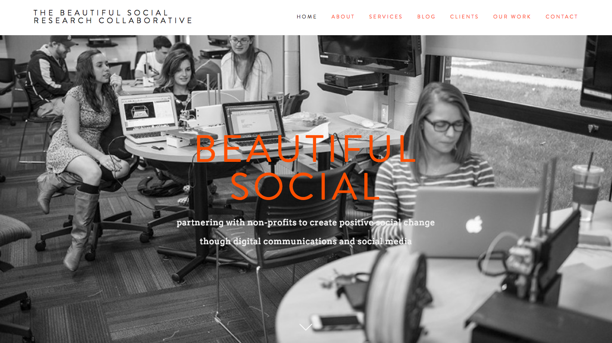
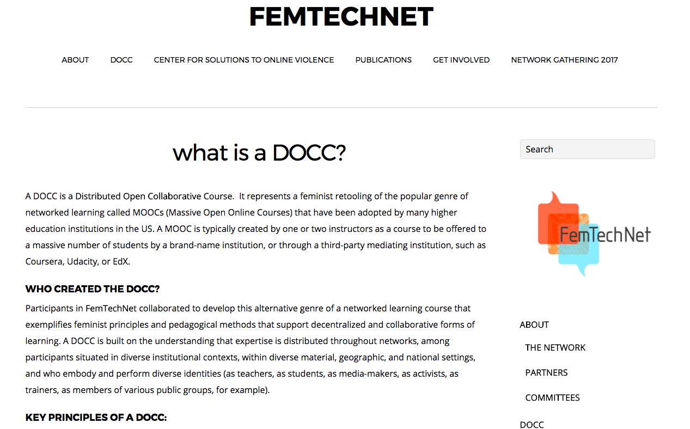
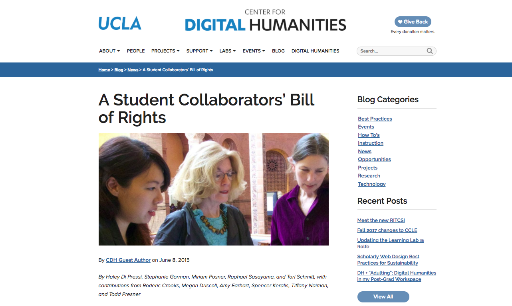
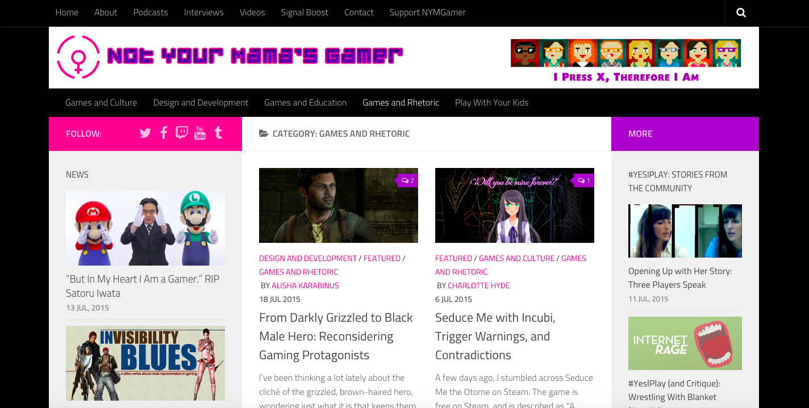

# COLLABORATION

### Amanda Licastro

Stevenson University | [digitocentrism.com](http://digitocentrism.com/) 

### Katina Rogers

The Graduate Center, CUNY | [katinarogers.com](http://katinarogers.com/bio)

### Danica Savonick

The Graduate Center, CUNY | [danicasavonick.com](http://danicasavonick.com/)

* * *

##### Publication Status:
* unreviewed draft
* draft version undergoing editorial review
* draft version undergoing peer-to-peer review 
* **draft version undergoing MLA copyediting**
* published

---

### Cross-Reference Keywords: Assessment, Authorship, Classroom, Community, Design, ePortfolio, Gaming, Gender, Intersectionality, Labor, Network, Online, Open, Play, Professionalization, Project Management, Public, Queer, Race, Social Justice

---

## CURATORIAL STATEMENT

In research, writing, and teaching, ideas build on countless others, weaving a complex network of influences. Collaborative work foregrounds this network, celebrating the value that many hands bring to a project. It includes diverse perspectives, flips the dichotomy of expert and novice, and explores alternative ideas—something Cathy Davidson, co-founder of the [HASTAC](http://www.hastac.org/) network, articulates as "[collaboration by difference](https://www.youtube.com/watch?v=zk8mvIYaO3w)" in her interview of the same title with *Harvard Business Review*. No matter what form collaboration takes—whether crowd-sourced projects, co-authored research, networked learning, or building and gaming—it depends on difference.

As education scholars have argued since at least the Progressive Era and John Dewey’s famous *Democracy and Education*, learning how to work together across differences is essential training for engaged citizenship and a robust democratic society. Collaboration is also critical in the professional environments that students will enter after earning their degrees. Teaching collaborative skills in the scaffolded environment of the classroom, then, makes sense not only in terms of improving students' learning outcomes, but also to equip them to succeed beyond the classroom. 

According to Andrea Lunsford and Lisa Ede, assignments best suited to collaboration are those that are labor-intensive, require multiple areas of expertise, or involve synthesis of divergent perspectives (123). These can range from low-stakes activities to long-term projects, and can extend beyond the classroom through partnerships with local community-based organizations.

Digital tools can streamline collaboration, making it easier than ever for students or entire classes to connect. Videoconferencing and collaborative Google Docs are now ubiquitous. Open-source tools like [Commons In A Box](http://commonsinabox.org/), [Omeka](https://www.omeka.net/), [Neatline](http://neatline.org/), [Zotero](https://www.zotero.org/), [Voyant](http://voyant-tools.org/), and others allow scholars to share their work and  build on one another's ideas to create projects that are as insightful as they are beautiful. Still, there is nothing magical about the ways tools like these enable people to work together. Some of the most effective collaboration techniques, like think-pair-share, involve nothing more sophisticated than [note cards and pencils](https://www.hastac.org/blogs/cathy-davidson/2012/04/08/single-best-way-transform-classrooms-any-size) (Davidson "Single Best Way").

As educators ourselves, we integrate these approaches into our courses. Danica Savonick structures [courses](https://www.hastac.org/blogs/danicasavonick/2015/05/18/introduction-narrative-collaborative-experimental-intellectual) around student-centered learning, public writing, and low-stakes group assignments, leading up to public [research projects](https://futuresinitiative.org/artsofdissentfinal/), which students evaluate after designing a rubric ("Introduction to Narrative;" *Arts of Dissent)*. Amanda Licastro scaffolds digital projects into writing courses by adding new tools and techniques slowly throughout the semester, building to a collaborative ["Design Fiction](https://wp.nyu.edu/licastro_fall14/category/final_projects/)" project (based on Kari Kraus’s [Bibliocircuitry](http://www.karikraus.com/?p=334) project) in which students design a new reading or writing technology by pitching ideas, voting on proposals, creating group contracts, and executing a prototype together (Licastro "Final Projects").

Evaluating collaborative work can be challenging when working within dominant, individualistic models of knowledge production. This includes addressing the pernicious gender inequalities that permeate our reward structures: recent research by Heather Sarsons indicates that women tend to be penalized for their collaborative research with men ("[Gender Differences in Group Work](http://scholar.harvard.edu/files/sarsons/files/gender_groupwork.pdf?m=1449178759)"). Organizations like the [AHA](https://www.historians.org/jobs-and-professional-development/career-diversity-for-historians/career-diversity-resources/five-skills/collaboration) and [MLA](https://www.mla.org/About-Us/Governance/Committees/Committee-Listings/Professional-Issues/Committee-on-Information-Technology/Guidelines-for-Evaluating-Work-in-Digital-Humanities-and-Digital-Media) are helping establish a new set of norms for the profession by acknowledging that if collaborative scholarship is to thrive, then formal scholarly reward structures must recognize and appropriately reward that work (Wilson; "Guidelines").

The same is true in our classrooms: students deserve to be fairly evaluated for collaborative work. Texts like *Collaborative Learning Techniques: A Handbook for College Faculty* (Barkley et al.) and the more recent *Writer/Designer* (Arola et al.) offer useful guidelines and rubrics for navigating tension between collaborative learning goals and the individual grades most institutions require. Key elements include careful assignment design and a hybrid approach to evaluating based on contract, competency, and improvement in order to promote individual accountability and positive group interdependence (Barkley et al. 83-94). 

The artifacts that follow model successful ways to design, facilitate, and evaluate generative collaborative experiences, and exemplify certain values essential to effective teamwork:

* Diversity. The selected projects foreground feminist, anti-racist, queer, decolonial, or interdisciplinary epistemologies and methodologies, and/or include collaborators that embody diversity of race, ethnicity, gender, background, and discipline.

* Equality. These projects all give fair credit to each collaborator. To the extent possible, they also build on low-tech, free, and/or open-source digital environments that ensure the broadest possible access.

* Student-Centered Ethos. The projects give special value to the importance of both teaching and learning, and to the role of the student in shaping their own educational experience.

* Innovation. Many of the featured projects try something new or risky, thereby sparking new insights and advancing a field.

* Impact. The artifacts represent projects that had a transformative effect on participants and had the potential to improve the lives of those beyond the classroom. 

Our hope as curators is that these resources will inspire educators to experiment with collaborative pedagogy, and explore its potential to bring about more just, equitable, and innovative teaching and learning.

## CURATED ARTIFACTS

### B-Social

* Type: Collaborative project
* Source URL: [http://beautifulsocial.org/](http://beautifulsocial.org/)
* Permissions: Permission granted by Bill Wolff
* Creator and Affiliation: Bill Wolff, St. Joseph's University
* Tags: Community, non-profits, social justice, social media, communications, service learning, project-based learning 

"Beautiful Social" (or B-Social) is a collaborative of faculty and students in the Communication Studies Department at St. Joseph’s University that pairs with local non-profit organizations in inner-city Philadelphia to provide consulting, training, multimedia production, and community research. Students enrolled in Social Media and Community Engagement and Nonprofit Communications "become consultants for clients while studying advanced topics in social media research and applying current theories and practices in semester-long team-based projects with community partners" (“About”). B-Social serves as an excellent example of collaborative Service Learning that integrates social justice issues into course work through project-based learning. Both the blog, which includes posts by students reflecting on their experience, and the “Our Work” section, which showcases the final projects, can be used in any classroom as models for collaborative work involving faculty, students, and community partners. 

### "Digital Labor, Urban Space, and Materiality"

Copy of artifact: [files/collaboration-artifact-posner-digital-labor.pdf](files/collaboration-artifact-posner-digital-labor.pdf)

* Type: Assignment
* Source URL: [http://digitalmateriallabor.org/final-project/](http://digitalmateriallabor.org/final-project/)
* Artifact Permissions: Creative Commons license
* Creator and Affiliation: Miriam Posner, University of California at Los Angeles
* Tags: WordPress, ScrollKit, writing, digital literacy, online publication, multimodal composition 

In [Digital Labor, Urban Space, and Materiality](http://digitalmateriallabor.org/), an undergraduate digital humanities course at UCLA, Professor Miriam Posner asks students to critique the labor and materiality of digital devices already in production. The "device narratives" project is an online publication in which each device featured is a “chapter” written collaboratively by groups of students in the course. These digital texts include maps, photographs, video, and other media hosted on a WordPress site (using the now-defunct ScrollKit). The documentation here includes links to finished narratives as well as the assignment's goals, timeline, and grading rubric. The structure and key concepts of this project are easily adaptable for any undergraduate or graduate course that focuses on research, writing, and digital literacy.

### Falling Up

 

* Type: Collaborative Project
* Source URL: [https://www.youtube.com/watch?v=BFuluIy-5QY](https://www.youtube.com/watch?v=BFuluIy-5QY)
* Artifact Permissions: Standard YouTube license; permission granted by Mike Wesch
* Creator and Affiliation: Mike Wesch, Kansas State University
* Tags: Community, ethnography, video, interviews, game theory, anthropology 

Professor Michael Wesch organizes his Kansas State University courses around collaborative projects, such as student-designed, directed, and produced videos. In spring 2015, students in Wesch’s "Digital Ethnography" course moved out of their dormitories and into Meadowlark Hills, a retirement community near campus. Students spent the semester getting to know the residents, learning about gerontology, and digital ethnogoraphy, and using what they were learning to positively impact the Meadowlark community. At the end, students took everything they had learned to create an "Interactive Empathy Game-Story" called “Falling Up.” The partnership produced transformative experiences for both students and residents, modeling how collaborative pedagogy can catalyze institutional change within and beyond the classroom. Having students work together on a multimedia project in partnership with the local community is a terrific way to engage in collaborative learning that will make a real impact in the world. 

### Feminisms and Interaction Design (IxD)

 

* Copy of artifact: [files/collaboration-artifact-feminisms-ixd.pdf](files/collaboration-artifact-feminisms-ixd.pdf) 
* Type: Assignment
* Source URL: [http://www.jsanofranchini.com/wp-content/uploads/2015/01/ENGL4874-Final-Project-Web.pdf](http://www.jsanofranchini.com/wp-content/uploads/2015/01/ENGL4874-Final-Project-Web.pdf)
* Artifact Permissions: CC BY-NC-SA 4.0
* Creator and Affiliation: Jennifer Sano-Franchini, Virginia Polytechnic Institute and State University
* Tags: WordPress, writing, design, group project, feminism 

This project was designed by Professor Jennifer Sano-Franchini as the culmination of [Issues in Professional and Public Discourse](http://www.jsanofranchini.com/wp-content/uploads/2015/01/ENGL4874-Syllabus-Web.pdf), a course for English majors at Virginia Tech. This course, which won the university's XCaliber Award for excellence in teaching with technology, invites students to investigate a "wicked problem," defined by designer and educator Jon Kolko as a "social or cultural problem that is difficult to solve because of incomplete, contradictory, and changing requirements." In an interview about the course, Sano-Franchini describes sexism and gender inequality as wicked problems for which interaction design can offer useful approaches (Mathews). For the final project, students work in groups to design a conceptual prototype (for a mobile application, game, website, interface, performance, etc.) informed by theories, research, and ideas in feminisms and interaction design. The artifact includes learning outcomes, a timeline, grading criteria, and more, all of which could be adapted for other courses. 

### Distributed Open Collaborative Course (DOCC)

 

* Type: Collaborative project
* Source URL: [https://femtechnet.org/docc/](https://femtechnet.org/docc/) 
* Artifact Permissions:
* Creator and Affiliation: FemTechNet; Multiple Universities
* Tags: Feminism, online courses, blog, multimodal composition 

FemTechNet is a network of scholars, artists, and students working with technology, science, and feminism. For four years, they have hosted Distributed Open Collaborative Courses in which instructors teaching courses related to feminism and technology connect their learning communities online. Unlike the hierarchical model of MOOCs (Massive Open Online Courses) in which one instructor teaches many students, the DOCC is a decentralized network with multiple nodes of engaged, participatory learning. Citing the [FemTechNet Manifesto,](https://femtechnet.org/publications/manifesto/) which states that "collaboration is a feminist technology," [K.J. Surkan](http://femtechnet.org/2015/05/ftn-roadshow-blog-series-collaborative/) describes the DOCC's collaboration as “happening at every level – between teachers as we establish new pedagogical connections across institutions, between teachers and students in Open Office Hours, between students in the completion of group projects, and between scholars through feminist video dialogues, writing and conferencing.” Educators can teach courses as part of the DOCC or adapt the model reap the benefits of networked pedagogy.  

### A Student Collaborators’ Bill of Rights

 

* Type: Teaching Guidelines
* Source URL: http://cdh.ucla.edu/news/a-student-collaborators-bill-of-rights/
* Artifact Permissions: 
* Creator and Affiliation: Haley Di Pressi, Stephanie Gorman, Miriam Posner, Raphael Sasayama, and Tori Schmitt, with contributions from Roderic Crooks, Megan Driscoll, Amy Earhart, Spencer Keralis, Tiffany Naiman, and Todd Presner; University of California at Los Angeles 
* Tags: Credit, rights, student work, attribution 

Faculty members, instructors, staff, and administrators must carefully consider how to give proper attribution and compensation to students who participate in collaborative digital projects. The UCLA Student Collaborators’ Bill of Rights exists as a guideline for best practices for student contributions to digital work. Collaborative work can and should include students as active contributors; however, power differentials can leave students vulnerable. As this statement notes,"students’ DH mentors may be the same people who give them grades, recommend them for jobs, and hold other kinds of power over their futures. Students may not feel entirely comfortable raising objections to certain practices if they feel these objections could endanger their academic or career prospects" (DiPressi et al). This site can be a starting place when developing equitable citation and compensation agreements for DH projects, class assignments, or collaborative scholarship that involves student participation. 

### OpenLab

 

* Artifact Type: Learning Platform 
* Source URL:[ https://openlab.citytech.cuny.edu/](https://openlab.citytech.cuny.edu/)
* Artifact Permissions: Creative Commons Attribution-NonCommercial-ShareAlike 3.0 License
* Creator and Affiliation: The OpenLab Team [link:[ https://openlab.citytech.cuny.edu/about/credits/](https://openlab.citytech.cuny.edu/about/credits/)]; New York City College of Technology, City University of New York
* Tags: Open-source, WordPress, BuddyPress, blog, course websites, student work, e-portfolios

The OpenLab is a collaborative digital learning platform open to students, faculty, staff, and alumni of New York City College of Technology, CUNY. Built using the open-source publishing and social networking platforms WordPress and BuddyPress, its goals are "to support teaching and learning, enable connection and collaboration, and strengthen the intellectual and social life of the college community." Classes can work together in shared or connected course spaces, and all members can collaborate on digital projects, participate in clubs, create online portfolios, and share their work publicly online (the [site tour](https://openlab.citytech.cuny.edu/openpedagogyopenlab/2016/02/08/openlab-tour-3-0/) provides example uses.) Because the site uses open-source software, institutions can implement and adapt this structure in order to build their own digital platform for collaborative interdisciplinary teaching and scholarship. Additionally, the site contains an abundance of syllabi, assignments, and student projects that educators can adapt to their local context.

### Not Your Mama’s Gamer (NYMG)

* Type: Collaborative Projects
* Source URL: [http://www.nymgamer.com/?page_id=2](http://www.nymgamer.com/?page_id=2)
* Artifact Permissions:
* Creator and Affiliation: Samantha Blackmon, Purdue University; Alex Layne, Metropolitan State University; additional collaborators as credited on the website [[http://www.nymgamer.com/?page_id=2](http://www.nymgamer.com/?page_id=2)] 
* Tags: Games, blog, feminism, multimodal composition, community 

*Not Your Mama’s Gamer* is a collaborative blog with regular and featured contributors who critique video games and gaming culture. The site includes podcasts, videos, and outside content oriented towards the mission of "unpacking games from a feminist perspective" ("About"). According to co-creator Samantha Blackmon, NYMG is a pedagogical “tool for social change” that demonstrates “how we can work collaboratively with other scholars, industry professionals, and community members to learn from each other and work together as change agents. NYMG also gives us the chance to show people how we, as scholars, might not only write for an academic audience, but also write in such a way as to become a part of a broader conversation” (personal interview). These resources can be used as catalysts for discussion and research in courses that discuss gender inequity in video game culture, and the blog itself is an excellent model for collaborative digital scholarship distributed as multimedia composition.

### The Pedagogy Project: Collaborative Digital Projects

 

* Type: Lesson plans
* Source URL: [http://www.hastac.org/pedagogy-project](http://www.hastac.org/pedagogy-project)
* Artifact Permissions: [Creative Commons Attribution-NonCommercial-ShareAlike 3.0 License](http://creativecommons.org/licenses/by-nc-sa/3.0/)
* Creator and Affiliation: HASTAC Scholars; Humanities, Arts, Science, and Technology Alliance and Collaboratory (HASTAC)
* Tags: Student-created, blog, assignments, lesson plans, digital pedagogy

The Pedagogy Project is a crowd-sourced collection of more than 80 projects and assignments related to digital technologies and collaboration, many contributed by graduate students. The Collaborative Digital Projects chapter offers specific lesson plans that educators can try immediately in their own classrooms, including projects and assignments related to close reading, blogging, game design, collective annotation, digital archives, visualization, and designing assignment sequences. The full Pedagogy Project appears on HASTAC (Humanities, Arts, Science, and Technology Alliance and Collaboratory), a free and open network of educators committed to transforming the ways we teach and learn. 

### Teaching #BlackLivesMatter: Countering the Pedagogies of Anti-Black Racism, A Collaborative, Crowd-Sourced Syllabus

Copy of artifact: [files/collaboration-artifact-blacklivesmatter.pdf](files/collaboration-artifact-blacklivesmatter.pdf)

* Type: Syllabus
* Source URL: [https://docs.google.com/document/d/1yjV779VAC2jJpM5-7aJ6OCFS71JiqTr8AToj0VNINRg/edit](https://docs.google.com/document/d/1yjV779VAC2jJpM5-7aJ6OCFS71JiqTr8AToj0VNINRg/edit)
* Artifact Permissions: Open, public Google Doc
* Creator and Affiliation: Mentoring Future Faculty of Color; The Graduate Center, City University of New York
* Tags: Google Docs, resources, social justice

["Teaching #BlackLivesMatter"](http://www.hastac.org/blogs/danicasavonick/2014/12/10/teaching-blacklivesmatter-countering-pedagogies-anti-black-racism) was an event organized by the Mentoring Future Faculty of Color group at the CUNY Graduate Center that explored "how to address racialization and state power as scholar-teachers, working at the level of both immediately executable plans for teaching/research, and longer term strategies for making the academy accountable to racial violence." In order to extend this conversation to as many voices as possible, the organizers set up an open syllabus using Google Docs. Contributors are invited to share resources, activities, discussion questions, and assignments related to teaching anti-racism. The use of simple technology helped advance the group’s objectives for the event, and enabled it to reach a wider audience. This syllabus includes many activities, assignments, and readings that anyone can use in the classroom. It also provides a model for creating a collaborative syllabus, something educators may wish to try in their own classes.

## RELATED MATERIALS

* Christie, Alex. "Pedagogy Toolkit for English." Web. 22 July 2015. [http://pedagogy-toolkit.org/resources/](http://pedagogy-toolkit.org/resources/)

* Howard, Rebecca Moore. "Collaborative Pedagogy." *A Guide to Composition Pedagogies*. New York: Oxford University Press, 2001.

* Keith, Melissa, and Joy Palmer. "CompFAQs from CompPile | What Is Collaboration?" Web. 22 July 2015. [http://compfaqs.org/BasicWritingCollaboration/Defined](http://compfaqs.org/BasicWritingCollaboration/Defined)

* "Special Issue: Mentorship and Collaboration." *The Journal of Interactive Technology and Pedagogy* 7 (2015). [http://jitp.commons.gc.cuny.edu/category/issues/issue-7/](http://jitp.commons.gc.cuny.edu/category/issues/issue-7/)

* Spiro, Lisa. "Zotero | Groups > Collaborative Scholarship in the Digital Humanities." Web. 22 July 2015. [https://www.zotero.org/groups/collaborative_scholarship_in_the_digital_humanities](https://www.zotero.org/groups/collaborative_scholarship_in_the_digital_humanities)

## WORKS CITED

"About." *The OpenLab at City Tech*. New York City College of Technology, City University of New York, n.d. [https://openlab.citytech.cuny.edu/about/](https://openlab.citytech.cuny.edu/about/). Accessed Oct. 2017. 

Arola, Kristin L., et al. *Writer/Designer: A Guide to Making Multimodal Projects.* New York, NY: Bedford/St. Martin's, 2014. Print.

*The Arts of Dissent*. [https://futuresinitiative.org/artsofdissentfinal/](https://futuresinitiative.org/artsofdissentfinal/). Accessed 11 Oct. 2017.

Barkley, Elizabeth F. et al. *Collaborative Learning Techniques: A Handbook for College Faculty*. Jossey-Bass, 2004. 

"Beautiful Social." [http://beautifulsocial.org/](http://beautifulsocial.org/). Communication Studies Department, Saint Joseph's University. Accessed 22 July 2015.

Blackmon, Samantha. Interview by Amanda Licastro. Personal Interview. Oct. 2017.

---, et al. "Not Your Mama’s Gamer." Web. 22 July 2015. [http://www.nymgamer.com/?page_id=2](http://www.nymgamer.com/?page_id=2)

Bruffee, Kenneth M. *Collaborative Learning: Higher Education, Interdependence, and the Authority of Knowledge* 2nd edition. Baltimore, Md: Johns Hopkins University Press, 1998. Print.

Christie, Alex. "Pedagogy Toolkit for English." Web. 22 July 2015. [http://pedagogy-toolkit.org/resources/](http://pedagogy-toolkit.org/resources/)

*City Tech OpenLab*. [https://openlab.citytech.cuny.edu/](https://openlab.citytech.cuny.edu/). Accessed 12 Oct. 2017.

*Commons In A Box*. [http://commonsinabox.org/](http://commonsinabox.org/). Accessed 22 July 2015.

Davidson, Cathy. *Collaboration by Difference*. May 15, 2012. Harvard Business Review, *YouTube*, [https://www.youtube.com/watch?v=zk8mvIYaO3w](https://www.youtube.com/watch?v=zk8mvIYaO3w).

---. *The New Education: How to Revolutionize the University to Prepare Students for a World in Flux*. Basic Books, 2017

---. "Single Best Way to Transform Classrooms of Any Size!" *HASTAC*, [https://www.hastac.org/blogs/cathy-davidson/2012/04/08/single-best-way-transform-classrooms-any-size](https://www.hastac.org/blogs/cathy-davidson/2012/04/08/single-best-way-transform-classrooms-any-size). Accessed 11 Oct. 2017.

Dewey, John. *Democracy and Education: An Introduction to the Philosophy of Education*. Macmillan, 1916.

Di Pressi, Haley,  Stephanie Gorman, Miriam Posner, Raphael Sasayama, and Tori Schmitt. "A Student Collaborators’ Bill of Rights." *Center for Digital Humanities - UCLA*, [http://www.cdh.ucla.edu/news-events/a-student-collaborators-bill-of-rights/](http://www.cdh.ucla.edu/news-events/a-student-collaborators-bill-of-rights/). Accessed 8 Sept. 2017. 

Farnel, Megan, et al. "It’s Complicated: The Social Lives of Networked Teens (danah Boyd) - Collaborative Book Engagement." *HASTAC*. N.p., n.d. [http://www.hastac.org/pages/its-complicated-collaborative-book-engagement](http://www.hastac.org/pages/its-complicated-collaborative-book-engagement). Accessed 22 July 2015. 

FemTechNet. "DOCC Courses." [http://femtechnet.org/docc/](http://femtechnet.org/docc/). Accessed 22 July 2015.

The Futures Initiative. "About The Futures Initiative." The Graduate Center, City University of New York.. [http://futures.gc.cuny.edu/about/](http://futures.gc.cuny.edu/about/). Accessed 22 July 2015.

Gold, Matthew K., et al. "Commons In A Box." City University of New York. [http://commonsinabox.org/](http://commonsinabox.org/). Accessed 22 July 2015.

"Guidelines for Evaluating Work in Digital Humanities and Digital..." *Modern Language Association,* [https://www.mla.org/About-Us/Governance/Committees/Committee-Listings/Professional-Issues/Committee-on-Information-Technology/Guidelines-for-Evaluating-Work-in-Digital-Humanities-and-Digital-Media](https://www.mla.org/About-Us/Governance/Committees/Committee-Listings/Professional-Issues/Committee-on-Information-Technology/Guidelines-for-Evaluating-Work-in-Digital-Humanities-and-Digital-Media). Accessed 11 Oct. 2017.

*HASTAC*. [http://www.hastac.org/](http://www.hastac.org/). Accessed 20 July 2015.

HASTAC Scholars. "The Pedagogy Project." *HASTAC.* [http://www.hastac.org/pedagogy-project](http://www.hastac.org/pedagogy-project). Accessed 22 July 2015.

Keith, Melissa, and Joy Palmer. "CompFAQs from CompPile | What Is Collaboration?"  [http://compfaqs.org/BasicWritingCollaboration/Defined](http://compfaqs.org/BasicWritingCollaboration/Defined). Accessed 22 July 2015.

Kraus, Kari M. "Bibliocircuitry and the Design of the Alien Everyday." 15 Nov. 2014. [http://www.karikraus.com/?p=334](http://www.karikraus.com/?p=334). Accessed 11 Oct. 2017.

Licastro, Amanda. "Final Projects." *Thinking and Writing Through New Media*, 11 Dec. 2014, [https://wp.nyu.edu/licastro_fall14/category/final_projects/](https://wp.nyu.edu/licastro_fall14/category/final_projects/). Accessed Oct. 2017.

---. "Final." *Gutenburg to Google Books”* [http://stevensonenglish.org/eng38101-licastro17/syllabus/](http://stevensonenglish.org/eng38101-licastro17/syllabus/). Accessed Oct. 2017. 

Lunsford, Andrea A., and Lisa Ede. *Singular Texts/Plural Authors: Perspectives on Collaborative Writing*. Carbondale: Southern Illinois University Press, 1990.

"Manifesto – FemTechNet." [https://femtechnet.org/publications/manifesto/](https://femtechnet.org/publications/manifesto/). Accessed 12 Oct. 2017.

Mathews, Brian. "Feminisms & Interaction Design. An Interview with Jennifer Sano-Franchini." *The Chronicle of Higher Education*, [http://www.chronicle.com/blognetwork/theubiquitouslibrarian/2015/07/12/feminisms-interaction-design-an-interview-with-jennifer-sano-franchini/](http://www.chronicle.com/blognetwork/theubiquitouslibrarian/2015/07/12/feminisms-interaction-design-an-interview-with-jennifer-sano-franchini/). Accessed 12 Oct. 2017.

Mentoring Future Faculty of Color. "Teaching #BlackLivesMatter: Countering the Pedagogies of Anti-Black Racism, A Collaborative, Crowd-Sourced Syllabus." 19 Dec 2014. The Graduate Center, CUNY. [https://docs.google.com/document/d/1yjV779VAC2jJpM5-7aJ6OCFS71JiqTr8AToj0VNINRg/edit](https://docs.google.com/document/d/1yjV779VAC2jJpM5-7aJ6OCFS71JiqTr8AToj0VNINRg/edit). Accessed 22 July 2015.

"OpenLab Tour 3.0 | Open Pedagogy on the OpenLab." [https://openlab.citytech.cuny.edu/openpedagogyopenlab/2016/02/08/openlab-tour-3-0/](https://openlab.citytech.cuny.edu/openpedagogyopenlab/2016/02/08/openlab-tour-3-0/). Accessed 12 Oct. 2017.

*Omeka*. [http://omeka.org/](http://omeka.org/). Accessed 22 July 2015.

Posner, Miriam. "Final Project : Digital Labor, Urban Space, and Materiality." [http://digitalmateriallabor.org/final-project/](http://digitalmateriallabor.org/final-project/). Accessed Oct. 2017.

Roy Rosenzweig Center for History and New Media. "Omeka." George Mason University. [http://omeka.org/](http://omeka.org/). Accessed 22 July 2015.

---. "Zotero." George Mason University. [http://zotero.org/](http://zotero.org/). Accessed Oct. 2017. 

Ranciere, Jacques. *The Ignorant Schoolmaster: Five Lessons in Intellectual Emancipation*. Stanford: Stanford UP, 1991.

Sano-Franchini, Jennifer. "Feminisms and Interaction Design (IxD) Final Project Assignment." Virginia Polytechnic Institute and State University. 2015. [http://www.jsanofranchini.com/wp-content/uploads/2015/01/ENGL4874-Final-Project-Web.pdf](http://www.jsanofranchini.com/wp-content/uploads/2015/01/ENGL4874-Final-Project-Web.pdf). Accessed Oct. 2017. 

---. "Feminisms and Interaction Design (IxD) Syllabus." Virginia Polytechnic Institute and State University. 2015. [http://www.jsanofranchini.com/wp-content/uploads/2015/01/ENGL4874-Syllabus-Web.pdf](http://www.jsanofranchini.com/wp-content/uploads/2015/01/ENGL4874-Syllabus-Web.pdf). Accessed Oct. 2017. 

Sarsons, Heather. "Gender differences in recognition for group work." Harvard University 3 (2015). [http://scholar.harvard.edu/files/sarsons/files/gender_groupwork.pdf?m=1449178759](http://scholar.harvard.edu/files/sarsons/files/gender_groupwork.pdf?m=1449178759)

Savonick, Danica. "‘Introduction to Narrative’: A Collaborative, Experimental Intellectual Adventure." *HASTAC*, 18 May 2015. [https://www.hastac.org/blogs/danicasavonick/2015/05/18/introduction-narrative-collaborative-experimental-intellectual](https://www.hastac.org/blogs/danicasavonick/2015/05/18/introduction-narrative-collaborative-experimental-intellectual).

The Scholars’ Lab. *Neatline*. [http://neatline.org/](http://neatline.org/). Accessed 22 July 2015.

Sinclair, Stéfan, and Geoffrey Rockwell. *Voyant Tools: Reveal Your Texts*. [http://voyant-tools.org/](http://voyant-tools.org/). Accessed Oct. 2017. 

"Special Issue: Mentorship and Collaboration." *The Journal of Interactive Technology and Pedagogy* 7 (2015). [http://jitp.commons.gc.cuny.edu/category/issues/issue-7/](http://jitp.commons.gc.cuny.edu/category/issues/issue-7/). Accessed Oct. 2017. 

Spiro, Lisa. "Zotero | Groups > Collaborative Scholarship in the Digital Humanities." [https://www.zotero.org/groups/collaborative_scholarship_in_the_digital_humanities](https://www.zotero.org/groups/collaborative_scholarship_in_the_digital_humanities). Accessed Oct. 2017. 

Surkan, K. J. "FTN Roadshow Blog Series* – Collaborative." *FemTechNet*, [http://femtechnet.org/2015/05/ftn-roadshow-blog-series-collaborative/](http://femtechnet.org/2015/05/ftn-roadshow-blog-series-collaborative/). Accessed 29 July 2015.

Michael Wesch. *"Falling Up" Interactive Empathy Game-Story Trailer*. YouTube, [https://www.youtube.com/watch?v=BFuluIy-5QY](https://www.youtube.com/watch?v=BFuluIy-5QY).

Wilson, Karen S. "Collaboration." *American Historical Association*, [https://www.historians.org/jobs-and-professional-development/career-diversity-for-historians/career-diversity-resources/five-skills/collaboration](https://www.historians.org/jobs-and-professional-development/career-diversity-for-historians/career-diversity-resources/five-skills/collaboration). Accessed 11 Oct. 2017.

