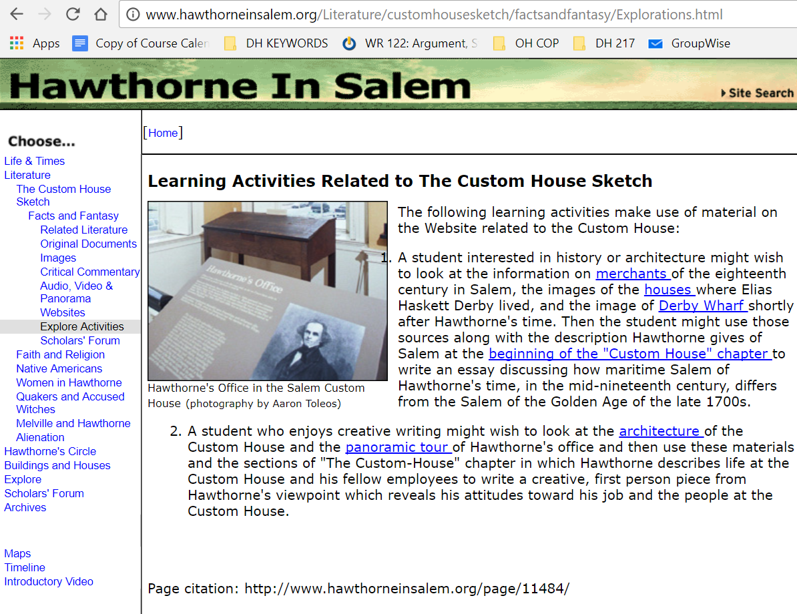
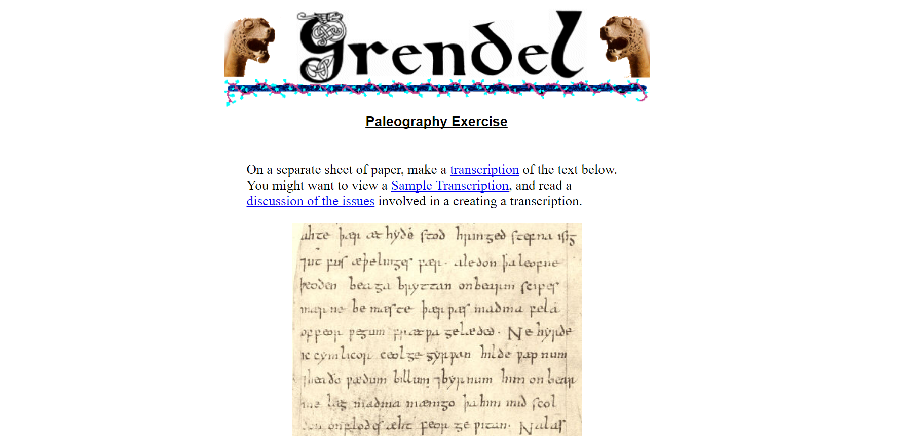
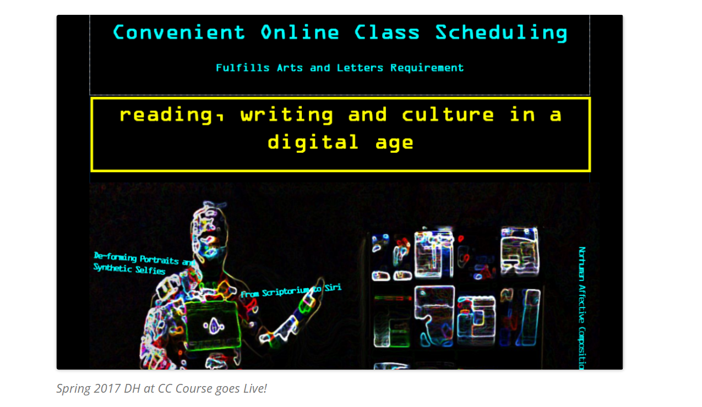
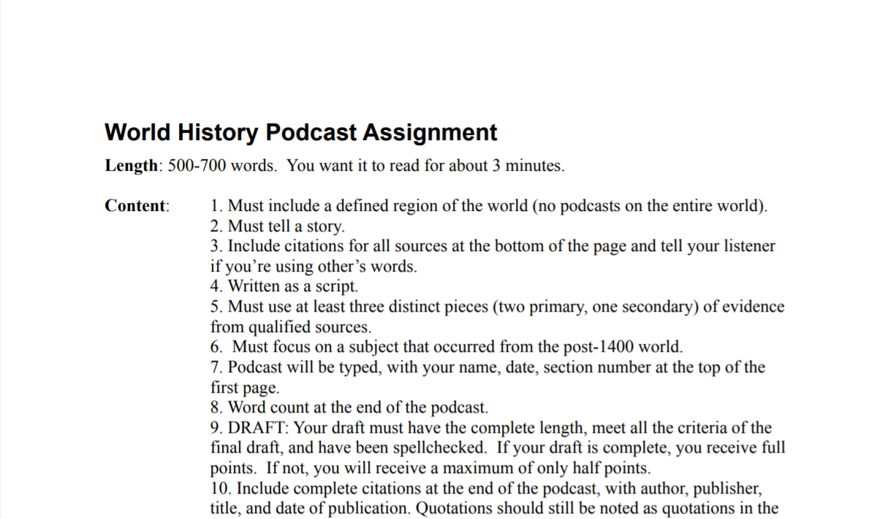
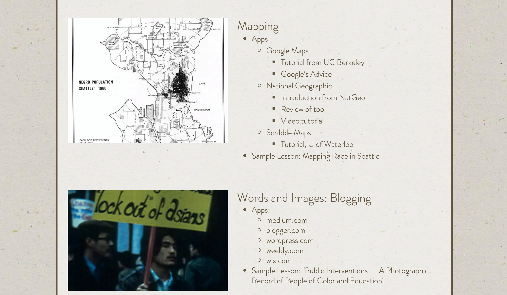
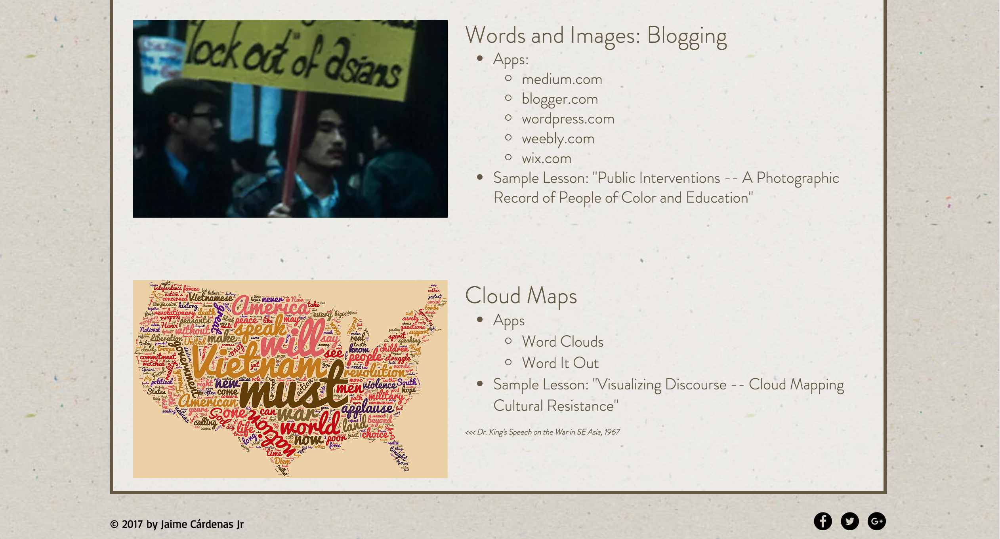
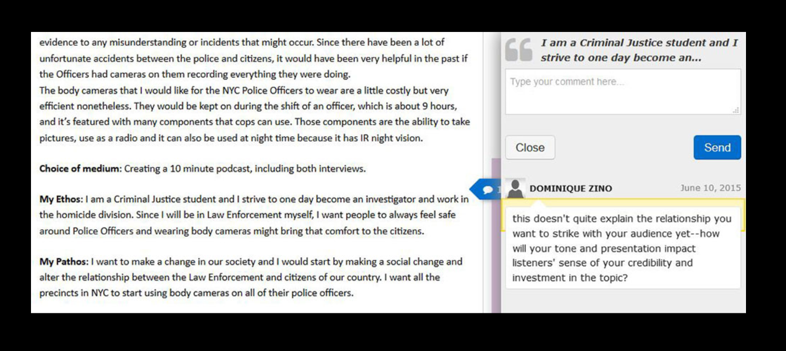
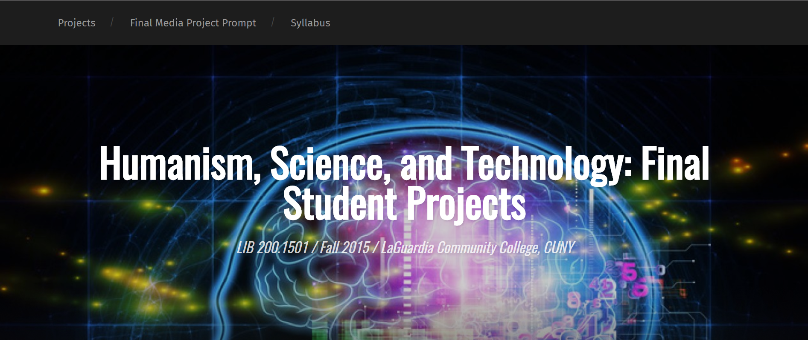

# COMMUNITY COLLEGE

### Anne B. McGrail, PhD

English Faculty, Lane Community College

---

### Cross-reference keywords: Access, Classroom, Collaboration, Community, Digital Divides, Failure, Social Justice

---

## CURATORIAL STATEMENT

Offering students low-cost, local, and open access to degrees, community colleges are a strength of the American public higher-education system. Community college students are some of the most diverse and also most vulnerable student populations in higher education. Their numbers are impressive: they comprise 46% of all undergraduates in the US; 41% of all first-time freshmen attend one of the more than 1200 community colleges in the country (American Association of Community Colleges “Enrollments”). Their profiles constitute a critical pedagogical context for equity: a majority of Native American, Black, and Hispanic students begin their college careers in community colleges, and 43% of Asian/Pacific Islander students are enrolled there. Fifty-nine percent are women, and students from the lowest socioeconomic quintile are increasingly more likely to begin post-secondary education at community colleges. (American Association of Community Colleges “Fast Facts”). Immigrants, too, make up a significant constituency: one study estimates that about 25% of community college students come from an immigrant background (National Center for Education Statistics). 
 
### Access and Equity 
 
An equitable vision for digital pedagogy embraces these students and the faculty who teach them. Digital projects develop empowering skills for students to represent their communities, to challenge inequalities, and to be critical participants in digital culture. Adoption of digital approaches in community colleges is hindered, however, by systemic barriers such as faculty workloads: Community college faculty spend more than two times the number of hours in the classroom teaching than do public doctoral faculty; 67 percent of community college faculty teach from 75 to more than 150 students (Rifkin), and 58% of community college courses are taught by part-time and contingent faculty (Center for Community College Student Engagement). In addition, unreliable facilities and student access to even minimal technology also have slowed the adoption of digital pedagogies in open-access colleges.

Recently, however, many teachers at community colleges have begun to integrate digital pedagogies into their curriculum as a means for helping open-access institutions reach their democratic potential. This development has been aided by recent support from organizations such as the NEH, which supported a summer institute in digital pedagogies for 29 community college teacher-scholars in 2015 (see the Online Commons in “Related Materials” below). And the inclusion of "community college" as a keyword in this volume signals the larger field of digital humanities' developing capacity for and interest in cultivating digital skills in novice humanists from all walks of life and from all strata of higher education.
 
### Curricular Anticipation and Translations 

Digital pedagogies in 100- and 200-level courses benefit from tailoring to the unique needs of students in open-access environments. Although two-year faculty may teach lower-division courses that mirror those in a university catalog, the teaching context of community colleges entails customizing pedagogy so that comparable learning outcomes are achieved in differential contexts. Community college teachers face challenges from resource barriers to uneven student preparedness. For community college courses to be successful, differentiated instructional design is often necessary to teach students with wide-ranging skill levels simultaneously. The syllabus below entitled "Reading, Writing, and Digital Culture," for example, allows for this differentiation in online settings using freely available web tools. Widely accepted project management features of digital projects, such as collaboration and tight deadlines, need to take account of exigencies of diverse students’ lives. Community college digital projects should anticipate the context of working-class and diverse students struggling with lives immersed in precarity. 

Community-college students’ responses to unfamiliarity, experimentation and failure may also differ significantly from middle-class students schooled in an atmosphere of productive challenge and soft landings. As the MLA keyword "fail" in this volume makes clear, failure can play productive roles in innovation and discovery (Croxall and Warnick). But handled too cavalierly, these signature features of digital practice can translate into student self-doubt and disappearance. The assignments featured here are characterized by an intentionally welcoming and generous instructional design that promotes equity.

One shouldn’t think of community college students only in terms of deficits, however. These students arrive on open-access campuses with unique assets and more maturity than their more traditional-age counterparts. With an average age of 29 (AACC “Students at Community Colleges”) community college students draw on life experience and abundant tacit knowledge to approach complex and unfamiliar tasks. The assignments that follow illustrate how embedding versions of digital annotation, distant reading, and digital publishing platforms, for example, strengthens traditional curricula in foundational courses. Even without classroom access to computers, students can study digital culture’s larger themes, e.g., the often hidden power of algorithms and databases, rhetorical awareness of interfaces, the changing norms of privacy and publicity, etc. By seeing digital pedagogy through the lens of equity, these artifacts and resources empower all students.

## CURATED ARTIFACTS 

#### Advancing Humanities through Technology
 

- Source: [http://www.nvcc.edu/home/cevans/technology/index.html](http://www.nvcc.edu/home/cevans/technology/index.html)
- Type: Grant Project Website ca. 1999
- Permissions: CC-BY NC
- Creator: Charles Evans, North Virginia Community College

In 1999 the NEH, the Community College Humanities Association and North Virginia Community College initiated a humanities computing community of practice among seventeen colleges entitled, “Advancing the Humanities through Technology at Community Colleges.” [http://www.nvcc.edu/home/cevans/technology/index.html](http://www.nvcc.edu/home/cevans/technology/index.html) The institute fostered development of impressive projects, including Harper College’s Grendel website [http://www.harpercollege.edu/~kneumann/grendel/welcome.htm](http://www.harpercollege.edu/~kneumann/grendel/welcome.htm) and North Shore Community College’s Hawthorne in Salem [http://www.hawthorneinsalem.org/](http://www.hawthorneinsalem.org/), both of which remain relevant community college pedagogical online resources. Projects there demonstrate how early on community college faculty saw the democratic potential of humanities computing. They also anticipate and, in their own way, answer the later definitional debates about what authentically “counts” as digital humanities: projects include website development, electronic portfolios, archival access, cross-disciplinary collaboration and student-generated, public-facing family heritage archives.

#### Hawthorne in Salem

- Source URL: [http://www.hawthorneinsalem.org/Literature/customhousesketch/factsandfantasy/Explorations.html](http://www.hawthorneinsalem.org/Literature/customhousesketch/factsandfantasy/Explorations.html)
- Type: Digital Archive Exploratory Learning Activities 
- Permissions: CC-BY NC
- Creator: Terri Whitney, PhD, North Shore Community College

Hawthorne in Salem, a historical resource and pedagogical tool, actively engages with community college students and exemplifies the value of local community college partnerships with cultural assets such as museums, universities and cultural sites. Terri Whitney expanded her work begun with the CCHA/NEH institute in 1999 to provide an interactive archive with photos, audio and video tours and other artifacts that support public access to historical and literary research. Guided site explorations and activities include panoramic tours through merchant homes and other architectural assets in Salem, Massachussetts, and themed explorative activities for students on Hawthorne's Framework of Faith, Native Americans in 19th Century Salem, Women, Quakers, and Accused Witches, and a Scholars' Forum, among other activities.

#### Paleotranscription Exercise with Grendel Online

- Source: [files/communitycollege-artifact-paleotranscription.pdf](files/communitycollege-artifact-paleotranscription.pdf)
- Type: Paleography Transcription Exercise
- Permissions: CC-BY NC
- Creators: Professors Richard Johnson and Kurt Neuman, Harper College

Harper College’s Grendel, designed by Richard Johnson and Kurt Neuman as part of the 1999 NEH grant project, is noteworthy for its interactivity in a pre-Web 2.0 context, and is an early instance of community college faculty’s recognition of the value of humanities computing for student engagement and participation. Using email to participate, students can identify and define significant words from Beowulf and have their work included in an online glossary. Ram files play back pronunciations. The same Web-based email system is used to support student annotations and translations of lines.

#### Reading, Writing, and Digital Culture Syllabus

- Source: [files/communitycollege-artifact-readingwritingdigitalculture.pdf](files/communitycollege-artifact-readingwritingdigitalculture.pdf)
- Type: Syllabus and Course Calendar
- Permissions: CC-BY NC
- Creator: Anne B. McGrail, PhD, Lane Community College

This is the syllabus and course calendar for an online course first taught in Spring 2017 as an introduction to digital humanities tools and methods. The grading method encourages maximum collaboration and experimentation. The class is taught online through a learning management system but students use tools on the open web. Detailed instructions for many student labs are in the Keywords resource blog Doing DH at the CC [https://blogs.lanecc.edu/dhatthecc/](https://blogs.lanecc.edu/dhatthecc/)

#### World History Podcast Assignment

- Source URL: [files/communitycollege-artifact-worldhistorypodcast.pdf](files/communitycollege-artifact-worldhistorypodcast.pdf)
- Type: World History Class Assignments
- Permissions: CC-BY NC
- Creator: Jack Norton, Normandale Community College

One of a collection of multiple assignments focusing on creating "digital history courses that embrace an anti-poverty andragogy." Students share their work on a blog created by Norton [https://historyatnormandale.wordpress.com/](https://historyatnormandale.wordpress.com/). Other assignments include working with online numerical data tools and using Omeka. A framing feature of coursework here is the commitment to engaging students outside of the institution's learning management system and using the open web to host course materials and student work. 

#### Public Interventions: A Photographic Record of People of Color and Education

- Type: History Assignment
- [files/communitycollege-artifact-publicinterventions.pdf](files/communitycollege-artifact-publicinterventions.pdf)
- Permissions: CC-BY NC
- Creator: Jaime Cardenas[a][b], PhD, Instructor of History (Tenured), Seattle Central College

Just like the understanding that all young people are “digital natives” is wrong, so is it wrong to assume that they are adroit interpreters of primary visual sources.  This assignment seeks to utilize the interest younger students have of visual culture in order to expand their abilities to interpret the past. In this case, because they are interpreting images of public education, something with which most of them have had direct experience, their interaction with these primary sources will be relatively intimate. Thus, this assignment has two built-in advantages: the use of visuals, and a “projected” nostalgia. Students may not initially observe images within the historical context that produced the primary source.  As Barbara Ormond and others recommend, teachers should guide our students through a detailed process that makes images, initially, less discernible so that in the end students will become better interpreters of the past.
 
#### Mapping Race in Seattle

- Type: History Assignment
- [files/communitycollege-artifact-mappingraceinseattle.pdf](files/communitycollege-artifact-mappingraceinseattle.pdf)
- Permissions: CC-BY NC
- Creator: Jaime Cardenas, PhD, Instructor of History (Tenured), Seattle Central College

This assessment aids in the processes of aiding students in locating, literally and figuratively, how power is enacted geographically in Seattle.  Capital accumulation and racism since the late 1800s, as well as the de facto expulsion of almost all Native people, has combined in Seattle with anti-Asian and anti-Black residential segregation. The question is, how?

This spatial approach to learning can be used, for example, when examining the proximity of African American and Asian American neighborhoods. Most students have not considered why the International District (which contains Chinatown and other Asian American neighborhoods) is adjacent to the Central District (the once mostly African American neighborhood of the city). When students see their mapping in conjunction to reading secondary sources and having discussions, their comprehension is deepened.
 
#### Visualizing Discourse: Cloud Mapping Cultural Resistance

 - Type: History Assignment
- [files/communitycollege-artifact-visualizingdiscourse.pdf](files/communitycollege-artifact-visualizingdiscourse.pdf)

- Permissions: CC-BY NC
- Creator: Jaime Cardenas, PhD, Instructor of History (Tenured), Seattle Central College

Word clouds are relatively commonplace on college campuses (e.g., flyers for workshops, a new course offering, etc).  Thankfully, what has captured the attention of students is the actual “content of the content,” or the text that the algorithm presents once it has run in the application.  Of course, they could read the words before using the word cloud app, but the process of quantification and subsequent representation allows students to carefully notice words, words analyzed within the particular historical context from which the text (speech, poem, etc.) emerged.  For instance the 1967 sermon that Rev. King gave against the U.S. war in southeast Asia is a prime example and one that is useful while teaching the US history survey: [http://tinyurl.com/mlkandvietnamwordcloud](http://tinyurl.com/mlkandvietnamwordcloud).  In this primary source, tellingly, the words “nation” and “America” are used more often than “God,” but the word “world” occurs more often than all of these.

 

#### Making Podcasts to Support Research-based Writing and Reflection

- Type: Assignment and Student Work
- [files/communitycollege-artifact-designplanpodcast.pdf](files/communitycollege-artifact-designplanpodcast.pdf)
- Permissions: CC-BY NC
- Creators: Dominique Zino, Assistant Professor of English, LaGuardia Community College; Vilma and Carmen, LaGuardia Community College students

In first-year composition courses at LaGuardia Community College, one learning objective is developing rhetorical awareness. By building in live speakers and live audiences, a podcasting project makes the concept of a “rhetorical situation” more concrete. Podcasting can be an informal, low-stakes assignment or it can serve as a more in-depth final research assignment. One useful resource for those experimenting with this genre is the composition textbook <em>Compose, Design, Advocate</em>, which takes a rhetorical approach to creating various kinds of multimedia artifacts. Authors Anne Wysocki and Dennis Lynch suggest that writers outline the moving rhetorical parts of a task (purpose, audience, context, strategies, medium, arrangement, and testing) through a document they call the “design plan.” The attached Word document includes an outline of a four-stage podcasting process. It also includes two sample student design plans, directions for interviewing and for creating a bibliography, and a grading rubric for a podcasting project. 
 
#### Capstone Liberal Arts Hybrid Final Digital Media Projects

- Type: Website of student work
- Source URL: [http://lib200fall15.bethanyholmstrom.net/](http://lib200fall15.bethanyholmstrom.net/)
- Permissions: CC-BY NC
- Creator: Bethany Holmstrom, Assistant Professor of English, LaGuardia Community College

LaGuardia Community College has undertaken an in-house professional development [project](https://docs.google.com/document/d/1hHeCwupjlaJ8MgjSwZSRhgn3f03UVvLdOXSw15DnQRk/edit) to support work such as this capstone site. Bethany Holmstrom’s students in her hybrid liberal arts capstone class created digital media projects in response to their course theme, Artificial Intelligence in sci-fi film/TV shows. Students pitched their projects to the class, wrote research narratives, and chose the platform that best suited their needs. Students were also asked to consider accessibility when designing their project. The projects were shared publicly, along with the research narratives. In this way, students creatively apply research and content encountered during the semester, making projects that speak to their own skills, interests, and connections to the course materials.
 
## RELATED MATERIALS

_Digital Humanities at Community Colleges_. Supported with an NEH Office of Digital Humanities Grant [https://dhatthecc.lanecc.edu/](https://dhatthecc.lanecc.edu/)
 
Holmstrom, Bethany, et al. _Hybrid and Digital Pedagogy at LaGuardia Community College_. [http://hybridenglish.commons.gc.cuny.edu/](http://hybridenglish.commons.gc.cuny.edu/)

Lane Community College Students. _Final Digital Document Presentations_. [https://www.youtube.com/playlist?list=PL8i5RdF89ejcbxcz6d91lYLNfuBPZ2jqk](https://www.youtube.com/playlist?list=PL8i5RdF89ejcbxcz6d91lYLNfuBPZ2jqk)

McGrail, Anne. _Doing DH at the CC_ [https://blogs.lanecc.edu/dhatthecc/](https://blogs.lanecc.edu/dhatthecc/)

_National Survey of Digital Humanities in Community Colleges_. Sponsored by an NEH Office of Digital Humanities Start-Up Grant [https://blogs.lanecc.edu/dhatthecc/2014/02/03/survey-data-available-from-national-survey-of-digital-humanities-in-community-colleges/](https://blogs.lanecc.edu/dhatthecc/2014/02/03/survey-data-available-from-national-survey-of-digital-humanities-in-community-colleges/)

## WORKS CITED

American Association of Community Colleges. “Community College Enrollments.” American Association of Community Colleges, 2015. July 8, 2015. Web.
http://www.aacc.nche.edu/AboutCC/Trends/Pages/enrollment.aspx

———. “2015 Community College Fast Fact Sheet.” American Association of Community Colleges. July 8, 2015. Web. [http://www.aacc.nche.edu/AboutCC/Pages/fastfactsfactsheet.aspx](http://www.aacc.nche.edu/AboutCC/Pages/fastfactsfactsheet.aspx)

———. “Students at Community Colleges.” 2016. Web.
[http://www.aacc.nche.edu/AboutCC/Trends/Pages/studentsatcommunitycolleges.aspx](http://www.aacc.nche.edu/AboutCC/Trends/Pages/studentsatcommunitycolleges.aspx)

Center for Community College Student Engagement. “Contingent commitments: Bringing part-time faculty into focus. A special report from the Center for Community College Student Engagement.” Austin, TX: The University of Texas at Austin, Program in Higher Education Leadership, 2014. [http://www.ccsse.org/docs/PTF_Special_Report.pdf](http://www.ccsse.org/docs/PTF_Special_Report.pdf)

Community College Research Center. “Community College FAQs.” Teachers College, Columbia University [http://ccrc.tc.columbia.edu/Community-College-FAQs.html](http://ccrc.tc.columbia.edu/Community-College-FAQs.html)

Council on Foreign Relations. “What College-Aged Students Know About the World: A Survey on Global Literacy.” Council on Foreign Relations, 13 Sept. 2016. Web. [http://www.cfr.org/society-and-culture/college-aged-students-know-world-survey-global-literacy/p38241](http://www.cfr.org/society-and-culture/college-aged-students-know-world-survey-global-literacy/p38241)
 
Croxall, Brian and Quinn Warnick. “Failure.” _Digital Pedagogy in the Humanities: Concepts, Models and Experiments_. Rebecca Frost Davis, Matthew K. Gold, Katherine D. Harris and Jentery Sayers (eds.). MLA Commons. Web. [https://digitalpedagogy.commons.mla.org/keywords/failure/](https://digitalpedagogy.commons.mla.org/keywords/failure/)

Hammersley, Laura A., Rebecca H. Bilous, Sarah W. James, Adam M. Trau, and Sandie Suchet-Pearson. 2014. “Challenging ideals of reciprocity in undergraduate teaching: the unexpected benefits of unpredictable cross-cultural fieldwork.” _Journal of Geography In Higher Education_ 38, no. 2: 208–218.
 
Marshall, Bridget. “Using Primary Sources in the Classroom.” Lowell Teacher Workshop: Dr. Bridget Marshall. Tsongas Industrial History Center, October 9, 2013. Video. Web. [https://www.youtube.com/watch?v=ipaXJ3_VVRQ](https://www.youtube.com/watch?v=ipaXJ3_VVRQ)

MLA Committee on Community Colleges. “A Community College Teaching Career.” Modern Language Association.  2006. [http://bit.ly/2dO5ide](http://bit.ly/2dO5ide)

McGrail, Anne B. “National Survey of Digital Humanities at Community Colleges.” Doing DH at the CC. October 2014.
[https://blogs.lanecc.edu/dhatthecc/2014/02/03/survey-data-available-from-national-survey-of-digital-humanities-in-community-colleges/](https://blogs.lanecc.edu/dhatthecc/2014/02/03/survey-data-available-from-national-survey-of-digital-humanities-in-community-colleges/)
 
National Center for Education Statistics, “Profile of Undergraduates in U.S. Postsecondary Education Institutions: 2003–04, With a Special Analysis of Community College Students.” U.S. Department of Education, 2006. [http://nces.ed.gov/pubsearch/pubsinfo.asp?pubid=2006184](http://nces.ed.gov/pubsearch/pubsinfo.asp?pubid=2006184)

Rifkin, Troni. “Public Community College Faculty.” American Association of Community Colleges. n.d. Web. [http://www.aacc.nche.edu/Resources/aaccprograms/pastprojects/Pages/publicccfaculty.aspx](http://www.aacc.nche.edu/Resources/aaccprograms/pastprojects/Pages/publicccfaculty.aspx)

Wysocki, Anne and Dennis Lynch. _Compose, Design, Advocate: a Rhetoric for Integrating Written, Oral and Visual Communication_. Pearson: 2013.
 
 
 

 
 
 
