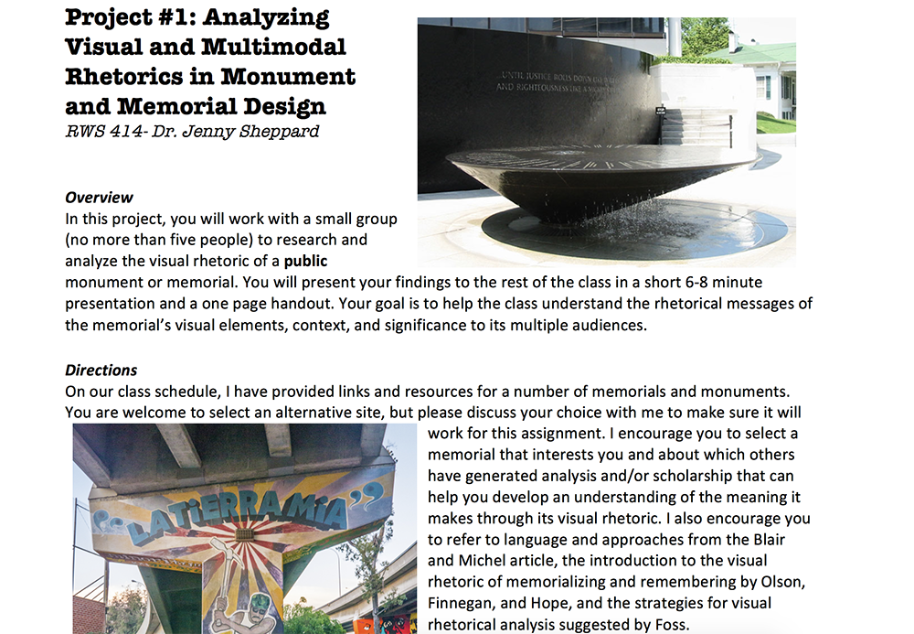
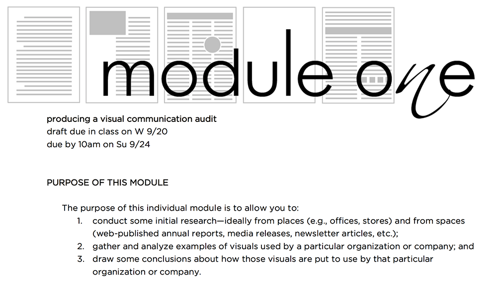
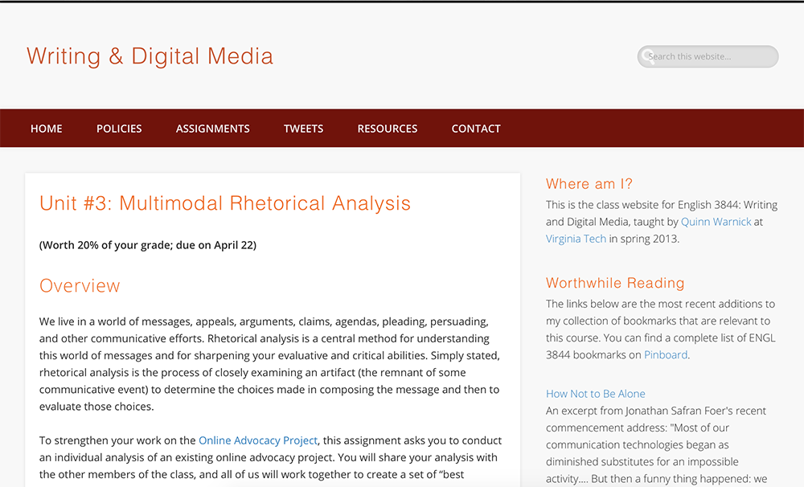
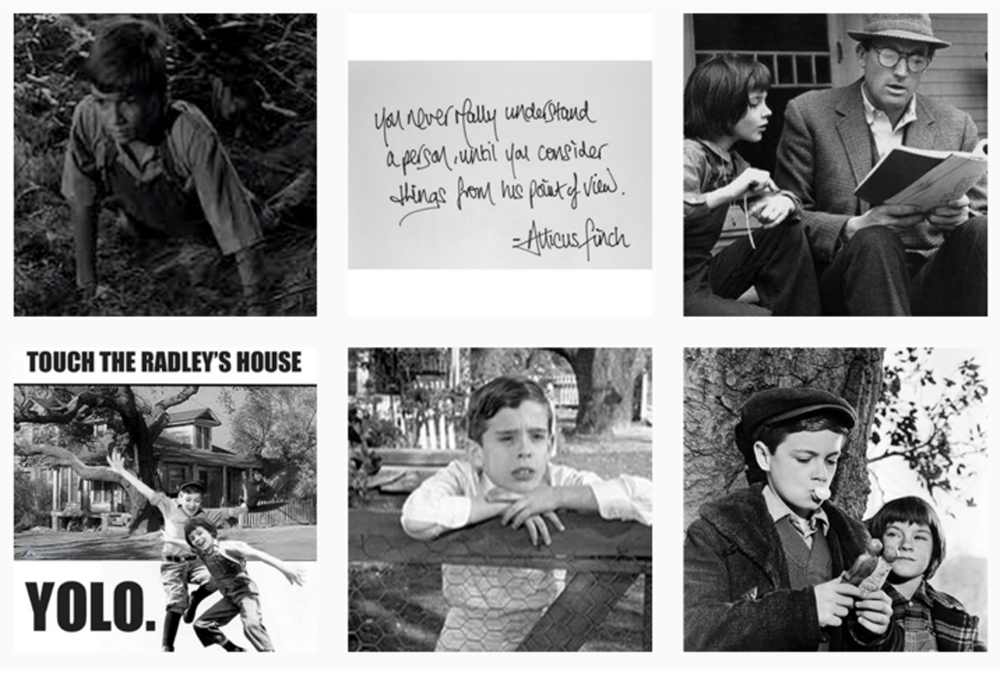
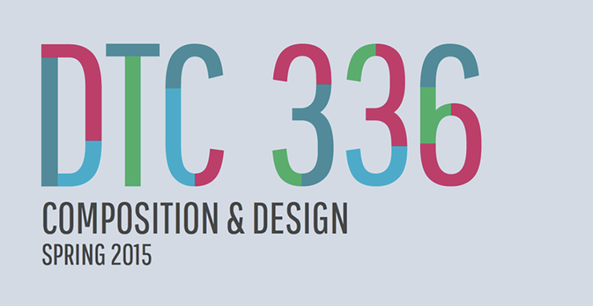
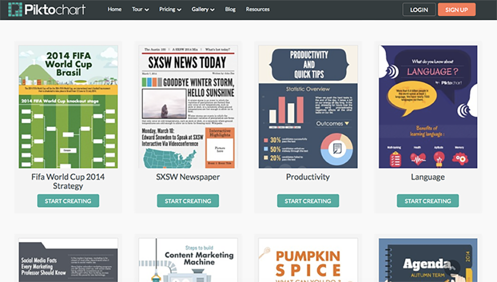
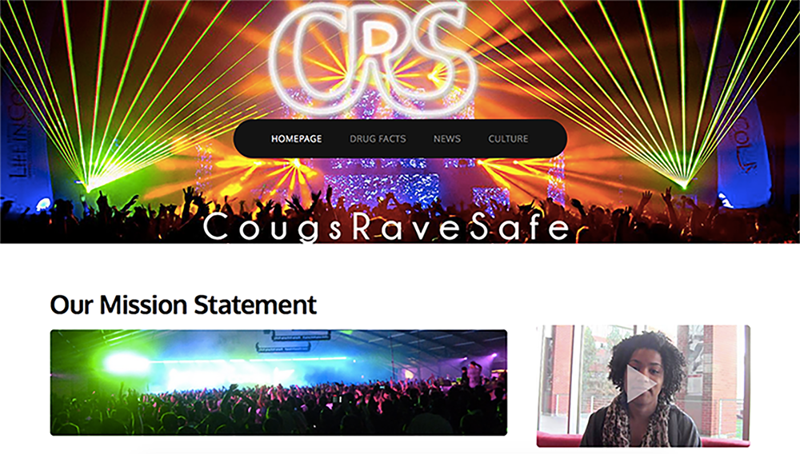
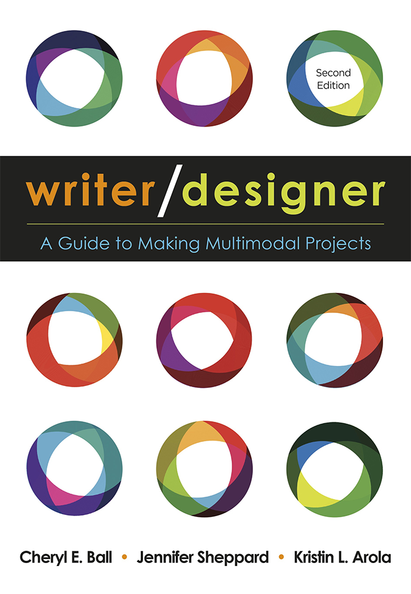
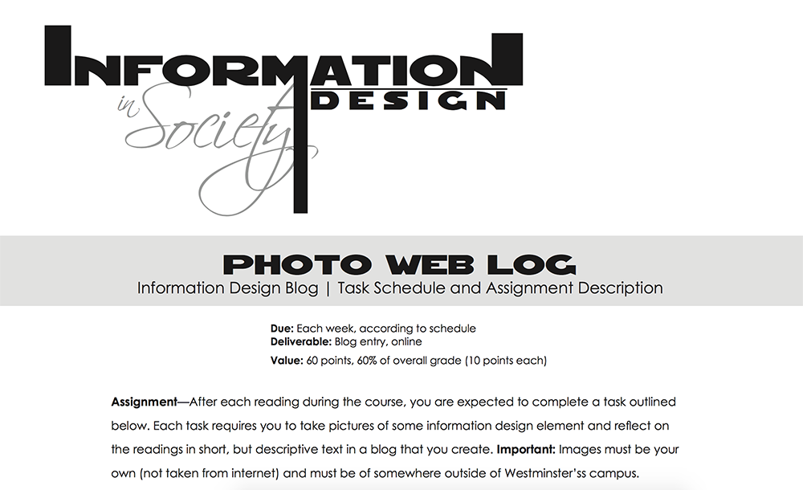
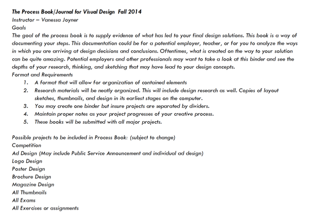

---

title: Digital Pedagogy in the Humanities

subtitle: Concepts, Models, and Experiments

chapter: Design

URL: keywords/design.md

author:

- family: Sheppard

  given: Jennifer

- family: Arola

  given: Kristin L. 

editor:

- family: Sayers & Harris

  given: Jentery & Katherine D.

publisher: Modern Language Association

type: book

---

# Design
### [Jennifer Sheppard](http://jennysheppard.com/) 
San Diego State University 
### [Kristin L. Arola](http://arola.kuurola.com) 
Michigan State University

---

##### Publication Status:
* unreviewed draft
* draft version undergoing editorial review
* draft version undergoing peer-to-peer review
* **draft version undergoing MLA copyediting**
* awaiting pre-print copy
* published 

---

### Cross-Reference Keywords: Assessment, Classroom, Disability, Failure, Gender, Makerspaces, Mapping, Multimodal, Race, Remix, Rhetoric, Queer, Sexuality, Sound, Video

---

## CURATORIAL STATEMENT 

## 

In the context of digital pedagogy, design is a holistic means for broadening and reframing the activities of meaning making. A design approach recognizes that meaning is made not just through linguistic content but also through arrangement, context of use, and multiple modes of expression. Rather than viewing communication in digital environments solely as a process of producing words for the screen or print, a design-oriented approach helps students learn to craft all aspects of communication at their disposal. Through purposeful design — the thoughtful selection and integration of text, images, sound, spatial considerations, and/or movement — students are able to utilize all available means of persuasion to deliver deliberative, rhetorically-savvy messages to their intended audience.

Design is inclusive of the creative invention and composing processes of a text/artifact and the specific rhetorical, aesthetic, and personal decisions that make the text/artifact what it is. That is, design refers both to the act of making and the artifact made. Teaching digital production and analysis through a design lens also relies necessarily on an understanding of all texts as multimodal. Even traditional print texts are constituted not just with words but also with visual and spatial considerations. A design-oriented approach, one that includes attention to 1) accessibility, 2) design thinking, and 3) critical design, helps students develop practices that offer greater control over all avenues for meaning-making in whatever context, medium, or mode they happen to be working.

First, a pedagogy grounded in universal design “respects human diversity and promotes inclusion of all people”… so that “the design of products and environments [can be] usable to the greatest extent possible by all people of all ages and abilities” (Story, Mueller, and Mace). By including a multitude of voices and needs throughout the design process, design solutions are integrative instead of fragmentary, and are more likely to work in meaningful ways for a much wider audience. Introducing principles of Universal Design into a digital pedagogy, such as flexibility in use, perceptible information, and tolerance for error, helps teach communication design in ways relevant to the diverse needs and expectations of 21st century audiences.

Second, a pedagogy attuned to "design thinking" is useful in enacting a usable and accessible design pedagogy. Design thinking is an exploratory, though systematized and creative problem-solving method for creating artifacts that are innovative, holistic, sustainable, and human-centered (Design-Thinking.org). Although the steps can vary, design thinking typically begins with carefully defining the problem at hand and finding ways to learn about and empathize with the needs of the target audience before developing initial concepts, drafts, and/or prototypes. Designers work to find solutions that are best suited for the greatest number of audience members possible.

Third, critical design helps to interrogate the role designed objects play in everyday life. Critical design offers a way to critique social, cultural, technical and economic concerns through analysis and design of artifacts. As Dunne and Raby argue, “It's more about values and an attitude, a way of looking at design and imagining its possibilities beyond the narrow definitions of what is presented through media and in the shops.” Critical design, and related critical endeavors in design, such as "adversarial design" (DiSalvo), "design fiction" (Sterling), and “critical play (Flanagan), all share an interest in pushing the boundaries of design and better understanding both how it is influenced by culture and how it can be used to question and reshape culture in more conscious ways. Such concerns can also be seen in multimodal rhetoric (Ball, Sheppard, and Arola).

To help leverage the affordances of emerging technologies, multiple modes of expression, and new expectations of readers/users, we advocate for the following pedagogical commitments for design, commitments that are further exemplified through the curated artifacts: 

1. First, students should find and analyze numerous examples of communication in different modes and media to encourage discussion and analysis of how and why different kinds of designs work (or don’t). 

2. Second, student should engage in hands-on learning in context (or what literacy scholars such as the New London Group refer to as situated practice). Reading and analyzing texts and making texts are very different sets of practices. It takes time and experimentation to learn how to design and implement rhetoric strategies in particular media, even if one can point out how they function in texts made by others. 

3. Finally, instructors should include multiple opportunities for critical self-reflection. Such activities call on students to move from implicit practice (just doing without considering why or how) to explicit understanding (the ability to name and explain the purposes of particular design choices). Through requiring students to write about and make conscious, deliberate design decisions in their projects, they are pressed to consider what worked, what didn’t, and how they might alter their approach in the future. 

## CURATED ARTIFACTS 

These artifacts are curated into three categories based on our pedagogical commitments for design: 1) Analyzing Design, 2) Producing Designs, and 3) Critical Self-Reflection. These assignments and resources foster a discursive understanding of the designs students both produce and encounter.

## Part 1: ANALYZING DESIGN

Our first commitment to design involves finding and analyzing numerous examples. These assignments provide ways of engaging with design analysis across a range of courses and topics.

### Analyzing Visual and Multimodal Rhetorics in Monuments and Memorials

* Artifact Type: Assignment and syllabus
* Source URL: [http://jennysheppard.com/wp-content/uploads/2017/09/sheppard_visual_rhetoric_monuments.pdf](http://jennysheppard.com/wp-content/uploads/2017/09/sheppard_visual_rhetoric_monuments.pdf)from a Rhetoric in Visual Culture course, [http://jennysheppard.com/wp-content/uploads/2017/06/rws414_spring16_sheppard_syllabus.docx](http://jennysheppard.com/wp-content/uploads/2017/06/rws414_spring16_sheppard_syllabus.docx)
* Creator: Jennifer Sheppard
* Copy of Artifact: [design-sheppard-vis_rhet_monuments.pdf](files/design-sheppard-vis_rhet_monuments.pdf)

This multi-step assignment asks students to select and analyze a monument or memorial of their choice. After completing several readings on visual, spatial, and performative rhetoric, student teams visit their chosen artifact (or review it online if it is not local) and complete a systematic analysis of its physical, contextual, and commemorative elements and present their findings to the rest of the class. As material objects, the design of monuments and memorials not only call viewers’ attention to visual symbols, but also to issues of location, kairos, absence, and audience interaction. That is, this analysis asks students to evaluate the multitude of ways the designer(s) created meaning and encouraged viewer participation in commemorative acts. 

### Visual Communication Audit

* Artifact Type: Assignment and syllabus
* Source URL: [https://www.msu.edu/~devossda/360/modules/module1.pdf](https://www.msu.edu/~devossda/360/modules/module1.pdf) from a Visual Rhetoric and Document Design course, [https://www.msu.edu/~devossda/360/](https://www.msu.edu/~devossda/360/)
* Creator: Danielle DeVoss
* Copy of Artifact: [design-devoss_comm_audit.pdf](files/design-devoss_comm_audit.pdf)

Focused on the professional writing classroom, this assignment asks students to identify an organization or company and to perform a visual audit. Students gather external communication (posters, flyers, handouts, reports, media releases, etc.) from the company or organization and analyze the work the visual aspects of these texts perform. The assignment allows students to explore how design choices help shape the message of a business or organization. 

### Multimodal Rhetorical Analysis

* Artifact Type: Assignment and syllabus
* Source URL: [http://3844s13.quinnwarnick.com/unit3/ from a Writing &](http://3844s13.quinnwarnick.com/unit3/) from a Writing & Digital Media course, [http://3844s13.quinnwarnick.com/](http://3844s13.quinnwarnick.com/) 
* Creator: Quinn Warnick
* Copy of Artifact: [design-Warnick-Multimodal Rhetorical Analysis.pdf](files/design-Warnick-Multimodal Rhetorical Analysis.pdf)

While the first two artifacts in this list look more specifically at design, this assignment folds design into a multimodal rhetorical analysis assignment. It also asks students to specifically consider how the analysis work they are doing can lead to a list of best practices for their own productions. Encouraging students to dig deeply within design analyses while also considering how those analyses can contribute to their own design practices is key in fostering a discursive understanding of design within digital pedagogy. Similar to how we ask students to analyze writing in the hopes they become more critical about reading and writing, this assignment asks students to analyze a multimodal text so as to become more critical about the multimodal texts they produce. More specifically, it asks them to take stock of the most effective strategies they encounter so as to produce a list of best practices for their own designs. This assignments helps make a bridge from analysis to production.

## Part 2: DESIGNING

Our second commitment to design is hands-on learning in context, or put more simply, designing. As described above, we believe students need practice in composing designs. Just as most English teachers believe students should both read *and* write alphabetic text, we believe students should both analyze *and* produce designs. These assignments ask students to mindfully engage in the design process.

### Remix a Story

* Artifact Type: Assignment and syllabus
* Source URL: [http://3844s15.tracigardner.com/assignments/project-4-remix-a-story/](http://3844s15.tracigardner.com/assignments/project-4-remix-a-story/) from a Writing and Digital Media course, [http://3844s15.tracigardner.com/syllabus/](http://3844s15.tracigardner.com/syllabus/)
* Creator: Traci Gardner
* Copy of Artifact: [design-gardner_Remix_a_Story.pdf](files/design-gardner_Remix_a_Story.pdf)

Redesigning asks students to consider how the design of a text encourages a certain understanding of that text. In this assignment, Traci Gardner asks her students to take an existing story told through the written word and translate it into a multimodal version. By asking students to think creatively about how to redesign and represent text in a new format, students must consider how the design choices they make have rhetorical effects. This assignment can be used in literature courses as a way of interrogating how a story is told, shaped, read, and understood through the modal choices used.

### Autobiographical Icons

* Artifact Type: Assignment
* Source URL:
    * Part (1), [http://baddayeveryday.com/teaching/2015/spring/dtc336/project2_1](http://baddayeveryday.com/teaching/2015/spring/dtc336/project2_1)
  * Part (2), [http://baddayeveryday.com/teaching/2015/spring/dtc336/project2_2](http://baddayeveryday.com/teaching/2015/spring/dtc336/project2_2)
  * Part (3), [http://baddayeveryday.com/teaching/2015/spring/dtc336/project2_3](http://baddayeveryday.com/teaching/2015/spring/dtc336/project2_3)
  * Assessment, [http://baddayeveryday.com/teaching/docs/dtc336/DTC336_project_2_grading_sheet.pdf](http://baddayeveryday.com/teaching/docs/dtc336/DTC336_project_2_grading_sheet.pdf)
  * From a Composition and Design course, [http://baddayeveryday.com/teaching/2015/spring/dtc336/syllabus](http://baddayeveryday.com/teaching/2015/spring/dtc336/syllabus)
* Creator: Jeff Kuure
* Copy of Artifact: [design-kuure-dtc336_assessment.pdf](files/design-kuure-dtc336_assessment.pdf)

In this three-part assignment, Jeff Kuure asks his students to develop a set of personalized icons that represent actions taken throughout the day. Students are asked to consider how icons function as design cues for particular audiences in particular situations. While the final project includes icons drawn through Adobe Illustrator, this assignment is easily modified for less technical courses where students could simply hand-draw the icon with a written description. Producing icons allows students to consider the ways in which simple design choices, when done well, can convey complicated meaning. It also helps students think through the ways they as audience members understand and use icons in their daily lives.

### Infographic Assignment

* Artifact Type: Assignment 
* Source URL: [http://williamwolff.org/courses/ia-spring-2013/ia-assignments-s13/ias13-infographic-assignment/ ](http://williamwolff.org/courses/ia-spring-2013/ia-assignments-s13/ias13-infographic-assignment/ )
* Creator: Bill Wolff
* Copy of Artifact: [design-wolff_inforgraphic.pdf](files/design-wolff_inforgraphic.pdf)

Infographics are visual representations of information or data and provide an interesting way of considering how design impacts the ways information is understood. The decision to represent wealth inequality through a line graph as opposed to icons of people drawn to scale to represent average salary, speaks to issues of purpose and audience and is an engaging way to help students see the rhetorical role of design. In this assignment, Bill Wolff asks his students to engage with Edward Tufte's and Ellen Lupton's theories of design, typography, and evidence presentation through creating infographics with Piktochart (a free online infographic creator). Along with producing an infographic, students also write a reflection in which they describe their objective, their rhetorical strategies, and the ways in which they engaged with Tufte and Lupton's theories of information design. While we have categorized this assignment under "Producing Design," it includes a nice balance of both producing and reflecting, thus enacting critical self-reflection, our third pedagogical commitment to design pedagogy as defined above.

### Informational Campaign

* Artifact Type: Assignment and syllabus
* Source URL: [http://arola.kuurola.com/355/fall14/project4.html ](http://arola.kuurola.com/355/fall14/project4.html) from a Multimedia Authoring: Exploring New Rhetorics course, [http://arola.kuurola.com/355/fall14](http://arola.kuurola.com/355/fall14)
* Creator: Kristin Arola
* Copy of Artifact: [design-arola_info_campaign.pdf](files/design-arola_info_campaign.pdf)

In this assignment, Arola has her students work in groups to design an informational campaign that includes a clearly defined graphic identity, a short video, and a website. Students begin by analyzing other campaigns and composing a list of best practices, after which they work through a series of steps in order to complete the final product. While this assignment usually takes 5-7 weeks of a semester, pieces of it can be pulled to suit a variety of pedagogical goals. Design plays a large role in that students must consider how to best share information with an audience through the use of still and moving images. Students also engage in self-reflections throughout, giving a pitch presentation and also presenting the final project. While categorized within production, this assignment brings together analysis, production, and self-reflection, thus enacting all of our design pedagogy commitments.

## Part 3: CRITICAL SELF-REFLECTION

Our third pedagogical commitment to design includes incorporating multiple opportunities for critical self-reflection. So as to engage in self-reflection about the designs produced or encountered, students need a vocabulary to discursively engage with design. The analysis assignments in Part 1 suggest some ways of folding in terminology; however, these three artifacts provide specific vocabulary that we find useful. You might also consider turning to terminology you are already familiar with (from rhetorical analysis, film studies, document design, etc.).

### Writer/Designer: A Guide to Making Multimodal Projects

* Artifact Type: Book
* Source URL: [http://www.macmillanlearning.com/Catalog/product/writerdesigner-secondedition-ball](http://www.macmillanlearning.com/Catalog/product/writerdesigner-secondedition-ball)
* Creators: Cheryl E. Ball, Jennifer Sheppard, and Kristin L. Arola
* Copy of Artifact: none

As the authors of this textbook and this entry, we understand ourselves not so much as writing teachers, but as teachers of rhetoric who help our students leverage the communication options at their disposal. The title of our book, *Writer/Designer*, reflects our belief that writing and designing always work together. Whether we are authors working with words, images, sound, or movement, decisions about what the content says and how it looks and functions are necessarily entwined, even when we do not pay conscious attention to their relationship. The book moves students from analysis to production and provides both the language to discuss design choices as well as a step-by-step process for designing multimodal texts. With plenty of visual examples, *Writer/Designer* provides a design-based approach to multimodal composing.

### Photo WebLog Assignment

* Artifact Type: Assignment and syllabus
* Source URL: [http://thevisualcommunicationguy.com/wp-content/uploads/2013/10/PhotoWebLog_AssignmentDescription.pdf](http://thevisualcommunicationguy.com/wp-content/uploads/2013/10/PhotoWebLog_AssignmentDescription.pdf) from an Information Design in Society course, http://thevisualcommunicationguy.com/wp-content/uploads/2013/10/InformationDesignInSociety_Syllabus.pdf
* Creator: Curtis Newbold
* Copy of Artifact: [design-newbold-PhotoWebLog.pdf](files/design-newbold-PhotoWebLog.pdf)

In this assignment, Curtis Newbold asks students to take photos of real life communication design and to analyze their effectiveness in helping people navigate the world. Importantly, students post these images and analyses to their blogs and then reflect on how they utilize (or don’t) concepts from the course readings. This final reflective step is crucial in helping students to bridge the divide between concepts in information design and the functionality and effectiveness of these concepts as implemented in the physical world.

### The Process Book/Journal

* Artifact Type: Assignment 
* Source URL: [http://www.uttyler.edu/communication/files/mcom3311_vis_design_fall_15.pdf](http://www.uttyler.edu/communication/files/mcom3311_vis_design_fall_15.pdf)
* Creator: Vanessa Joyner
* Copy of Artifact: [design-joyner-process-book.pdf](files/design-joyner-process-book.pdf)

In this semester-long project, Vanessa Joyner calls on students to document all stages in the design process (research, concept, design, and application) of their course projects. She argues that such notebooks can be useful for students in demonstrating their practices to potential employers and for reflecting on and improving their processes for thinking, researching, conceptualizing, and refining their design solutions. Significantly, Joyner calls students’ attention to the value of critical reflection on completed design in the “application” stage. Specifically, she asks them to consider the relevance and effectiveness of their final designs for their intended audiences and purposes and what they can apply from this experience to future projects. 

## RELATED MATERIALS

 

Arola, Kristin, Jennifer Sheppard and Cheryl E. Ball. “Multimodality as a Frame for Individual and Institutional Change.” *Hybrid Pedagogy*. [http://www.hybridpedagogy.com/journal/multimodality-frame-individual-institutional-change/](http://www.hybridpedagogy.com/journal/multimodality-frame-individual-institutional-change/)

Lupton, Ellen and Christopher Clark. Thinking With Type. [http://www.thinkingwithtype.com/](http://www.thinkingwithtype.com/)

New London Group. “A Pedagogy of Multiliteracies: Designing Social Future.” [http://www.static.kern.org/filer/blogWrite44ManilaWebsite/paul/articles/A_Pedagogy_of_Multiliteracies_Designing_Social_Futures.htm](http://www.static.kern.org/filer/blogWrite44ManilaWebsite/paul/articles/A_Pedagogy_of_Multiliteracies_Designing_Social_Futures.htm)

Newbold, Curtis. "The Visual Communication Guy - Teaching Materials." [http://thevisualcommunicationguy.com/resources/teaching-aids/](http://thevisualcommunicationguy.com/resources/teaching-aids/)

Wysocki, Anne Frances, Johndan Johnson-Eilola, Cynthia L. Selfe &Geoffrey Sirc. *Writing New Media: Theory and Applications for Expanding the Teaching of Composition*. [http://www.usu.edu/usupress/books/index.cfm?isbn=5755](http://www.usu.edu/usupress/books/index.cfm?isbn=5755)

## WORKS CITED

Arola, Kristin L. “Informational Campaign.” http://arola.kuurola.com/355/fall14/project4.html Accessed 29 September 2017.

---. “The Design of Web 2.0: The Rise of the Template, the Fall of Design.” *Computers & Composition*, vol. 27, no. 1, 2010, pp. 4-14. 

Ball, Cheryl E., Jennifer Sheppard, and Kristin Arola.  *Writer/Designer: A Guide to Making Multimodal Projects.* 2nd ed., Bedford/St. Martin’s, 2017. 

DeVoss, Dànielle Nicole. “Visual Communication Audit.” [https://msu.edu/~devossda/360/pdfs/wra_360_SYLLABUS.pdf](https://msu.edu/~devossda/360/pdfs/wra_360_SYLLABUS.pdf). Accessed 29 September 2017.

Design-Thinking.org. “Design Thinking Workshop Classes.” [http://design-thinking.org/en/index.html](http://design-thinking.org/en/index.html). Accessed 22 May 2016.

DiSalvo, Carl. *Adversarial Design.* MIT Press, 2012. 

Dunne, Anthony and Fiona Raby. “Critical Design FAQ.” [http://www.dunneandraby.co.uk/content/bydandr/13/0](http://www.dunneandraby.co.uk/content/bydandr/13/0). Accessed 20 May 2016.

Flanagan, Mary. *Critical Play: Radical Game Design.* MIT Press, 2013. 

Gardner, Traci. “Remix a Story.” [http://3844s15.tracigardner.com/assignments/project-4-remix-a-story/](http://3844s15.tracigardner.com/assignments/project-4-remix-a-story/) Accessed 29 September 2017.

Jewitt, Carey and Jeff Bezemer. *Introducing Multimodality.* Routledge, 2016. 

Joyner, Vanessa. “The Process Book/Journal.” [http://www.uttyler.edu/communication/files/mcom3311_vis_design_fall_15.pdf](http://www.uttyler.edu/communication/files/mcom3311_vis_design_fall_15.pdf). Accessed 29 September 2017.

Kuure, Jeff. “Autobiographical Icons.” [http://baddayeveryday.com/teaching/2015/spring/dtc336/project2_1](http://baddayeveryday.com/teaching/2015/spring/dtc336/project2_1).  Accessed 29 September 2017.

Lupton, Ellen. *Thinking with Type: A Critical Guide for Designers, Writers, Editors, and Students.* 2nd ed. Princeton Architectural Press, 2010. 

Mace, Ronald L., Graeme J. Hardie, and Jaime P. Place. “Accessible Environments: Toward Universal Design.” *Toward a More Human Architecture.* Edited by W.E. Preiser, J. C. Vischer, and E. T. White. Van Nostrand, 1991

New London Group. “A Pedagogy of Multiliteracies: Designing Social Futures.” *Harvard Educational Review,* vol. 66, no. 1, 1996, pp. 60-93. 

Newbold, Curtis. *The Visual Communication Guy - Teaching.* [http://thevisualcommunicationguy.com/resources/teaching-aids/](http://thevisualcommunicationguy.com/resources/teaching-aids/). Accessed 27 Sept. 2017

——-. “Photo WebLog Assignment.” [http://thevisualcommunicationguy.com/wp-content/uploads/2013/10/PhotoWebLog_AssignmentDescription.pdf](http://thevisualcommunicationguy.com/wp-content/uploads/2013/10/PhotoWebLog_AssignmentDescription.pdf). Accessed 29 September 2017.

Rosner, Daniela. “Reshaping the Limits of Design in HCI.” *IX Interactions*, vol. XXII, no. 2, 2015, pp. 67-69. Accessed 15 May 2016.

Sheppard, Jennifer. "Analyzing Visual and Multimodal Rhetorics in Monuments and Memorials." [http://jennysheppard.com/wp-content/uploads/2017/09/sheppard_visual_rhetoric_monuments.pdf](http://jennysheppard.com/wp-content/uploads/2017/09/sheppard_visual_rhetoric_monuments.pdf) Accessed 29 September 2017.

—--. “The Rhetorical Work of Multimedia Production Practices: It’s More than Just Technical Skill.” *Computers and Composition*, vol. 26, no. 2, 2009, pp. 122-131. 

Stanford d.school. *Virtual Crash Course in Design Thinking.* [https://dschool.stanford.edu/resources-collections/a-virtual-crash-course-in-design-thinking](https://dschool.stanford.edu/resources-collections/a-virtual-crash-course-in-design-thinking). Accessed 15 May 2016.

Sterling, Bruce. “Design Fictions.” *Interactions.* vol. 16, no. 3, 2009, pp. 20-24. 

Warnick, Quinn. “Multimodal Rhetorical Analysis.” [http://3844s13.quinnwarnick.com/unit3/](http://3844s13.quinnwarnick.com/unit3/). 29 September 2017.

Wolff, William. “Infographic Assignment.” [http://williamwolff.org/courses/ia-spring-2013/ia-assignments-s13/ias13-infographic-assignment/](http://williamwolff.org/courses/ia-spring-2013/ia-assignments-s13/ias13-infographic-assignment/). Accessed 29 September 2017.

Wysocki, Anne Frances, Johndan Johnson-Eilola, Cynthia L. Selfe & Geoffrey Sirc. *Writing New Media: Theory and Applications for Expanding the Teaching of Composition*. Utah State University Press, 2004. 

