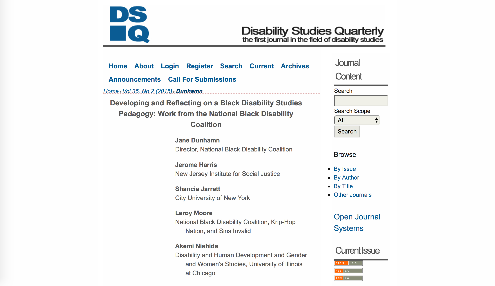
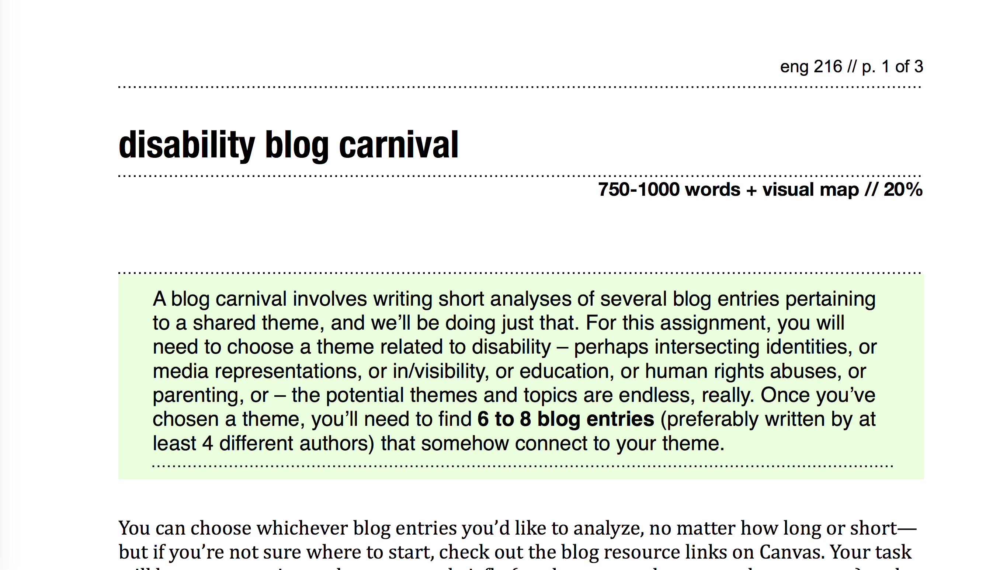
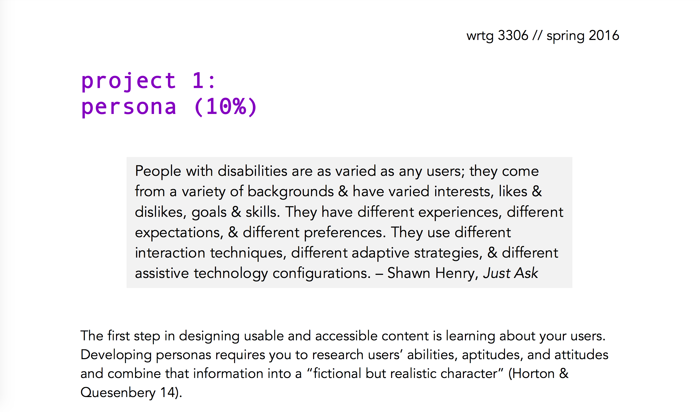
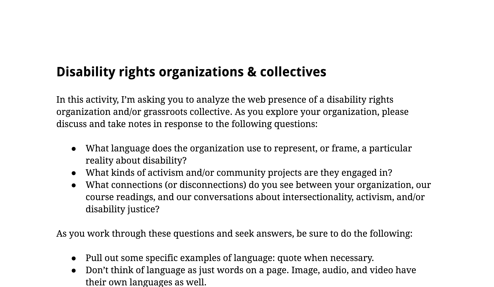
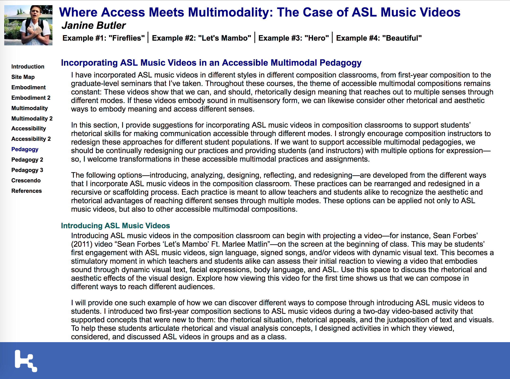
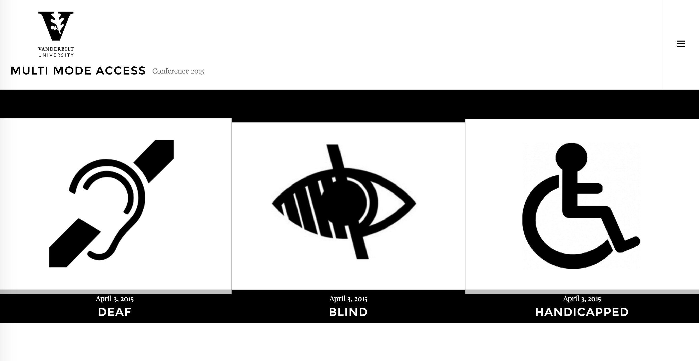
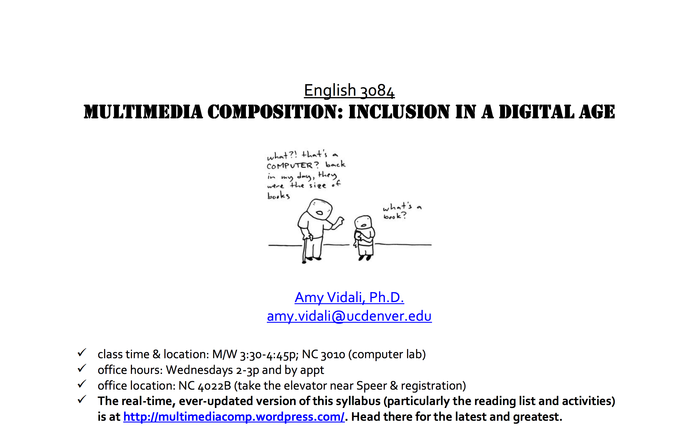
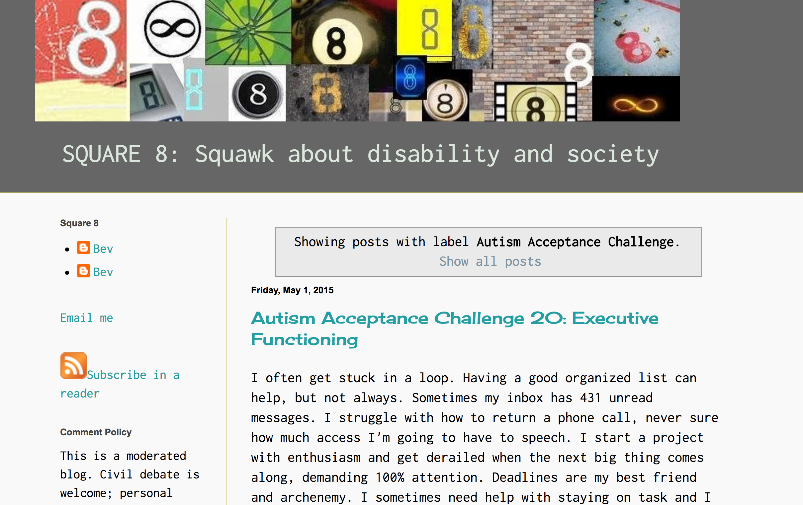
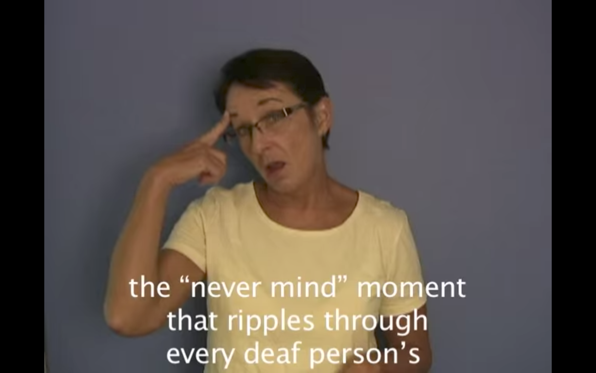

# DISABILITY  

## Melanie Yergeau
University of Michigan | [http://kuiama.net](http://kuiama.net)

---

##### Publication Status:
* unreviewed draft  
* draft version undergoing editorial review 
* **draft version undergoing MLA copyediting**
* awaiting pre-print copy
* published 

---

### Cross-Reference Keywords: access, rhetoric, social justice

---

## CURATORIAL STATEMENT 

Representation is a double-edged sword in disability studies. Representation, as a term, signals how disability is represented across media: in literature, film, public policy statements, ad campaigns, and so on. In other words, how are disabled people represented by others? But representation also summons questions about constituency and participation. For instance, how are disabled people included in the conversations that most concern them, if at all? How do disabled people advocate, collectivize, make meaning, and crip social structures? These representational questions are central to disability studies, not merely because of their re-centering of disability from the margins, but because they prod scholars and activists to consider historical and contemporary elisions in the field.

This particular curation examines disability's exigences by means of topics that complicate notions of passive representation. Students who have taken disability studies courses frequently relate that it is hard to unsee disability, in the world writ large, after they have taken such a class. Attention to disability, whether in a class exercise or major assignment, has tremendous potential to reshape the ways in which students come to understand themselves and the world around them. In this regard, representation often holds a dual meaning in disability-oriented pedagogy. For instance, disability activists work to direct thinking from "how many people have disabilities and how do we help them?" to "how, where, and to what extent are disabled voices being amplified"? With the latter question, there is a move from *assisting* and *curing* toward organizing and agency. This question can be asked in terms of self-representation, or how disabled people are given space and opportunity to narrate their own experiences. It can also be asked in terms of other-representation, or how nondisabled people effect representations of disability.

These questions concerning representation have significantly evolved over the past twenty years. In 1998, Simi Linton famously claimed in *Claiming Disability: Knowledge and Identity* that humanistic fields were perhaps the most hospitable spaces for teaching disability studies. Her argument, in effect, concerned the ways in which allied health fields -- in particular, medicine, psychology, and special education -- conceived disability purely as a phenomenon in need of fixing, as numbers that should inspire fear in us all. In short, such classes tend to imagine cohorts of nondisabled students who will, in their future careers, serve as helpers and fixers -- this, as opposed to a pedagogical focus on systems change, culture, or identity. Over the past decade, disability studies has expanded well beyond Linton's earlier framework. As Elizabeth Brewer and Brenda Brueggemann note in their survey of articles published in [*Disability Studies Quarterly*](http://dsq-sds.org/article/view/4258/3598) between 2000-2012, the field has grown considerably more interdisciplinary, and considerably more mediated. 

The mediation of disability studies has largely to do with conflicting affordances and drawbacks of digital spaces for disability activism. But it also has to do with other questions about representation, not only about nondisabled people and ideologies of ability, but the ways in which disability studies and activism has represented itself. As many of the artifacts below contend, disability studies has been a concertedly white and classed project , what Chris Bell and Sami Schalk have referred to as White Disability Studies. Disabled people of color are routinely erased from the narratives scholar-activists tell about the field and its histories. As well, academic spaces are spaces of distinct class and educational privilege. Queer and disabled activists of color have forwarded disability justice as an intersectional framework that works to redress these omissions and injustices, encouraging interdependence, solidarity, and collective access as modes of action. As Patty Berne notes, disability justice "holds a vision born out of collective struggle, drawing upon the legacies of cultural and spiritual resistance within a thousand underground paths, igniting small persistent fires of rebellion in everyday life." 

As teachers, we need to consider the ways in which our classrooms, and our own positions and privilege, recreate the dynamics that disability studies has long sought to dismantle: that of the distal researcher studying marginal subjects, without their consent in the subjects that concern them most. Those who are new to disability studies should not come to these artifacts with yet more trepidation. Rather, these dynamics, many of them painful, might inspire questions, hopes, ideas, and, as Jay Dolmage says, "[places to start](http://dsq-sds.org/article/view/4632/3946)" in the re/design of pedagogical and activist spaces that work to center multiply marginalized people. Whose voices are being amplified in the texts that we assign or analyze? 

The artifacts below are not exhaustive introductions to disability studies, but they provide entry points for considering the many valences of the field -- its erasures, its emerging conversations, and its complicated relationships with digital pedagogy. Thematically, these artifacts might be conceptualized as resources that highlight human rights issues, theorize intersectionality and identity, relate the potentialities as well as the incommensurabilities of multimodal texts, and/or provide methods for helping students apprehend the complexities of the field. As well, these artifacts complicate and "crip" what we might term academic texts. Such conversations about power and the academy are important in disability studies, and they can spark robust discussions in the classroom about norms, genre, identity, and composing.

## CURATED ARTIFACTS 

### Developing and Reflecting on a Black Disability Studies Pedagogy

* Artifact type: Article, syllabus 
* Source: [http://dsq-sds.org/article/view/4637/3933](http://dsq-sds.org/article/view/4637/3933)
* Creators: Jane Dunhamn, Jerome Harris, Shancia Jarrett, Leroy Moore, Akemi Nishida, Margaret Price, Britney Robinson, Sami Schalk

Combining reflective essay and syllabus, this article troubles disability studies and its elisions of Black disability, as well its failure to engage African American and African diaspora studies. The article explores the contours of what Black Disability Studies (BDS) might mean both as a curricular agent and a discipline unto itself, while also resisting a definition or singular construction of BDS. The authors pose a series of meditations on their experiences as faculty, students, and activists in disability studies classes and the field writ large. The article concludes with an outline of a course themed on Black Disabled Experience, which includes learning objectives, core competencies, and a list of course readings. The authors note that this syllabus could form the basis of a stand-alone BDS course, but it could also be used in service of radically reimagining other courses. For example, while this article will strike instructors as being incredibly generative and paradigm-changing for graduate courses or teacher training, it can also be a powerful read in undergraduate courses. Students, for example, might consider how and where to re/narrate intersections of blackness, identity, and/or disability in courses they have taken, and to think critically about their own positionalities and the paucity of such conversations or texts in their classes. As well, students might be encouraged to design their own BDS resources and to make their work accessible to broader publics online.

### Disability Blog Carnival

* Artifact type: Assignment 
* Source: [http://kuiama.net/portfolio/wp-content/uploads/2017/09/carnival.pdf](http://kuiama.net/portfolio/wp-content/uploads/2017/09/carnival.pdf)
* Creator: Melanie Yergeau

Often likened to a traveling blog, blog carnivals typically host links and summaries of blog posts related to a specific topic. A prominent disability blog carnival, for example, is [Blogging Against Disablism Day](https://www.facebook.com/BloggingAgainstDisablismDay/) (BADD), in which bloggers write on topics relating to disability discrimination and social justice. Modeled after BADD, the disability blog carnival assignment asks students to choose a disability-related topic, research an allied set of disability rights blogs, and compose a longform blog post that synthesizes key strands among 6-8 blog posts related to their chosen topic. Student carnivals, for example, might include topics such as Latinx disability rights, neuroqueer activism, psychiatric survivorship, or capitalism and disability. In the broader spirit of accessibility, students are also tasked with creating visual maps that summarize or supplement the overall findings within their carnival. Blogs that students typically find useful as starting points for their research include [Krip Hop Nation](http://kriphopnation.com/), [Autistic Hoya](http://autistichoya.com/), [Disability Studies at Temple](http://disstud.blogspot.com/), [Intersected](http://intersecteddisability.blogspot.com/),[Disability in KidLit](http://disabilityinkidlit.wordpress.com), and [NeuroQueer](http://neuroqueer.blogspot.com/).

### (Disability) Persona

* Artifact type: Assignment 
* Source: [http://allisonhitt.com/3306_project1.pdf](http://allisonhitt.com/3306_project1.pdf)
* Creator: Allison Hitt

An assignment for Hitt's undergraduate Writing As Information Design class, the disability persona project asks students to profile an imaginary disabled student at the University of Central Arkansas. Students are tasked with conducting demographic research, learning about a disability of their choosing, and conceptualizing their imagined student's needs and abilities when engaging texts across mode and platform. Hitt instructs students to avoid stereotyping disabled people and suggests they learn about disability from first-person blogs and life writing, while also attending to intersecting aspects of identity, such as nationality, race, gender, and class. Importantly, this assignment is the first in a larger sequence of accessibility protocols and user testing projects in the class. In the prompt, Hitt notes that conducting user research with this level of specifity is key to thinking about accessible design and thinking critically about disability.

### Disability Rights Organizations and Collectives

* Artifact type: Activity 
* Source: [http://bit.ly/2wfQn55](http://bit.ly/2wfQn55)
* Creator: Melanie Yergeau

Structured across one or more class periods, this activity rotates between small group discussion, web research, and digital reporting of findings via a short presentation in class. In teams of two or four, students investigate a disability rights organization and/or a grassroots collective and research its history, initiatives, and representations of disability (visually, textually, and aurally). Discussion questions prompt students to not only learn the missions of an organization, but to also critically examine how the collective imagines disability in the context of broader intersectional discourses on oppression, identity, and civil rights. Typically, this exercise follows an earlier activity in which students examine and present findings on disability charities, which are overwhelmingly white and affluent in the make-up of board members as well as images on websites. Notably, the charities from the first exercise tend to be rehabilitative and corporate in approach, a radical divergence from the groups students encounter in this exercise. As well, the organizations in this exercise include nonprofits, archival projects, performance collectives, and virtually-based grassroots groups. Students report their findings via a shared blog space, taking care to make all material created accessible to a broad audience within and beyond the class.

### Incorporating ASL Music Videos in an Accessible Multimodal Pedagogy

* Artifact type: Handout 
* Source: [http://kairos.technorhetoric.net/21.1/topoi/butler/pedagogy1.html](http://kairos.technorhetoric.net/21.1/topoi/butler/pedagogy1.html)
* Creator: Janine Butler

Butler's ASL music video handout is embedded in a *Kairos* webtext article that examines the affordances of multisensory pedagogies. Describing the viewing experience as "a stimulatory moment in which teachers and students alike can assess their initial reaction to viewing a video that embodies sound through dynamic visual text, facial expressions, body language, and ASL," Butler asks students to watch videos such as Sean Forbes's "Sean Forbes 'Let’s Mambo' Ft. Marlee Matlin." She then structures class discussion around a series of prompts from the discussion handout, each of which encourages students to consider the complex interrelations between visual and rhetorical analysis. While this handout is primarily directed toward writing classes, Butler notes that this exercise can be used across discipline, rank, and mode of composition, and could be used as a tool to jumpstart discussions about collective access and interdependence.

### Modes of Embodiment: MULTI MODE ACCESS

* Artifact type: Student work
* Source: [https://multimodeaccess.wordpress.com/](https://multimodeaccess.wordpress.com/)
* Creators: Aimi Hamraie and Informational Access Design Team at Vanderbilt University

*Modes of Embodiment* is a student-organized website and conference developed as part of Hamraie's 2015 [Bionic Bodies, Cyborg Cultures](https://aimihamraie.wordpress.com/teaching/) course. For their final project in the course, students may choose between composing an individual paper or group design project. Students then present these projects at a conference that they collaboratively organize, both physically and virtually, with an attention to accessibility. Structured across modes, the conference website provides material access through text, audio recordings, PowerPoint slides, and an active tweetstream. The conference site provides not only an example of an accessible website, but it likewise models robust collaborative pedagogy. Hamraie notes that Master's students organize and moderate the panels on top of designing the website, taking communal responsibility for advertising and running the conference. As well, the conference routinely extends beyond the contours of the class. Community members attend sessions, and people external to Vanderbilt participate in the conversation via Twitter.

### Multimedia Composition: Inclusion in a Digital Age

* Artifact type: Syllabus
* Source: [https://view.officeapps.live.com/op/view.aspx?src=https://avidali.files.wordpress.com/2013/03/3084-syllabus-sp-2012.doc](https://view.officeapps.live.com/op/view.aspx?src=https://avidali.files.wordpress.com/2013/03/3084-syllabus-sp-2012.doc)
* Creator: Amy Vidali

An upper-level undergraduate seminar, Vidali's course employs inclusivity as a lens through which to re-assess common methods in multimodal composing: visual rhetoric, auditory rhetoric, and hypertextual rhetoric. For instance, Vidali asks students to consider how Temple Grandin's *Thinking in Pictures* complicates some of the common assumptions that visual rhetoric scholarship imparts about seeing and knowing. The curriculum is structured evenly across texts from digital rhetoric and disability studies, with works from each field spanning genre and mode. In keeping with the diversity of course texts, Vidali asks students to compose broadly. Assignments include analyzing a personal experience in comic form; a musical genre analysis, in which students present their findings via podcast; and an accessibly designed hypertext. Instructors will find Vidali's syllabus a useful launching point for assignment and reading ideas, but perhaps most notable is the syllabus's attention to accessibility (see, for example, the disability inclusion statement) as well as its embedded links to the course blog, which features student writing. 

### Recognizing Disability Studies

* Artifact type: Syllabus
* Source: 
* Creator: Margaret Price

*Recognizing Disability Studies* is a graduate-level seminar that examines the histories, turns, and challenges within disability studies as a field. Structured around elisions and potential futures, the course features units dedicated to bioethics, critical race theory, mental disability, crip theory, and materiality. Accessibility thematically structures all course projects. In particular, Price encourages students to compose in a modality of their choosing (i.e., via forms most accessible to students), while also requiring students to craft accessibly designed projects (i.e. creating projects accessible to broad audiences). Course projects include reading responses and participation in the class discussion forum, a collaborative presentation of supplemental course readings, and a final project composed in a genre and/or mode relevant to students' home fields. 

### SQUARE 8: Autism Acceptance Challenge

* Artifact type: Exercise 
* Source URL: [http://aspergersquare8.blogspot.com/search/label/Autism%20Acceptance%20Challenge](http://aspergersquare8.blogspot.com/search/label/Autism%20Acceptance%20Challenge)
* Creator: Bev Harp

*SQUARE 8* represents among the most heavily mediated and resourced examples of disability activism blogs. Run by Bev Harp, *SQUARE 8* has led a number of internet campaigns over the past decade, ranging from 2015's [Autism Acceptance Challenge](http://aspergersquare8.blogspot.com/search/label/Autism%20Acceptance%20Challenge) to 2010's [Late Intervention Campaign](http://aspergersquare8.blogspot.com/2010/02/late-interventions-contributions-from.html), the latter of which wryly targeted the curative and often child-centric focus of autism research. The Autism Acceptance Challenge is more of an education-centered campaign, one that is directed broadly toward an audience that is wanting and willing to learn. A series of twenty different posts, the challenges include [an exercise that involves interviewing autistic people](http://aspergersquare8.blogspot.com/2015/04/autism-acceptance-challenge-16-ask.html), a [discussion (or writing) prompt](http://aspergersquare8.blogspot.com/2015/04/autism-acceptance-challenge-15-whats.html) wherein Harp asks readers to reflect on what object/idea/obsesson gets them through the day, and a [neuroqueering challenge](http://aspergersquare8.blogspot.com/2015/04/autism-acceptance-challenge-14.html) that encourages readers to remix, vandalize, and/or queer autism stereotypes found in images and visual ad campaigns. 

### "Why I Mind" 

* Artifact type: Exercise, video
* Source URLs: Video with subtitles: [https://www.youtube.com/watch?v=RoNR6EWT7D4](https://www.youtube.com/watch?v=RoNR6EWT7D4); video without subtitles: [https://www.youtube.com/watch?v=J4ak5HHcrnI](https://www.youtube.com/watch?v=J4ak5HHcrnI)
* Creator: Brenda Brueggemann

When leading workshops on captioning and disability, Brueggemann asks viewers to watch two versions of "Why I Mind": one captioned, the other not. In this six-minute video, Brueggemann stories through the common refrain that deaf people face when asking others to repeat words and conversations: "never mind." Using a combination of audio narration, subtitles, visuals, and ASL, Brueggemann leads viewers through the story of Carl Dupree, a Gallaudet student who was killed by police while trying to sign. Upon showing each version, Brueggemann asks students to write on notecards, instructing them to pay close attention to the rhetorical affordances of the captioned video. As well, Brueggemann at times plays a third variant of the videos, using YouTube's auto-caption feature on the uncaptioned video. Auto-caption, on the whole, results in wildly inaccurate captions, but also, as Brueggemann notes, can generate a kind of found disability poetry. Typically, students will have read Sean Zdenek's ["Which  Sounds Are Significant?"](http://dsq-sds.org/article/view/1667/1604) prior to this exercise; Zdenek's piece provides students a starting point for observing text contrast, placement, proximity, speed, and transcription choices.

## RELATED MATERIALS
 
Dolmage, Jay. "Universal Design: Places to Start." [http://dsq-sds.org/article/view/4632/3946](http://dsq-sds.org/article/view/4632/3946)

*All the Weight of Our Dreams: On Living Racialized Autism*. Eds. Lydia X.Z. Brown, E. Ashkenazy, and Morénike Giwa Onaiwu. 2017. [https://autismandrace.com/](https://autismandrace.com/)

Rhett & Link. "CAPTION FAIL: Lady Gaga Putt-Putt Rally." [https://www.youtube.com/watch?v=hVNrkXM3TTI](https://www.youtube.com/watch?v=hVNrkXM3TTI)

Vidali, Amy, and Dev Bose, with Hilary Selznick, Tara Wood, and Dale Ireland. *Disability Rhetoric*. [http://disabilityrhetoric.com/](http://disabilityrhetoric.com/)

Wood, Caitlin (ed.). Criptiques. https://criptiques.com/

## WORKS CITED

Bell, Chris. "Introducing White Disability Studies: A Modest Proposal." *The Disability Studies Reader*, 2nd ed. Ed. Lennard J. Davis. New York, NY: Routledge, 2006. 275-282.

Berne, Patty. "Disability Justice -- A Working Draft." *Sins Invalid*. [http://sinsinvalid.org/blog/disability-justice-a-working-draft-by-patty-berne](http://sinsinvalid.org/blog/disability-justice-a-working-draft-by-patty-berne)

Brewer, Elizabeth, and Brenda Brueggemann. "The View from DSQ." *Disability Studies Quarterly*, 34.2 (2014): [http://dsq-sds.org/article/view/4258/3598](http://dsq-sds.org/article/view/4258/3598)

Brown, Lydia. *Autistic Hoya*. [http://autistichoya.com/](http://autistichoya.com/)

-- . "Judge Rotenberg Center Living Archive." [https://autistichoya.net/judge-rotenberg-center/](https://autistichoya.net/judge-rotenberg-center/)

Brueggemann, Brenda. "Why I Mind." [https://www.youtube.com/watch?v=RoNR6EWT7D4](https://www.youtube.com/watch?v=RoNR6EWT7D4)

Butler, Janine. "Where Access Meets Multimodality: The Case of ASL Music Videos." *Kairos: A Journal of Rhetoric, Technology, and Pedagogy*, 21.1 (2016). [http://kairos.technorhetoric.net/21.2/topoi/butler/pedagogy1.html](http://kairos.technorhetoric.net/21.2/topoi/butler/pedagogy1.html)

Çevik, Kerima. *Intersected*. [http://intersecteddisability.blogspot.com/](http://intersecteddisability.blogspot.com/)

Dunhamn, Jane, Jerome Harris, Shancia Jarrett, Leroy Moore, Akemi Nishida, Margaret Price, Britney Robinson, and Sami Schalk. "Developing and Reflecting on a Black Disability Studies Pedagogy: Work from the National Black Disability Coalition." *Disability Studies Quarterly*, 35.2 (2015). [http://dsq-sds.org/article/view/4637/3933](http://dsq-sds.org/article/view/4637/3933)

Duyvis, Corinne, Kayla Whaley, Natasha Razi, Yahong Chi, and Kody Keplinger, eds. *Disability in KidLit*. http://disabilityinkidlit.com/ 

Grace, Elizabeth J. (Ibby), Dani Ryskamp, Michael Monje Jr., and Nick Walker, eds. *NeuroQueer*. [http://neuroqueer.blogspot.com/](http://neuroqueer.blogspot.com/)

Hamraie, Aimi, and Informational Access Design Team at Vanderbilt University. *Modes of Embodiment: MULTI MODE ACCESS*. [https://multimodeaccess.wordpress.com/](https://multimodeaccess.wordpress.com/)

Harp, Bev. *SQUARE 8: Squawk About Disability in Society*. [http://aspergersquare8.blogspot.com/](http://aspergersquare8.blogspot.com/)

Linton, Simi. *Claiming Disability: Knowledge and Identity*. New York: NYU P, 1998.

Moore, Leroy. *Krip-Hop Nation*. [http://kriphopnation.com/](http://kriphopnation.com/)

Price, Margaret. "Recognizing Disability Studies."

Richards, Penny, Mike Dorn, and Carol Marfisi. *Disability Studies, Temple U*. [http://disstud.blogspot.com/](http://disstud.blogspot.com/)

Schalk, Sami. "Coming to Claim Crip: Disidentification with/in Disability Studies." *Disability Studies Quarterly*, 33.2 (2013). [http://dsq-sds.org/article/view/3705/3240](http://dsq-sds.org/article/view/3705/3240)

Vidali, Amy. "Multimedia Composition: Inclusion in a Digital Age." [http://amyvidali.com](http://amyvidali.com)

Yergeau, Melanie. "Disability Blog Carnival."

--. "Disability Rights Organizations and Collectives."
