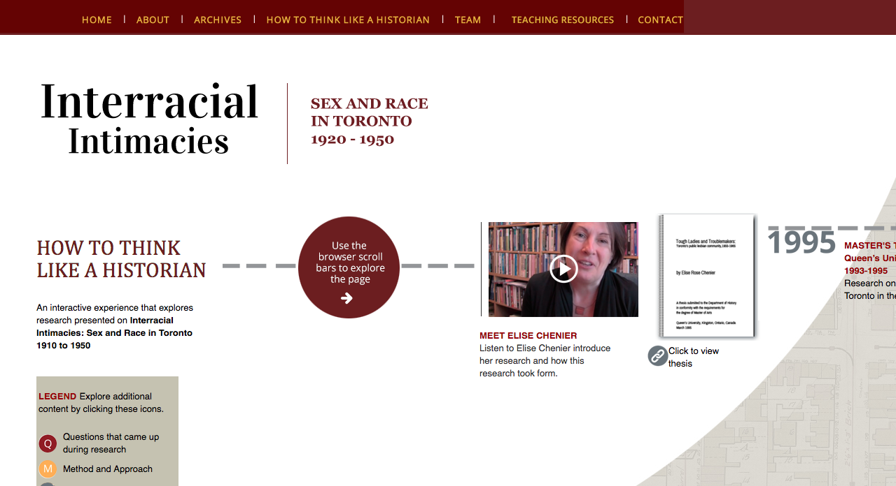
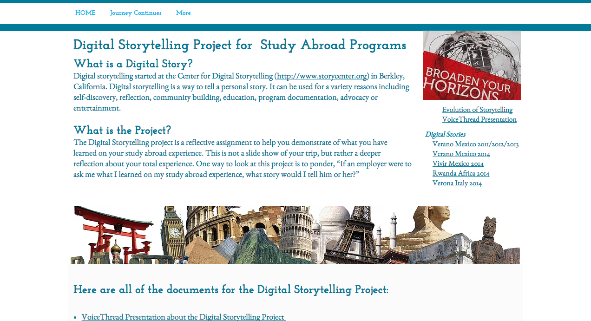
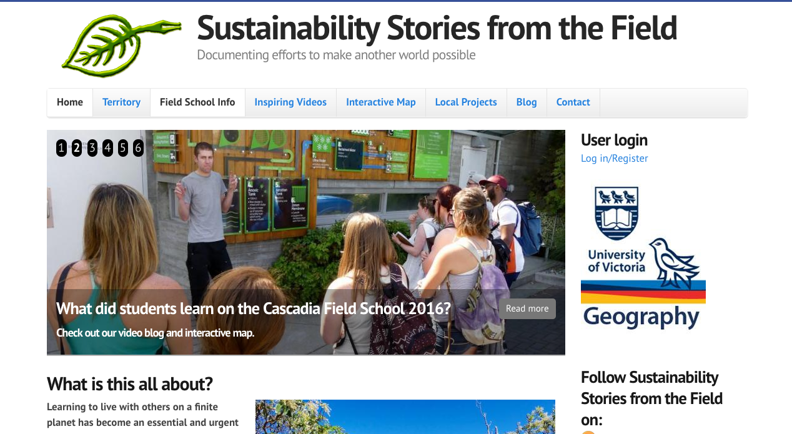
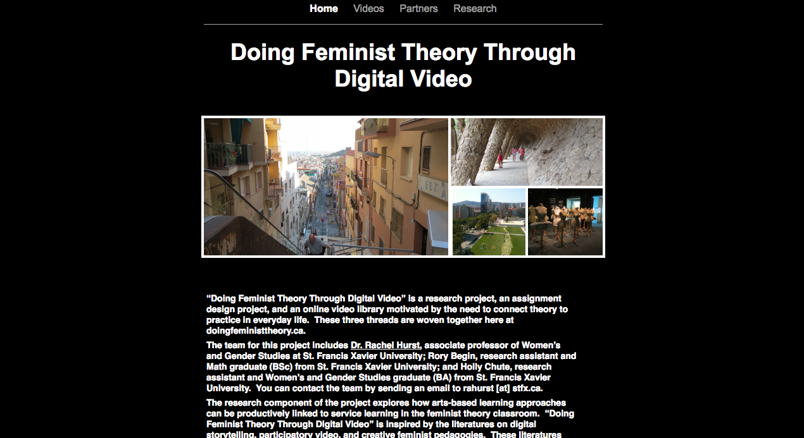
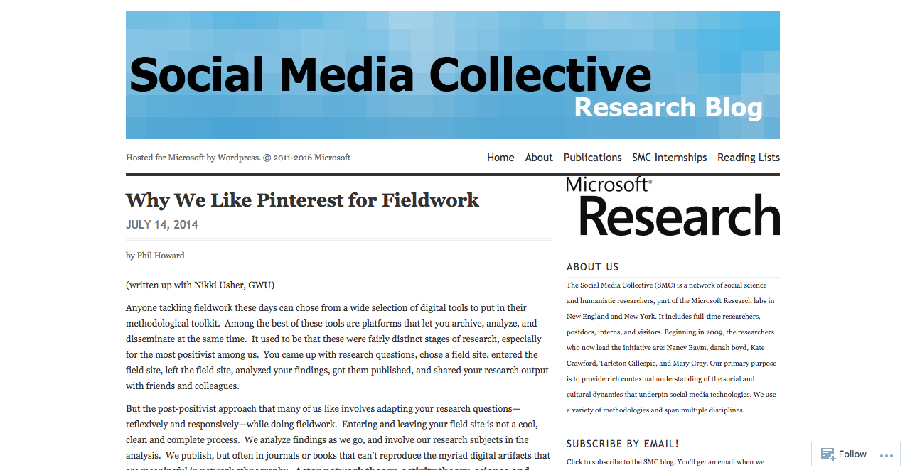
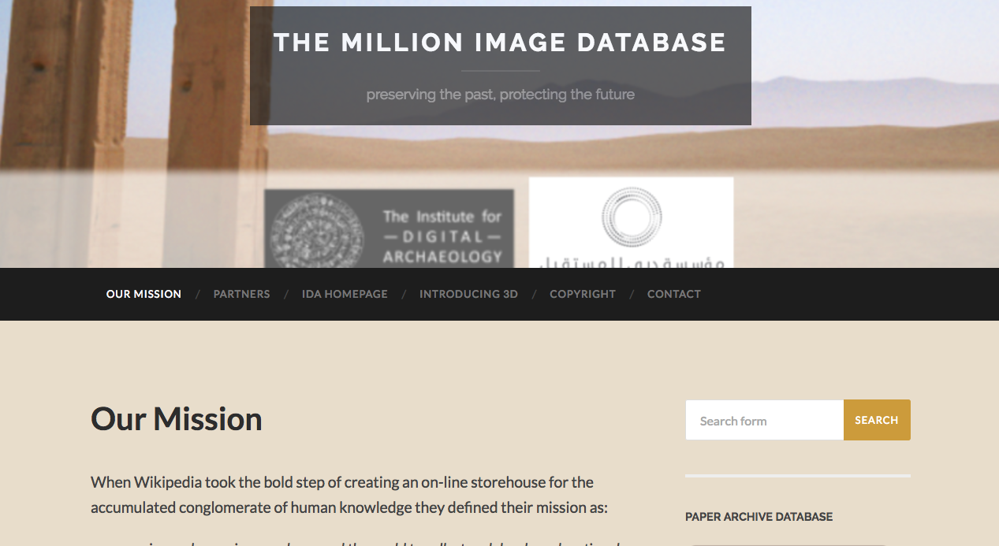
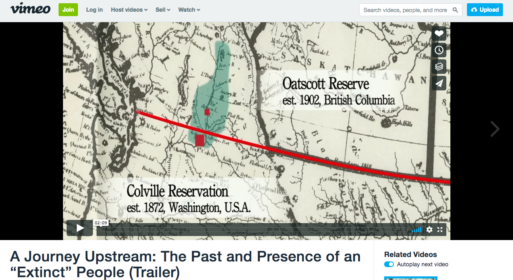
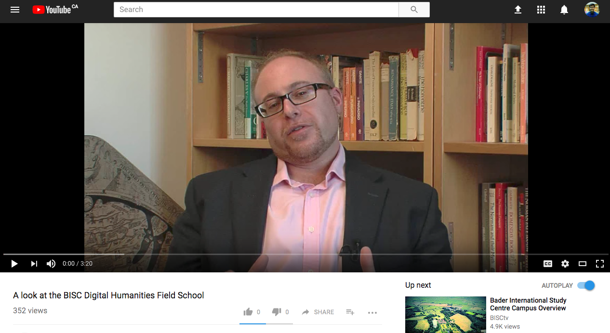
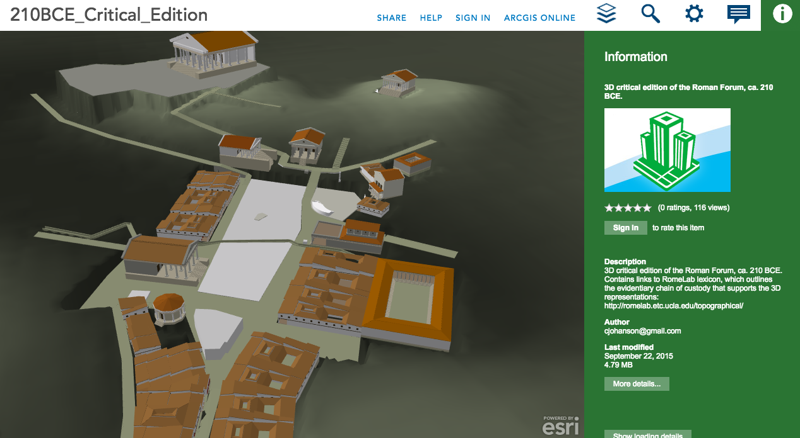
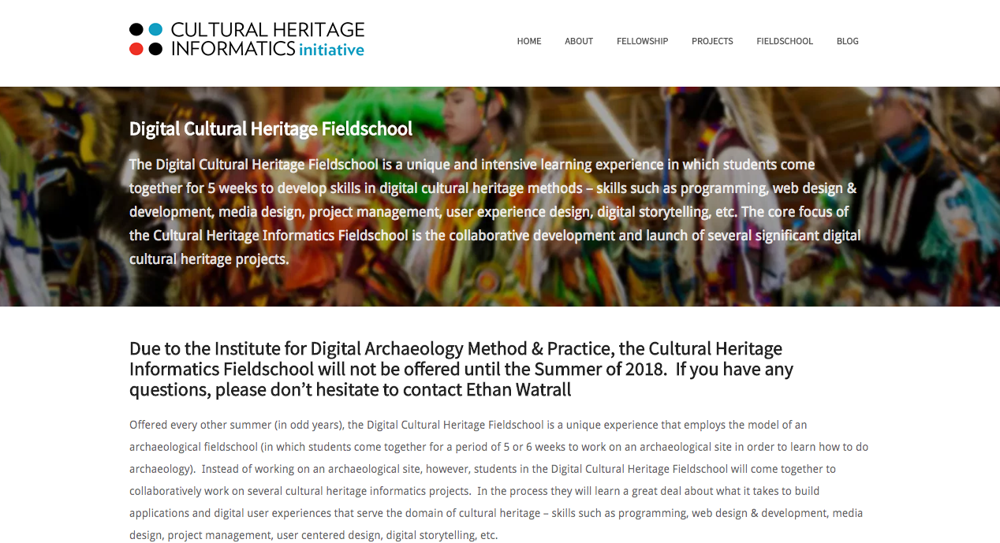

# Fieldwork
 
### Colette Colligan and Michelle Levy and Abdul Zahir
Simon Fraser University

---

##### Publication Status:
* unreviewed draft
* draft version undergoing editorial review
* draft version undergoing peer-to-peer review
* **draft version undergoing MLA copyediting**
* awaiting pre-print copy
* published 

---

## CURATORIAL STATEMENT

Fieldwork as a pedagogical practice has two central components: learning by doing through immersion, and learning by traveling and dwelling in a spatially-demarcated field (Clifford 52-91). Digital culture is transforming the practice of fieldwork for scholars and students alike.

Many of the curated digital artifacts below exemplify how fieldwork is undergoing a remediation of form, pushing the boundaries of academic inquiry and communication (Colligan, Levy, & Yoder; France & Welsh 47). Freeing fieldwork from the confines of a spatially-demarcated “field,” digital technology introduces new immersive and expressive forms of fieldwork practice and pedagogy. Among the curated artifacts are digital assignments and projects that allow students immersed in fieldwork (whether on-site or virtual) to experiment with creative forms of storytelling, such as blogging and filming—activities that can blur the boundaries between documentation and expression. These artifacts also leverage social media to interactively engage diverse publics in fieldwork. Cultural critique and diverse forms of expression converge in these experimental and interactive forms of digital fieldwork, also raising vital questions about the rights over content collected in the field, the ethics of appropriation and representation, and the effects of technology on the objects of study (Borowiecki et al. xxiv-xxix).

In adopting pedagogical practices that promote creativity and enable experimentation, the digital artifacts gathered also expand the limits of what counts as knowledge production in the humanities. Process is emphasized as a necessary part of learning, reflective of the turn toward “making as a form of knowing” in digital humanities (Galey & Ruecker 407). As fieldwork is published online in earlier stages of progress, it is modeled for students as interactive, iterative, and ultimately as inquiry and discovery. This philosophy of building as a way of knowing prompts questions about the nature and purpose of fieldwork. Who is doing that work and under what conditions? Who is the researcher and who is the subject? And how will the digital reconstructions of field sites, media-making, and project-driven fieldwork produce knowledge? This process-based approach foregrounds the relationship between work and knowledge that is central to fieldwork and can inform digital culture and Digital Humanities practices. This approach can bind us to empirical modes of “looking, collecting, and record-keeping” that have undergone powerful critique for their colonial legacies (Mattern), but can also initiate reshaping of these practices. Further, feminist, critical race, and postcolonial theories can impact digital fieldwork methods through their understanding of technologies as “skilled practices,” always in need of situatedness and contextualization (Haraway 587).

As a pedagogical research practice, fieldwork already has a collaborative ethos similar to practices within Digital Humanities (Deegan & McCarty 2-5), but the artifacts below show how digital fieldwork is rescaling these collaborations. Drawing on citizen science (Ratto and Boler 5; Ridge 1-2) and Wikipedia’s collaborative accomplishments to engage global communities in data collection and knowledge production (Vandendorpe 2), some of the artifacts address a wide public, urging participation in field documentation and commentary. Different social configurations emerge around these artifacts, whether a loosely connected network of citizen fieldworkers, a devoted network of Pinterest or social-media followers, or supportive kinship networks commenting on student fieldwork. Open and networked models of fieldwork collaboration can also reconfigure hierarchical teacher-student and researcher-subject roles. Simultaneously, rapid shifts in the scale of fieldwork introduce the potential for ill-defined and unstable roles and networks, necessitating critical inquiry into the effects of this expansion of scale and digital inequalities (Ragnedda & Muschert 2-5).

Finally, the digital fieldwork represented by the following artifacts involves critically rethinking embodied site-specific inquiry and re-situating knowledge. Fieldwork is traditionally tied to place as a source of meaning and knowledge: a researcher travels to a site and returns with data for analysis. Digital fieldwork can, however, break down the perceived distance between field and home. It can do so through the virtual reconstruction of an archaeological site. Mobile devices can also accelerate data collection and immediately share results. Immersion can occur on-screen, and not physically on-site, through the use of screen-based technologies and virtual reconstructions. Both site-specific and screen-based fieldwork are mediated interactions, and both raise issues of exploitation and distortion. It cannot be assumed that the re-situated knowledges digital technologies afford lead to a distance from gendered and colonialist fieldwork practices (Mattern), hence the need for ongoing cultural critique within pedagogical applications of new digital media (Liu 501-502; Wernimont 20-22).

The curatorial vision informing the following selection of artifacts presents this revitalization of fieldwork as a remediation of creative and critical practice (artifacts 1, 2, and 3), a turn toward process-driven models of knowledge production (artifacts 4 and 5), an engagement with open social research (artifacts 6 and 7), and a critical rethinking of site-specific inquiry (artifacts 8, 9, and 10). These categories come together, with some overlap, in the artifacts below.

## CURATED ARTIFACTS

#### Interracial Intimacies: Sex and Race in Toronto: 1920-1950

* Artifact Type: Website
* Source URL: http://interracialintimacies.org/how_to.html
* Permissions: CC BY-NC
* Creator and Affiliation: Elise Chenier and Stacey Makortoff (Simon Fraser University)
* Tags: oral history; how-to guide

Interracial Intimacies is an interactive website and pedagogical tool that follows a historian on her journey from research question to published article. With detailed descriptions narrating every step of the process, historian Elise Chenier describes the process of historical fieldwork for students. Chenier begins with a question on Lesbian Bar Culture in Toronto in the 1950s and ‘60s, and navigates the circuitous path—through oral interviews, archival collection, and analysis of primary sources such as maps, newspaper reports, census data, marriage certifications, and photographs—towards the final published paper on interracial relationships between men of Chinese Heritage and women of Non-Asian Heritage in Toronto between 1910 and 1950. An example of oral history as fieldwork, and a how-to guide for aspiring historians, the site demonstrates to students the twists and turns involved in historical inquiry: “The thing about oral history is you never really know what you are going to find out.”

#### Digital Storytelling Project for Study Abroad Programs

* Artifact Type: Assignment
* Source URL: http://www.melodybuckner.com/#!studyabroad/cx4z
* Permissions: CC BY-NC
* Creator and Affiliation: Melody Buckner (University of Arizona)
* Tags: digital storytelling; study abroad

This website outlines a student assignment for designing digital stories within study abroad programs. It brings a popular genre of personal storytelling, spearheaded by the Berkeley Centre of Digital Storytelling, to the field, situating the digital story as the capstone project. Drawing on the genre’s emotional power, it encourages self-expression, self-discovery, and interactive narration within a reflective fieldwork practice. Instructional support is provided in the form of assignment timelines, grading rubrics, storytelling tips, sample digital stories, and suggested story-making platforms. It designs its assignment around VoiceThread, a free web-based storytelling platform that allows users to mix text, images, and audio-visual recordings with social media functionality to bring work in the field to larger networks of family, friends, and peers. While based on a six-week study abroad trip, the assignment could be adapted for shorter or longer periods. Other free digital storytelling platforms could also be incorporated into the assignment.

#### Sustainability Stories from the Field

* Artifact Type: Assignment
* Source URL: http://fieldschools.geog.uvic.ca/
* Permissions: CC BY-NC
* Creator and Affiliation: Cam Owens (University of Victoria)
* Tags: student digital fieldwork; blogging

This website showcases student digital fieldwork undertaken since 2012 during sustainability field courses run by the University of Victoria’s Department of Geography. The site discusses and shares “ examples of sustainability, resilience, regeneration” relevant to local and international fieldwork. These examples find expression in a range of student digital stories, including short videos, travel blogs, and interactive maps on topics like the creation of biking networks in Victoria and urban efforts to battle climate change. The website’s curatorial vision makes it pedagogically useful in digital fieldwork:  year by year, it compiles work by different students, at different stages of progress, and from different field courses, promoting a work-in-progress, team-based curatorial practice. Curation typically happens at one point; this website shows its integration in fieldwork, giving students a site for shared learning and expression, and instructors a model for collecting student fieldwork and giving value to it at various stages of development.

#### Doing Feminist Theory through Digital Video

* Artifact Type: Collaborative project 
* Source URL: http://www.doingfeministtheory.ca/
* Permissions: CC BY-NC
* Creator and Affiliation: Rachel Alpha Johnston Hurst, Rory Begin, and Holly Chute (St. Francis Xavier University)
* Tags: digital video; feminist theory

Students of a feminist theory course at St. Francis Xavier University were asked to consult with community groups in the field to create short, non-documentary digital videos (3-5 minutes in length) on a concept relevant to the study of feminist theory, such as decolonization, power, or sexual violence. “Inspired by the literatures on digital storytelling, participatory video, and creative feminist pedagogies,” students met with community groups and organizations and scripted and directed their documentaries with their community partners in mind. This detailed assignment sheet provides students with step-by-step instructions for every stage of the process: from conceptualizing and planning to strategies for meeting and working with community partners; from providing a curated list of videos students could use for inspiration to technical information about filming and editing. In addition to the assignment, the website includes research outcomes and links to the student videos produced in the course.

#### Why We Like Pinterest for Fieldwork

* Artifact Type: Digital tool
* Source URL: https://socialmediacollective.org/2014/07/14/why-we-like-pinterest-for-fieldwork/
* Permissions: CC BY-NC
* Creator and Affiliation: Phil Howard (University of Oxford) and Nikki Usher (George Washington University)
* Tags: Pinterest

Efficiently collecting data  during fieldwork is challenging. Notes scribbled on paper and mistyped on devices are illegible or confusing, while photographs and videos fill up mobile storage. As data accumulates across platforms, metadata must remain meaningful for inquiry and retrieval. This blog, proposes Pinterest as an in-field solution: an easy-to-use, web-based tool for storing, annotating, and sharing digital image artifacts collected during fieldwork. Available as a mobile app, Pinterest combines data capture and storage, letting the user retain rights over content. It also links to social media for immediate public sharing and presentation, or private sharing through closed boards. As a digital image archive of fieldwork artifacts gathered on the go, it also allows for ongoing review of fieldwork observations and practices. With links to fieldwork Pinterest boards, this blog post lays out the potential of this digital platform for in-field gathering, sharing, and storing of images.

#### The Million Image Database

* Artifact Type: Collaborative project
* Source URL: http://www.millionimage.org.uk/
* Permissions: Open-Access http://www.millionimage.org.uk/copyright/
* Creator and Affiliation: The Institute for Digital Archaeology
* Tags: open-access; Million Image Database; social fieldwork; cultural heritage

The Million Image Database is an open-access photographic collection of world cultural heritage materials. Inspired by Wikipedia’s collaborative knowledge-assembling effort, the Institute of Digital Archaeology launched this social fieldwork project in collaboration with UNESCO and other academic partners. The site gathers images of objects, architecture, and places to document and preserve “humanity’s history as represented by the things we build” for now and the future. Through interactive maps, users can gain access, to high-quality anaglyph images of cultural sites. The database depends entirely on its user community: the Institute accepts all contributions and asserts no copyright over its images, making them available to exchange freely and without attribution. Though still in development, this database has the potential to become an important resource for digital heritage and virtual fieldwork as well as a teaching and learning platform for raising complex debates about citizen fieldwork, cultural rights and appropriation, and digital repatriation.

#### A Journey Upstream: The Past and Presence of an “Extinct” People (Trailer)

* Artifact Type: Student work
* Source URL: https://vimeo.com/78530205
* Permissions: Need to be formally obtained (editors will provide means)
* Creator and Affiliation: Directed and Produced by Erica Kowsz (UMass Amherst); Co-Produced by Nathan Goodale (Hamilton College)
* Tags: documentary; archaeology; cultural heritage; linguistics; indigeneity 

This is a trailer for the documentary “A Journey Upstream: The Past and Presence of an ‘Extinct’ People,” directed by archaeology graduate student, Erica Kowsz, and part of SEARCH, a multi-institutional archaeology, cultural heritage, and linguistics project. The project documents the history and continued presence of the Sinixt Nation in British Columbia, despite the Canadian government having pronounced it “extinct” in 1956. An example of student digital fieldwork, the video demonstrates technology’s crucial role in documentation, with interviews of the supposedly “extinct” members of Sinixt Nations. Currently in the data collection stage, the video exemplifies project staging, allowing the public some access to the project’s historical context and aims before completion. The project also demonstrates how students use multimedia to create and disseminate archaeological and anthropological research. The video, reflecting a preliminary stage of research, does not address directly issues of ownership and management of the documentary videos.

#### A Look at the BISC Digital Humanities Field School

* Artifact Type: Video
* Source URL: https://youtu.be/PCSzXG536BU
* Permissions: Standard YouTube license
* Creator and Affiliation: BISCtv (Bader International Study Centre, Queens University)
* Tags: digitization; fieldwork; site-specificity; digital humanities

In this video, visiting fellow Chris Jones describes the Field School in Digital Humanities, offered in 2015, where students visit two medieval parish churches in Surrey containing historical objects that Jones is digitizing: a 1615 King James Bible and various medieval wall paintings. The field school’s aim is to investigate which digitizing technologies are appropriate for the artifacts. The video’s pedagogical use lies in its advocacy for site-specific research, to assess historical artifacts in the sites they would have been originally experienced in order to understand their social and material significance. High-resolution digital photos, for instance, distort the original experience of viewing the wall paintings by candlelight, and the censorship of the images during the medieval period. The video thus considers the adequacy of digital photography and videography as documentary tools, suggesting the need for contextualization through other media. It also demonstrates the need for site-specific sensitivity in digital fieldwork.

#### Rome Lab

* Artifact Type: Digital tool
* Source URL: http://www.arcgis.com/apps/CEWebViewer/viewer.html?3dWebScene=6bfc7de39700434bbc9c1df48fed8b52
* Permissions: Creative Commons Attribution-NonCommercial 4.0 International License
* Creator and Affiliation: Christopher Johanson (UCLA)
* Tags: virtual reconstruction; ArcMap; ArcGIS; mapping

RomeLab recreates three critical editions of the Roman Forum, for 210 BCE, 160 BCE, and 44 BCE. Developed within ArcGIS online using ArcMap shapefiles in Esri CityEngine, the project virtually reconstructs the Roman Forum at historical moments within interactive, three-dimensional interfaces. The interface allows the user to navigate within the reconstruction and view it from different perspectives. In performing virtual reconstruction, the researchers’ aim is to create “digital laboratories” where individuals can have a virtual world experience. These digital laboratories enable students and scholars to bring the field home, with digital technology enhancing what can be seen on-site, opening up new spatial perspectives and virtually reconstructing buildings that no longer exist. A built-in comparison tool uses a split-screen function to visualize different possible reconstructions, where data sources are uncertain or conflicting. The tool thus allows a screen-based fieldwork, as students and scholars can virtually reconstruct buildings in ways impossible on-site.

#### 2013 Cultural Heritage Informatics Fieldschool: Visualization: Time, Space, and Data

* Artifact Type: Program design/assignments
* Source URL: http://chi.anthropology.msu.edu/fieldschool/
* Permissions: CC BY-NC
* Creator and Affiliation: Ethan Watrall (Michigan State University)
* Tags: field school; visualization; maps; space; time

MSU’s Digital Cultural Heritage Fieldschool shows how fieldwork can happen locally in the digital age. In 2013, it ran a five-week field school on-campus focused on “visualizing time, space,and data.” The program taught digital skills related to cultural heritage, concentrating on visualizing cultural data, and undertook data-intensive fieldwork on a range of sites (for example, the “Endangered African Heritage” project). In re-conceptualizing fieldwork as a critical practice of “building as a way of knowing,” rather than as a spatial practice of exotic displacement, the program’s design and assignments prioritized the development of on-campus work—thus, exploring distance as a condition of fieldwork knowledge. The potential for cultural fieldwork to move beyond its colonial legacies of travelling from the centre to the periphery and back to extract new knowledge thus emerges with digitally-oriented research practices, carefully developed for the 2013 field school program and assignments.

## RELATED MATERIALS

Deegan, Marilyn and Willard McCarty, editors. *Collaborative Research in the Digital Humanities*. Routledge, 2012.

Ramsay, Stephen and Geoffrey Rockwell. “Developing Things: Notes toward an Epistemology of Building in the Digital Humanities.” *Debates in the Digital Humanities*, edited by Matthew K. Gold, University of Minnesota Press, 2012, pp. 75-84.

Sanjek, Roger and Susan W. Tratner, editors. *eFieldnotes: The Makings of Anthropology in the Digital World.* University of Pennsylvania Press, 2015.

Selfe, Cynthia L., editor. *Multimodal Composition: Resources for Teachers.* Hampton Press, 2007.

Shabani Mligo, Elia. *Doing Effective Field Work: A Textbook For Students of Qualitative Field Research in High-Learning Institutions.* Wipf and Stock Publisher, 2013.

## WORKS CITED

“A Look at the BISC Digital Humanities Field School.” *YouTube*, uploaded by BISCtv, 18 Feb. 2014, https://youtu.be/PCSzXG536BU.

Buckner, Melody. *Digital Storytelling Project for Study Abroad Programs.* University of Arizona, http://www.melodybuckner.com/#!studyabroad/cx4z. Accessed 15 Aug. 2016.

Borowiecki, Karol J., Neil Forbes, and Antonella Fresa, editors. *Cultural Heritage in a Changing World.* Springer International Publishing, 2016.

Chenier, Elise and Stacey Makortoff. *Interracial Intimacies.* Simon Fraser University, http://interracialintimacies.org/how_to.html. Accessed 15 Aug. 2016.

Clifford, James. *Routes: Travel and Translation in the Late Twentieth Century.* Harvard University Press, 1997.

Colligan, Colette, Michelle Levy and Paul Yoder, editors. “Study Abroad in the Lake District and Beyond.” *Romantic Circles Pedagogies* (Forthcoming 2016).

Galey, Alan and Stan Ruecker. “How a prototype argues.” *Literary and Linguistic Computing: Journal of the Association for Literary and Linguistic Computing and The Association for Computers and the Humanities*, vol. 25, no. 4, 2010, pp. 405-424. Oxford Journals, doi: 10.1093/llc/fqq021. Accessed 15 Aug. 2016.

Haraway, Donna. “Situated Knowledges: The Science Question in Feminism and the Privilege of Partial Perspective.” *Feminist Studies*, vol. 14, no. 3, 1988, pp. 575-600. ProQuest, http://proxy.lib.sfu.ca/login?url=http://search.proquest.com.proxy.lib.sfu.ca/docview/1295968804?accountid=13800. Accessed 15 Aug. 2016.

Howard, Phil and Nikki Usher. “Why We Like Pinterest for Fieldwork.” *Social Media Collective*, 14 Jul. 2014, https://socialmediacollective.org/2014/07/14/why-we-like-pinterest-for-fieldwork/. Accessed 15 Aug. 2016.

Hurst, Rachel Alpha Johnston, Rory Begin and Holly Chute. *Doing Feminist Theory Through Digital Video*. St. Francis Xavier University, http://www.doingfeministtheory.ca/. Accessed 15 Aug. 2016.

Hyndman, Jennifer. “The Field as Here and Now, Not There and Then.” *Geographical Review*, vol. 91, no. 1, 2001, pp. 262-272. *JSTOR*, http://www.jstor.org.proxy.lib.sfu.ca/stable/3250827. Accessed 15 Aug. 2016.

Johanson, Christopher. *RomeLab*. 21 Sept. 2015, http://www.arcgis.com/apps/CEWebViewer/viewer.html?3dWebScene=6bfc7de39700434bbc9c1df48fed8b52. Accessed 15 Aug. 2016.

Kowsz, Erica and Nathan Goodale. “A Journey Upstream: The Past and Present of an “Extinct” People (Trailer).” *Vimeo*, uploaded by Erica Kowsz, 4 Nov. 2014, https://vimeo.com/78530205.

Liu, Alan. “Where is Cultural Criticism in the Digital Humanities?” *Debates in the Digital Humanities*, edited by Matthew K. Gold, University of Minnesota Press, 2012, pp. 490-510.

Mattern, Shannon. “Cloud and Field: On the resurgence of “field guides” in a networked age.” *Places Journal*, Aug. 2016, https://placesjournal.org/article/cloud-and-field/. Accessed 15 Aug. 2016.

Owens, Cam. *Sustainability Stories from the Field*. University of Victoria, 2014, http://fieldschools.geog.uvic.ca. Accessed 15 Aug. 2016.

Ragnedda, Massimo and Glenn W. Muschert, editors. *The Digital Divide: The Internet and Social Inequality in International Perspective*. Routledge, 2013.

Ratto, Matt and Megan Boler, editors. *DIY Citizenship: Critical Making and Social Media*. MIT Press, 2014.

Ridge, Mia, editor. *Crowdsourcing our Cultural Heritage*. Routledge, 2014.

Risam, Roopika. “Beyond the Margins: Intersectionality and the Digital Humanities.” *Digital Humanities Quarterly*, vol. 9, no. 2, 2015. http://www.digitalhumanities.org/dhq/vol/9/2/000208/000208.html. Accessed 15 Aug. 2016.

*The Million Image Database*. The Institute for Digital Archaeology, http://www.millionimage.org.uk/. Accessed 15 Aug. 2016.

Vandendorpe, Christian. “Wikipedia and the Ecosystem of Knowledge.” *Scholarly and Research Communication*, vol. 6, no. 3, 2015, http://src-online.ca/index.php/src/article/view/201. Accessed 15 Aug. 2016.

Watrall, Ethan. *Cultural Heritage Informatics Fieldschool*. Michigan State University, 2013, http://chi.anthropology.msu.edu/fieldschool/ Accessed 15 Aug. 2016.

Welsh, Katharine and Derek France. “Smartphones and Fieldwork.” *Geography*, vol. 97, no. 1, 2012, pp. 47-51. *JSTOR*, http://www.jstor.org.proxy.lib.sfu.ca/stable/24412180. Accessed 15 Aug. 2016.

Wernimont, Jacqueline. “Whence Feminism? Assessing Feminist Interventions in Digital Literary Archives.” *Digital Humanities Quarterly*, vol. 7, no. 1, 2013, http://www.digitalhumanities.org/dhq/vol/7/1/000156/000156.html. Accessed 15 Aug. 2016.

