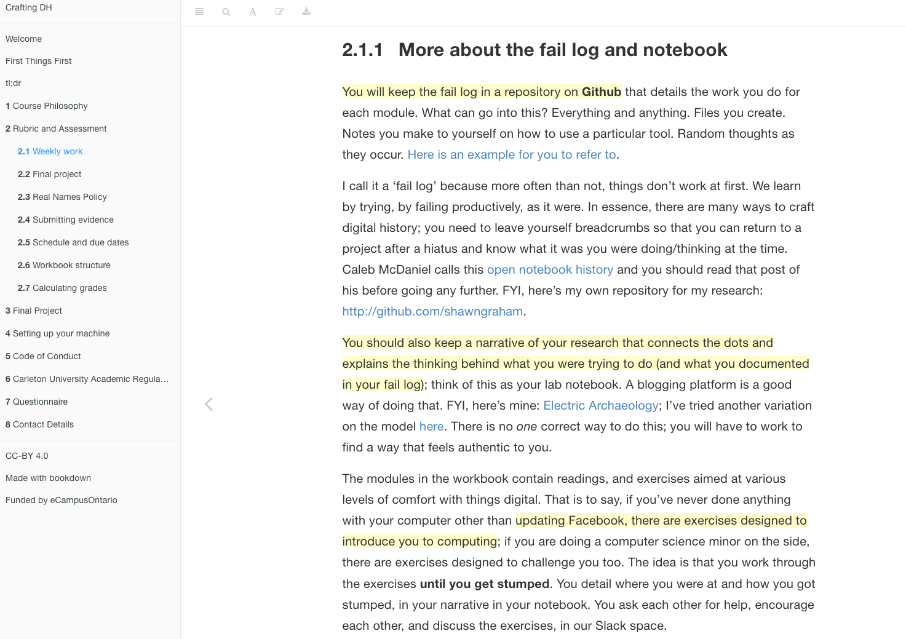
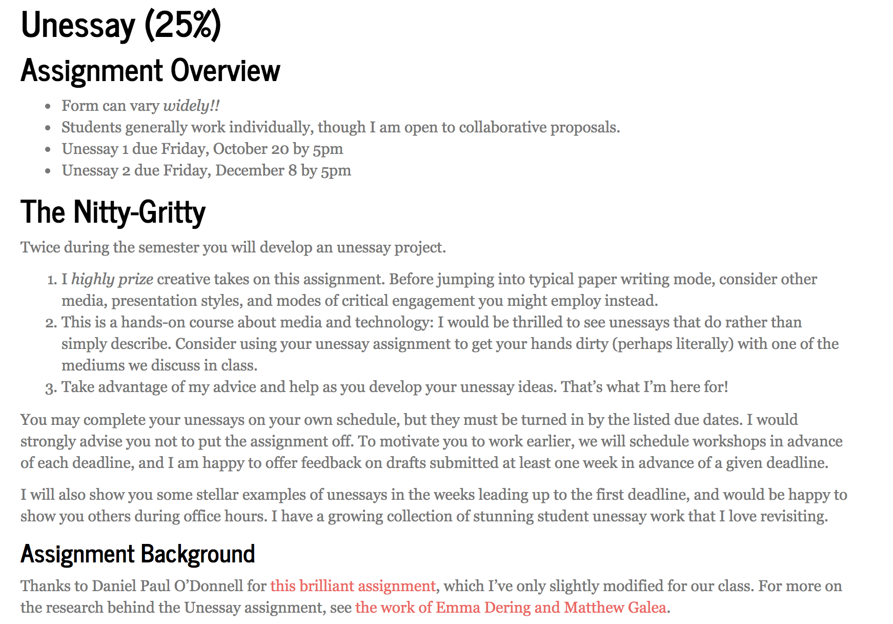
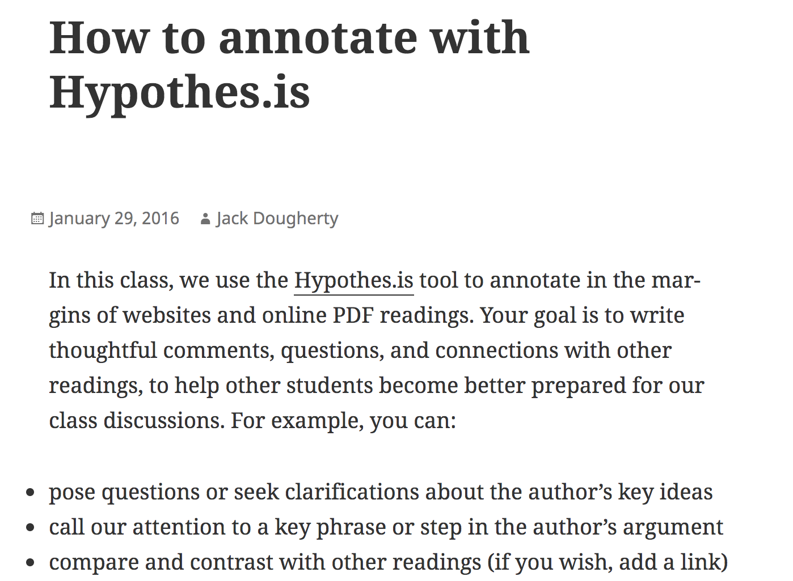
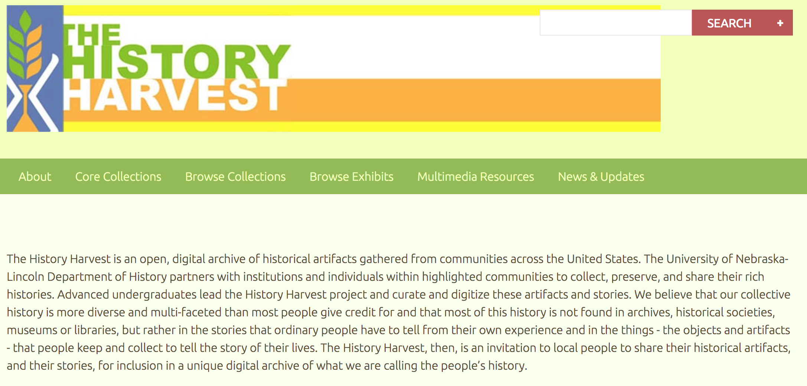
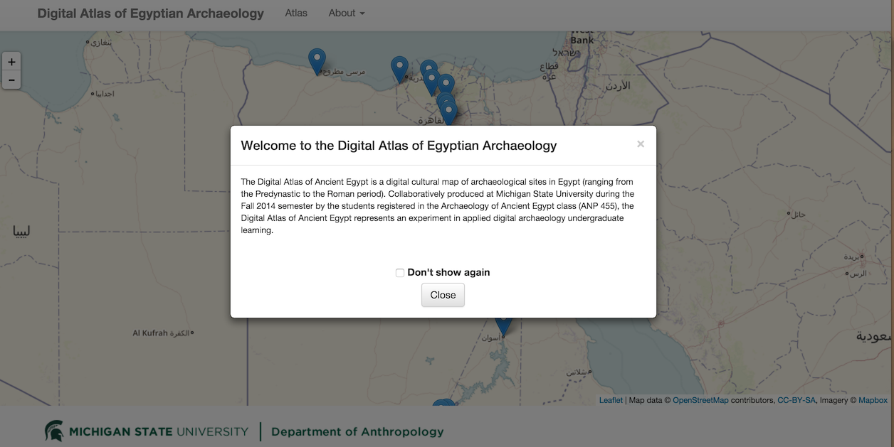
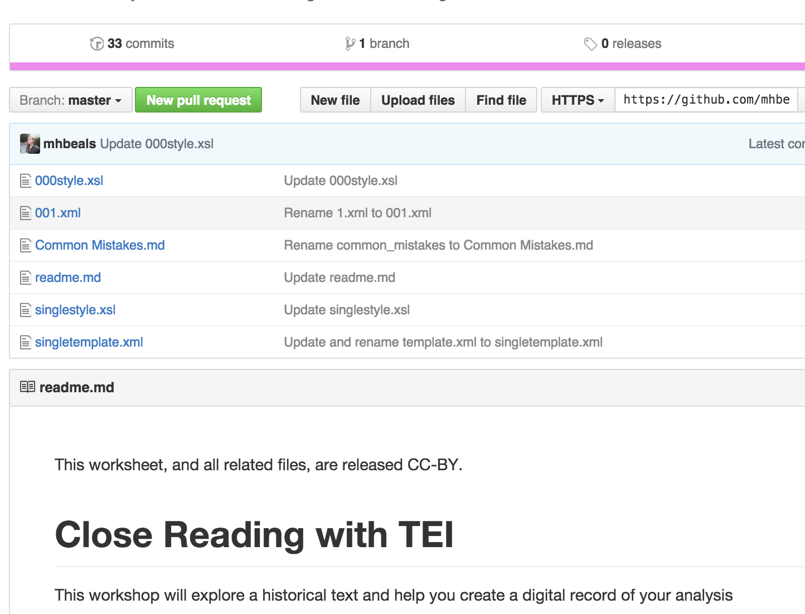
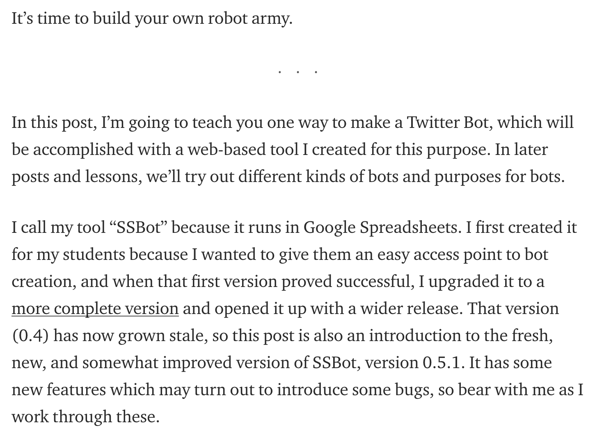

# History

### Shawn Graham
Carleton University, Ottawa | [http://electricarchaeology.ca](http://electricarchaeology.ca)

---

##### Publication Status:
* unreviewed draft
* draft version undergoing editorial review
* draft version undergoing peer-to-peer review https://digitalpedagogy.commons.mla.org/
* **draft version undergoing MLA copyediting**
* published

---

## CURATORIAL STATEMENT

History, as a discipline, has several approaches to the teaching and _doing_ of history that can often incorporate digital tools and techniques while at the same time not necessarily being 'digital pedagogy'. What distinguishes 'history' in terms of digital pedagogy is in its motivations. Robertson points out that social historians have long used web based technologies to reach teachers and schools, motivated by a commitment 'to democratizing the creation of the past', which is also the core of what distinguishes digital history from Digital Humanities. This also has had the effect of situating digital history in an alliance with practitioners of public history ("Differences"). Robertson points out that public history is not necessarily in the mainstream of historical practice, and so digital history continues to occupy a marginal position. The key idea in terms of a digital pedagogy emerging from the digital historian's practice derives from the root word for history, ιστορία 'istoria' _inquiry_, meaning a (public) questioning or interrogating.

'History' then is an active verb. The artifacts collected below speak to the idea of digital pedagogy as a kind of public inquiry into the causes of things, as a kind of [making](https://digitalpedagogy.mla.hcommons.org/keywords/makerspaces/). Thus, they are organized to both facilitate inquiry, but also, its assessment. This puts digital pedagogy in history in a transgressive situation, especially when we remember that the status quo signifier for historical seriousness, for scholarship, is essay-writing (and its longer cousin, the monograph) (cf Blevins and Mullen, 39). Digital work that transgresses this 'compulsory figure' (O'Donnell) is only slowly being recognized. Fredd Gibbs argues that the problem comes down to the fact that there is 'virtually no precedent' for what is now possible to do in digital history. Robertson points out that the difficulty centers on the extent to which "traditional, print scholarship and its conventions can be used as a measure in assessing digital history" (Robertson, "Reviewing Digital History").

Many acts of digital history begin with the idea of the online exhibit (often built on the [Omeka](http://omeka.org) platform). Translating physical materials into their digital simulacra necessitates the idea of 'paradata'. In the field of archaeological visualization and 3d reconstruction, the [London Charter (item 4.6)](http://www.londoncharter.org/principles/documentation.html) advocates for 'paradata' documents that detail and discuss the transformations of materials into their digital counterparts and the choices made to effect that transformation, because that process is necessary to examine in order to understand the full meaning of the digital work. The creation of such paradata documents (however instantiated) should be an integral part of digital pedagogy in history so that the digital transformations do not become unmoored from the 'real world'. In many respects, the concept of paradata for digital pedagogy ties into other kinds of reflective pedagogical practice such as [eportfolios](https://digitalpedagogy.mla.hcommons.org/keywords/eportfolio/). Paradata enable novel forms of digital work to fit into the existing patterns and expectations of assessment, even while they subtly shift the goalposts of what becomes 'normal' in historical work.

The artifacts collected for this keyword represent examples that lay a pathway for us to employ this vision of a digital pedagogy of history, whether that teaching takes place in a classroom or in public, online or off. These artifacts:

  - embody approaches that embrace an open approach to research and crafting history (including ideas around 'failing in public' (see also ['failure'](https://digitalpedagogy.mla.hcommons.org/keywords/failure/) in this volume)
	- engage students with other modes of historical 'writing' (where 'writing' is a synonym for both crafting and communicating the results of historical method)
	- explicitly or implicitly are entangled with the concept of 'paradata'
	- provide models for reuse and assessment

The artifacts are arranged in an order that should facilitate the integration of digital pedagogies into one's teaching and research. They move from general exercises that embed openness in the student's research practice, to ways of allowing students to engage the wider public in the process of historical research, to more creative examples of student work. This vision of 'history' is very outward facing and so helps to turn our teaching inside-out; the teaching of history becomes an act of public history in this model. Public history is ever aware of its audiences. As in the discussion for the keyword [Public](https://digitalpedagogy.commons.mla.org/keywords/public/), the act of making work outward-facing is itself transgressive. Other keywords in this collection that are germane to 'history' as envisioned here include [Blogging](https://digitalpedagogy.mla.hcommons.org/keywords/blogging/), [ePortfolio](https://digitalpedagogy.mla.hcommons.org/keywords/eportfolio/), [Gaming](https://digitalpedagogy.mla.hcommons.org/keywords/gaming/), [Play](https://digitalpedagogy.mla.hcommons.org/keywords/play/), [Mapping](https://digitalpedagogy.mla.hcommons.org/keywords/mapping/), and [Text Analysis](https://digitalpedagogy.mla.hcommons.org/keywords/text-analysis/)

Digital pedagogy in history changes not just how we teach, but how we _do_, history - how we work on our own, with colleagues, with students, and with the public.

## CURATED ARTIFACTS

#### Fail log and Open Notebook

+ Artifact Type: teaching guidelines
+ Source URL: [http://site.craftingdigitalhistory.ca/rubric-and-assessment.html#weekly-work](http://site.craftingdigitalhistory.ca/rubric-and-assessment.html#weekly-work)
+ Permissions: CC BY-NC-SA
+ Creator and Affiliation: Shawn Graham, Carleton University
+ Tags: getting started; Github repository and personal blog

This assignment operationalizes [Caleb McDaniel's arguments](http://wcm1.web.rice.edu/open-notebook-history.html) for why historians should make the historical research process open to inspection, situating the idea within practices familiar to historians. The 'Fail Log' assignment surfaces the hidden 'gotchas' of doing digital work, and permits students a way of 'showing their work'. As students all have different starting points with digital materials, these notebooks and the sharing of materials can be used to help build community and support. Mark Sample called this approach ['flogging' - fail logging](https://wayback.archive.org/web/20150124022659/http://sites.davidson.edu/hacking/course-guidelines/). The open notebook can also be an effective introduction to open peer review journal and book projects, such as those undertaken by [Michelle Moravec](http://michellemoravec.com/michelle-moravec/). It parallels more familiar forms such as course blogging.

#### The Unessay

+ Artifact Type: assignment prompt
+ Source URL: [http://f17rwda.ryancordell.org/assignments.html#unessay_(15%)](http://f17rwda.ryancordell.org/assignments.html#unessay_(25%))
+ Permissions: CC
+ Creator and Affiliation: Ryan Cordell, Northeastern University
+ Tags: getting started

How do we grade assess artifacts in history that don't look like essays? One answer is to frame them as 'unessays', where the student chooses their _own_ platform, their own expressive medium, to examine a question. Particularly for digital work, the unessay shifts the focus from technical competency to how the medium and the argument intersect, reinforce, or contradict each other. Daniel Paul O'Donnell coined the ideas and rationale behind an ['unessay'](http://people.uleth.ca/~daniel.odonnell/Teaching/the-unessay); in this artifact, Ryan Cordell operationalizes the concept and provides [examples of student work](http://f17rwda.ryancordell.org/assignments.html#model_unessays), from an imaginative 'manifesto' by 'Ada Lovelace', to highly annotated code, to Tumblr photo essays. 

#### Collaborative Annotation

+ Artifact Type: teaching guidelines
+ Source URL: [http://commons.trincoll.edu/cssp/seminar/annotate-with-hypothesis/](http://commons.trincoll.edu/cssp/seminar/annotate-with-hypothesis/)
+ Permissions: CC-BY-NC
+ Creator and Affiliation: Jack Dougherty, Trinity College
+ Tags: getting started; Hypothes.is

In this assignment, Dougherty shows how to use [the Hypothes.is web annotation tool](http://web.hypothes.is) as part of a seminar in history. This work was discussed in a public webinar hosted by Jeremy Dean of [Hypothes.is](http://web.hypothes.is) (viewable at [https://www.youtube.com/watch?v=nWXbF-IDCUY](https://www.youtube.com/watch?v=nWXbF-IDCUY)). Collaborative annotation allows the instructor to model close reading in the open and helps the students to learn this disciplinary practice. Dougherty's materials, and the webinar participants' discussion, provide multiple examples and advice on building collaborative annotation assessment for history students. See also the [annotation](https://digitalpedagogy.mla.hcommons.org/keywords/annotation/) keyword in this volume.

#### HIST303 History Gone Digital: An Introduction

+ Artifact Type: syllabus
+ Source URL: [https://ianmilligan.ca/teaching/hist-303-syllabus/](https://ianmilligan.ca/teaching/hist-303-syllabus/)
+ Permissions: CC-BY-SA
+ Creator and Affiliation: Ian Milligan, University of Waterloo
+ Tags: getting started; Python; Omeka; Wordpress; Sketchup Make; Google Earth

This syllabus provides an example of a course designed explicitly to build digital skills for historians. Milligan's focus is on hands-on engagement with a wide variety of tools (including Omeka, Sketchup Make, the Google N-gram viewer, and the tutorials published by [The Programming Historian website](https://programminghistorian.org/lessons/)) that a digital historian might reasonably be expected to use as part of their practice. It is pitched at the undergraduate level, and frames that playful exploration of tools in the wider contexts of historiography, methods, and workflows. Its assessment exercises focus on the process of working with the materials.

#### The Knotted Line Curriculum Guide

+ Artifact Type: lesson plans
+ Source URL: [http://scalar.usc.edu/anvc/the-knotted-line/curriculum-guide](http://scalar.usc.edu/anvc/the-knotted-line/curriculum-guide) [PDF Version](https://docs.google.com/file/d/0BynaievnTP0pdHozZjQ5LXlFLWM/edit)
+ Permissions: CC-BY-NC-SA
+ Creator and Affiliation: Evan Bissell and Ora Wise
+ Tags: getting started; Scalar

The [Knotted Line](http://scalar.usc.edu/anvc/the-knotted-line/external?link=http%3A%2F%2Fknottedline.com%2Ftkl.html&prev=http%3A%2F%2Fscalar.usc.edu%2Fanvc%2Fthe-knotted-line%2Findex) is a multi-media exploration of the United States' entangled history of freedom and incarceration. It is built using the [Scalar](http://scalar.usc.edu/scalar/) publishing platform for scholarly born-digital content. This curriculum guide provides a rich set of remixable lesson and workshop plans and prompts for using the Knotted Line in one's class (including some multi-week projects, complete with learning objectives and assessment structures, like '['Flipping the Script: Making History with Media'](http://scalar.usc.edu/anvc/the-knotted-line/flipping-the-script-making-history-with-media). The structure of these plans could be adapted for use with other kinds of born-digital resources.

#### Historical Twine Project Rubric

+ Artifact Type: assignments
+ Source URL: [https://historicalsimulations.files.wordpress.com/2017/03/historical-twine-project-rubric-1-0.pdf](https://historicalsimulations.files.wordpress.com/2017/03/historical-twine-project-rubric-1-0.pdf)
+ Permissions: CC-BY-NC-SA
+ Creator and Affiliation: Jeremiah McCall, Cincinnati Country Day School
+ Tags: getting started; Twine

This artifact, and its associated discussion at the history and gaming group blog [Play the Past](http://www.playthepast.org/?p=5752) provide a clear and lucid model for integrating the creation of simulations into one's creative engagement with digital pedagogy. McCall provides an example and rationale for integrating Twine, "an open-source tool for telling interactive, nonlinear stories" as part of the historian's toolkit for crafting engaging history (Twine). A chief reason is that this engagement confronts the student with what she does not know (or cannot know) about the past from the available materials, and forces the student to grapple with the ambiguity.

#### History Harvest

+ Artifact Type: assignments
+ Source URL: [http://historyharvest.unl.edu/](http://historyharvest.unl.edu/)
+ Permissions: CC-BY
+ Creator and Affiliation: William G. Thomas, Patrick D. Jones, University of Nebraska Lincoln; see [the full list of collaborators](http://historyharvest.unl.edu/acknowledgements)
+ Tags: advanced; Omeka

The History Harvest is a public crowdsourcing project that brings undergraduate historians into a community where they work with members of that community to curate and then exhibit historical artifacts using the [Omeka](http://omeka.org) platform. Students plan and implement a day where interested members of the public share their historical materials, according to a theme. The students digitize (scan or photograph) the objects, collect the relevant meta-data and story, and discuss with the public the implications of putting the material online. The web exhibit is the final stage in the project. This process gives students experience in applied public history. A 'lessons learned' and suggestions for running one's own 'history harvest' are published [here](https://www.historians.org/publications-and-directories/perspectives-on-history/january-2013/history-harvests).

#### Digital Atlas of Egyptian Archaeology (DAEA)

+ Artifact Type: assignments
+ Source URL: [https://msu-anthropology.github.io/daea/](https://msu-anthropology.github.io/daea/) (Source code at [https://github.com/msu-anthropology/daea-fs14](https://github.com/msu-anthropology/daea-fs14))
+ Artifact Permissions: CC-BY-SA
+ Creator and Affiliation: Students in the Fall 2014 semester in the Archaeology of Ancient Egypt class (ANP 455) at Michigan State University, led by Ethan Watrall and supported by Brian Geyer.
+ Tags: advanced; Github; Leaflet.js

The Digital Atlas of Egyptian Archaeology (DAEA) as a work of collaborative scholarship exemplifies many of the ideas that the previous artifacts point towards. Writing and researching in public includes not just _text_ but also the _code_ that enables digital scholarship. The code for the DAEA is well commented, and can be repurposed by swapping out the data contained in the '[sites/AA-sites-popup.csv](https://github.com/msu-anthropology/daea-fs14/blob/master/sites/AA-sites-popup.csv)' file. The act of putting the source code online allows this student scholarship to be leveraged by other students, expanded, and transformed. An example of student reuse at another university became a [microhistory of St. John's, Newfoundland](http://xtina-r.github.io/daea/).

#### TEI Close Reading Exercise

+ Artifact Type: assignments
+ Source URL: [https://github.com/mhbeals/TEI-Close-Reading](https://github.com/mhbeals/TEI-Close-Reading)
+ Artifact Permissions: CC-BY
+ Creator and Affiliation: Melodee Beals, Loughborough University
+ Tags: advanced; Github; TEI markup

Marking up text with machine-readable semantic encoding has many pedagogical benefits, forcing close attention to a historical text. Beals' exercise provides a clear example of how one could incorporate TEI (the Text Encoding Initiative) standards for the semantic markup of primary sources found online. In its clarity of exposition, and in its arrangement of materials and organization, it is a useful model for the new practitioner of digital history pedagogies to emulate. Beyond the narrow concerns of TEI, this exercise demonstrates how exposing our research and teaching materials to the world (in this case, via a repository on Github) builds teaching capacity for the rest of us. A useful exercise for students can be to try to _improve_ the exercise by expanding on the parts that tripped them up.

#### Tiny Flashing Thumbs: How to bot your way to fake news success

+ Artifact Type: tutorial
+ Source URL: [https://medium.com/the-fake-news-reader/tiny-flashing-thumbs-how-to-bot-your-way-to-fake-news-success-f834bf44c4b4](https://medium.com/the-fake-news-reader/tiny-flashing-thumbs-how-to-bot-your-way-to-fake-news-success-f834bf44c4b4)
+ Artifact Permissions: CC-BY
+ Creator and Affiliation: Zach Whalen, University of Mary Washington
+ Tags: advanced; Google Sheets; Twitter

An important role of the historian is to humanize the past, while confronting the audience with the simultaneous alienness of it. What Mark Sample calls ['bots of conviction'](https://medium.com/@samplereality/a-protest-bot-is-a-bot-so-specific-you-cant-mistake-it-for-bullshit-90fe10b7fbaa#.k7zhd3p6e)) can enable that confrontation. This artifact shows how to make a Twitter bot (an account that tweets automatically) powered by a variety of different generators. The potential power of a Twitter bot for History is demonstrated by Caleb McDaniel's 'Every 3 Minutes' bot, which tweets every three minutes with the historical details of a slave sale in the United States. The associated paradata post at [http://wcm1.web.rice.edu/slave-sales-on-twitter.html](http://wcm1.web.rice.edu/slave-sales-on-twitter.html) discusses the underlying research and rationale for this particular bot. Students could use Whalen's templates to 'real-time' tweet a historical event, or adopt the persona of a historical personage, or follow McDaniel's example to uncover similar histories.

## RELATED MATERIALS

Elliot, Devon, Robert MacDougall, and William Turkel. "New Old Things: Fabrication, Physical Computing, and Experiment in Historical Practice." _Canadian Journal of Communication 37.1_ (2012). Web. [<http://www.cjc-online.ca/index.php/journal/article/view/2506>](http://www.cjc-online.ca/index.php/journal/article/view/2506).

Kelly, Mills. _Teaching History in the Digital Age_. Ann Arbor, MI: U of Michigan Press, 2013. Web. [<http://quod.lib.umich.edu/cgi/t/text/text-idx?cc=dh;c=dh;idno=12146032.0001.001;rgn=full text;view=toc;xc=1;g=dculture>](http://quod.lib.umich.edu/cgi/t/text/text-idx?cc=dh;c=dh;idno=12146032.0001.001;rgn=fulltext;view=toc;xc=1;g=dculture).

Lutz, John, Ruth Sandwell, et. al. "We Need Your Help!" _Great Unsolved Mysteries in Canadian History._ Canadian Heritage / University of Victoria, 1997. Web. 24 Feb. 2016. [<http://canadianmysteries.ca/en/index.php>](http://canadianmysteries.ca/en/index.php).

Nowviskie, Bethany. “Ludic Algorithms.” In _Pastplay: Teaching and Learning History with Technology_, edited by Kevin Kee, 139-71. Ann Arbor: University of Michigan Press, 2014. Web. [<http://quod.lib.umich.edu/d/dh/12544152.0001.001/1:5/--pastplay-teaching-and-learning-history-with-technology?g=dculture;rgn=div1;view=fulltext;xc=1#5.3>](http://quod.lib.umich.edu/d/dh/12544152.0001.001/1:5/--pastplay-teaching-and-learning-history-with-technology?g=dculture;rgn=div1;view=fulltext;xc=1#5.3).

Terras, Melissa. "A Virtual Tomb for Kelvingrove: Virtual Reality, Archaeology and Education." _Internet Archaeology_ 7. Department of Archaeology, York University, 1 Dec. 1999. Web. 24 Feb. 2016. [<http://intarch.ac.uk/journal/issue7/terras/>](http://intarch.ac.uk/journal/issue7/terras/).

## WORKS CITED

Alliance for Networking Visual Culture. _Scalar_. 2017. Web [<http://scalar.usc.edu/scalar/>](http://scalar.usc.edu/scalar/).

Beals, Melodee. "TEI Close Reading." _GitHub.com/mhbeals_. 30 Dec. 2014. Web. 24 Feb. 2016. [<https://github.com/mhbeals/TEI-Close-Reading>](https://github.com/mhbeals/TEI-Close-Reading).

Bissell, Evan. "The Knotted Line" _Scalar_. 19 Aug. 2014. Web. [<http://scalar.usc.edu/anvc/the-knotted-line/index>](http://scalar.usc.edu/anvc/the-knotted-line/index).

Blevins, Cameron, and Lincoln Mullins. "Jane, John ... Leslie? A Historical Method for Algorithmic Gender Prediction." _DHQ: Digital Humanities Quarterly_ 9.3 (2015). [<http://www.digitalhumanities.org/dhq/vol/9/3/000223/000223.html>](http://www.digitalhumanities.org/dhq/vol/9/3/000223/000223.html).

Cordell, Ryan. "Reading and Writing in the Digital Age". 2017. Web. [<http://f17rwda.ryancordell.org/assignments.html>](http://f17rwda.ryancordell.org/assignments.html).

Dean, Jeremy., et al. "Collaborative Annotation in the History Classroom". _Youtube_. 31 May 2016. Web. [<https://youtu.be/nWXbF-IDCUY>](https://youtu.be/nWXbF-IDCUY).

Dougherty, Jack. "Seminar Syllabus for Spring 2016" _Cities, Suburbs & Schools Project at Trinity College_. 2016. Web. [<http://commons.trincoll.edu/cssp/seminar/>](http://commons.trincoll.edu/cssp/seminar/).

Gibbs, Frederick W. "New Forms of History: Critiquing Data and Its Representations." _The American Historian._ Organization of American Historians, Issue 7, Feb. 2016. Web. 24 Feb. 2016. [<http://tah.oah.org/february-2016/new-forms-of-history-critiquing-data-and-its-representations/>](http://tah.oah.org/february-2016/new-forms-of-history-critiquing-data-and-its-representations/).

Graham, Shawn.  "Course Manual for Crafting Digital History" _craftingdigitalhistory.ca_ 2017. Web. [<http://craftingdigitalhistory.ca>](http://craftingdigitalhistory.ca).

Hypothes.is Project. _Hypothes.is - Annotate the Web, with anyone, anywhere_. N.d., Web. [<http://web.hypothes.is>](http://web.hypothes.is).

Londoncharter.org. _The London Charter for the Computer-Based Visualisation of Cultural Heritage_. 2009. Web. [<http://www.londoncharter.org/>](http://www.londoncharter.org/).

McCall, Jeremiah. "Creating Interactive Histories in History Class (Twine Teacher Diary)" _Play the Past_. Web log post. N.p., 10 Oct. 2016. Web. [<http://www.playthepast.org/?p=5752>](http://www.playthepast.org/?p=5752)l

McCall, Jeremiah. "Historical Twine Project Rubric 1.0" _Gaming The Past_. File. 2017.  [<https://historicalsimulations.files.wordpress.com/2017/03/historical-twine-project-rubric-1-0.pdf>](https://historicalsimulations.files.wordpress.com/2017/03/historical-twine-project-rubric-1-0.pdf).

McDaniel, W. Caleb. "@Every3Minutes." _Twitter_, 15 Nov. 2014. Web. 24 Feb. 2016. [<https://twitter.com/every3minutes>](https://twitter.com/every3minutes).

McDaniel, W. Caleb. "Open Notebook History." Weblog post. _W. Caleb McDaniel_. 22 May 2013. Web. 24 Feb. 2016. [<http://wcm1.web.rice.edu/open-notebook-history.html>](http://wcm1.web.rice.edu/open-notebook-history.html).

Milligan, Ian. "HIST 303 Syllabus" _ianmilligan.ca_. 2017. Web. [<https://ianmilligan.ca/teaching/hist-303-syllabus/>](https://ianmilligan.ca/teaching/hist-303-syllabus/).

Moravec, Michelle. "Writing in Public." _Michelle Moravec_. 11 Jan. 2013. Web. 24 Feb. 2016. [<http://michellemoravec.com/michelle-moravec/>](http://michellemoravec.com/michelle-moravec/).

O'Donnell, Daniel Paul. "The Unessay." Weblog post. _Daniel Paul O'Donnell_. 4 Sept. 2012. Web. 24 Feb. 2016. [<http://people.uleth.ca/~daniel.odonnell/Teaching/the-unessay>](http://people.uleth.ca/~daniel.odonnell/Teaching/the-unessay).

Roberston, Stephen. "The Differences between Digital Humanities and Digital History" _Debates in the Digital Humanities 2016_, edited by Matthew K. Gold and Lauren F. Klein, University of Minnesota Press, 2016. Web. [<http://dhdebates.gc.cuny.edu/debates/text/76>](http://dhdebates.gc.cuny.edu/debates/text/76).

Robertson, Stephen. "Reviewing Digital History: An Exchange on Digital Harlem in the American Historical Review." Web log post. _Dr Stephen Robertson_. N.p., 11 Feb. 2016. Web. 24 Feb. 2016. [<http://drstephenrobertson.com/article/reviewing-digital-history-digital-harlem-in-the-american-historical-review/>](http://drstephenrobertson.com/article/reviewing-digital-history-digital-harlem-in-the-american-historical-review/).

Ross, Christina. "St. John's Micro-History Mapping Project" _Github_. 8 Apr. 2015. Web. [<https://xtina-r.github.io/daea/>](https://xtina-r.github.io/daea/).

Roy Rosenzweig Center for History and New Media, George Mason University. _Omeka_. 2007-2017. Web. [<omeka.org/>](http://omeka.org).

Sample, Mark. "A Protest Bot is a Bot So Specific You Can't Mistake It for Bullshit: A Call for Bots of Conviction" Web log post. _Medium_. N.p., 30 May 2014. Web. [<https://medium.com/@samplereality/a-protest-bot-is-a-bot-so-specific-you-cant-mistake-it-for-bullshit-90fe10b7fbaa#.k7zhd3p6e>](https://medium.com/@samplereality/a-protest-bot-is-a-bot-so-specific-you-cant-mistake-it-for-bullshit-90fe10b7fbaa#.k7zhd3p6e).

Sample, Mark. "Hacking Remixing Design: Course Guidelines". 2015. Web. [<https://wayback.archive.org/web/20150124022659/http://sites.davidson.edu/hacking/course-guidelines/>](https://wayback.archive.org/web/20150124022659/http://sites.davidson.edu/hacking/course-guidelines/).

Thomas, William G., and Patrick D. Jones. "The History Harvest" _historyharvest.unl.edu_. N.d., Web. [<http://historyharvest.unl.edu>](http://historyharvest.unl.edu).

Thomas, William G., Patrick D. Jones, and Andrew Witmer. "History Harvest: What Happens When Students Collect and Digitize the People's History?" _Perspectives on History_. Jan 2013. Web. [<https://www.historians.org/publications-and-directories/perspectives-on-history/january-2013/history-harvests>](https://www.historians.org/publications-and-directories/perspectives-on-history/january-2013/history-harvests).

Twine. [https://twinery.org/](https://twinery.org/). Accessed October 5, 2017.

Watrall, Ethan, Bryan Geyer, and students enrolled in Fall 2014 ANP455: Ancient Egyptian Archaeology. "The Digital Atlas of Egyptian Archaeology" _Github_. 14 Aug. 2016. Web. [<https://github.com/msu-anthropology/daea-fs14>](https://github.com/msu-anthropology/daea-fs14).

Whalen, Zach. "Tiny Flashing Thumbs: How to Bot your way to Fake News Success" Web log post. _Medium_. N.p., 3 Feb. 2017. Web. [<https://medium.com/the-fake-news-reader/tiny-flashing-thumbs-how-to-bot-your-way-to-fake-news-success-f834bf44c4b4>](https://medium.com/the-fake-news-reader/tiny-flashing-thumbs-how-to-bot-your-way-to-fake-news-success-f834bf44c4b4).
