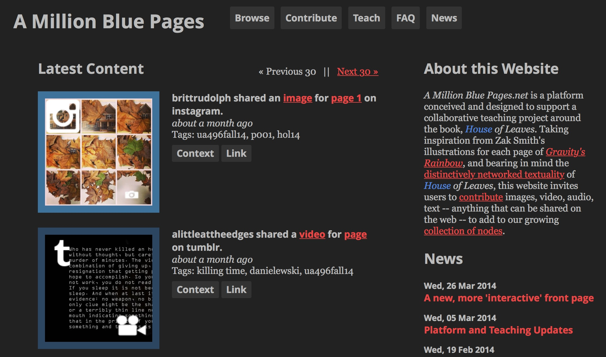
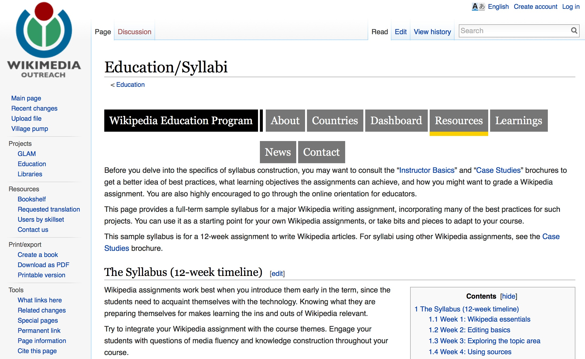
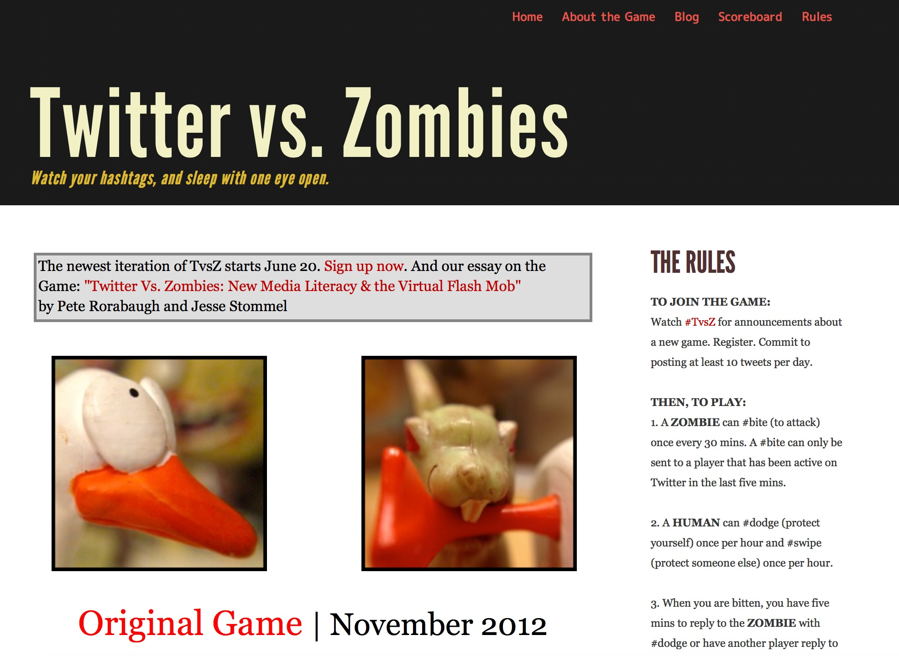
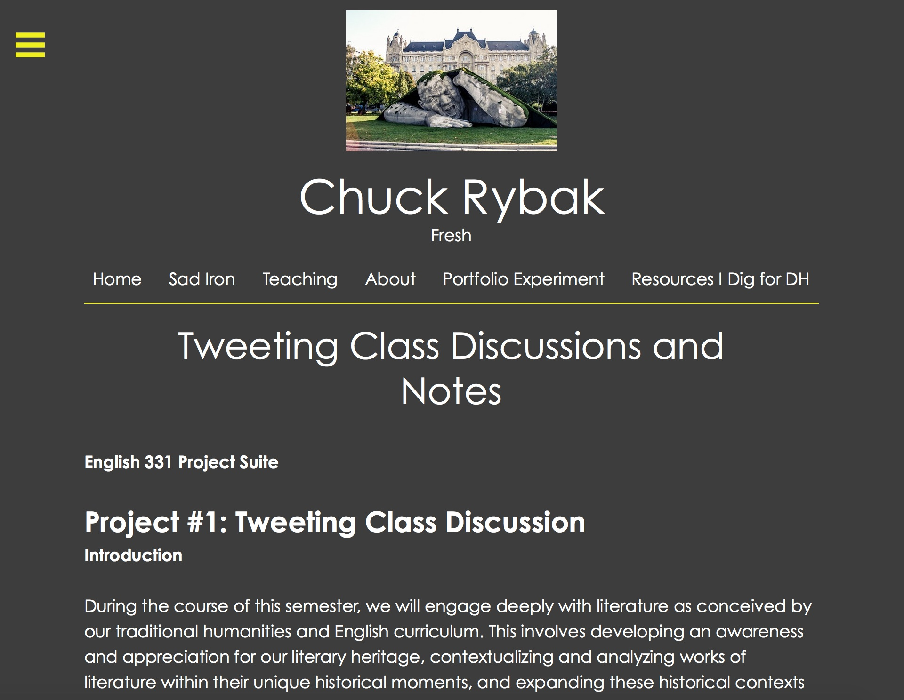
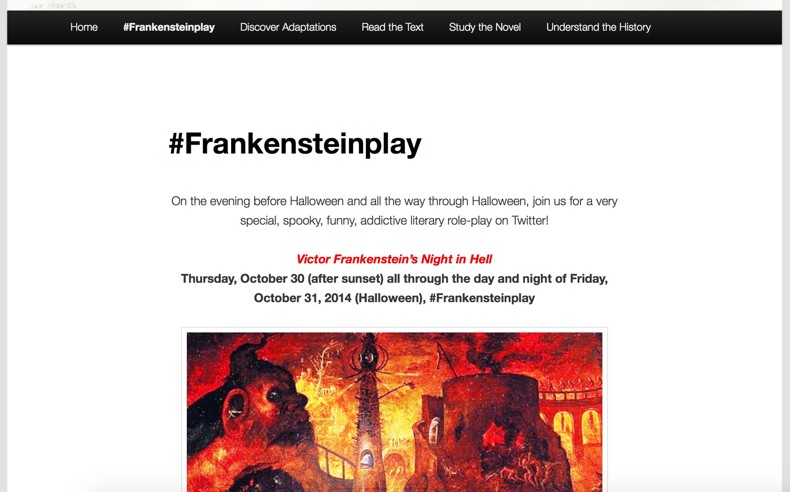
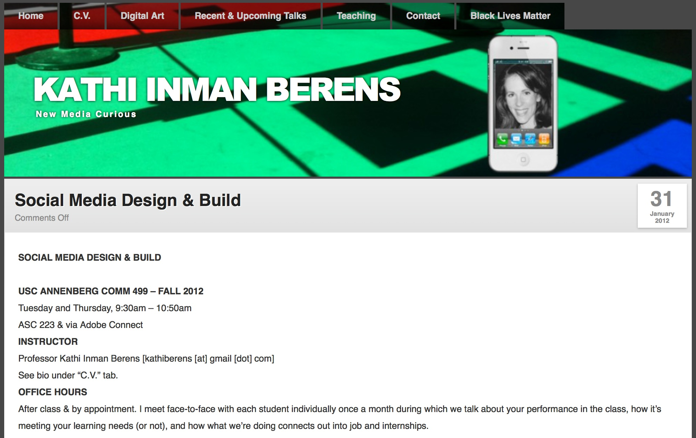
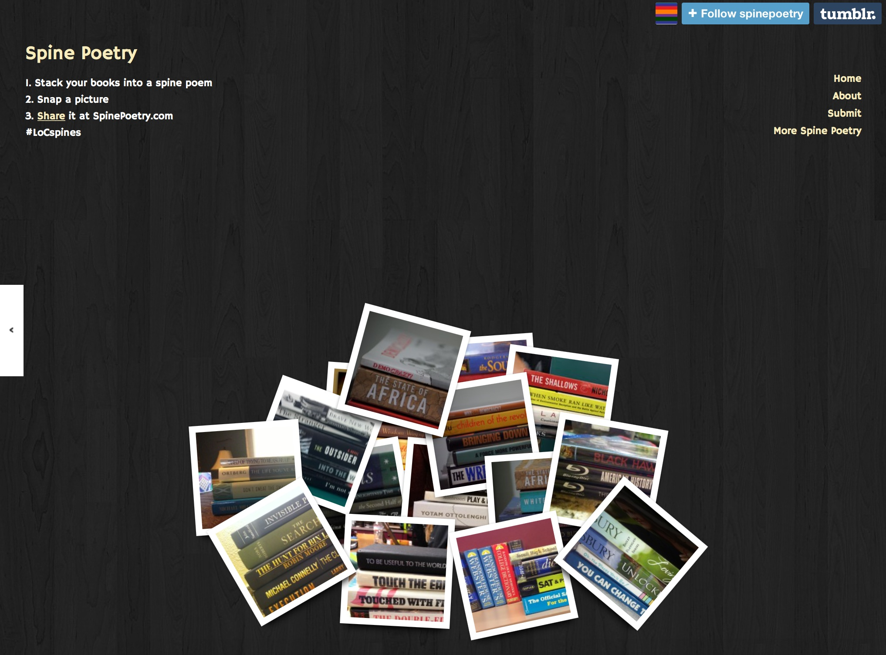
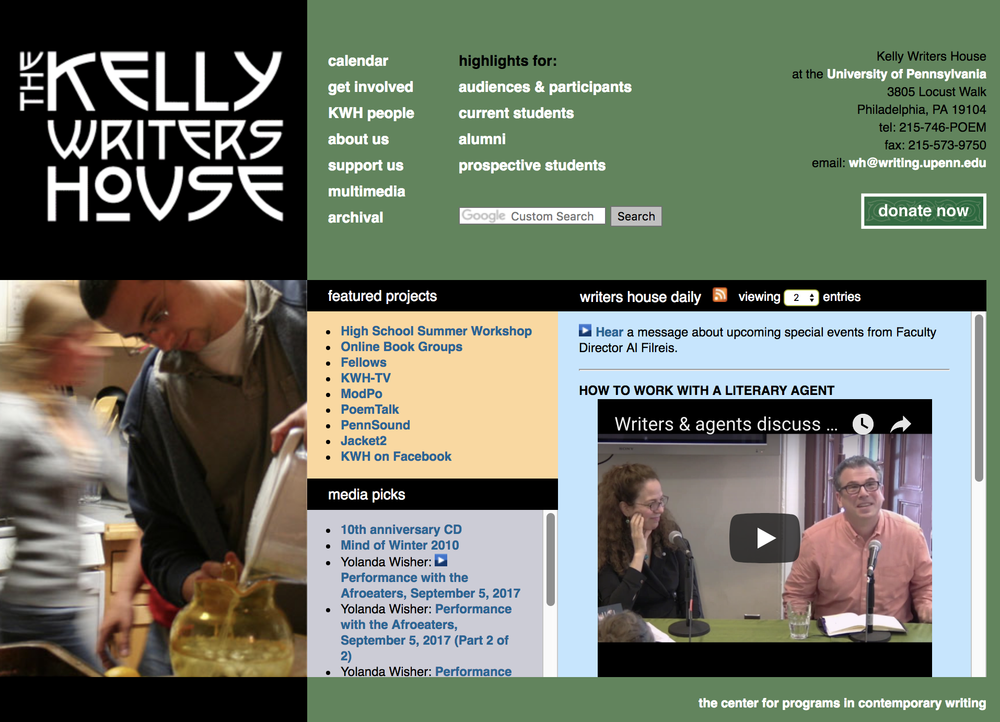
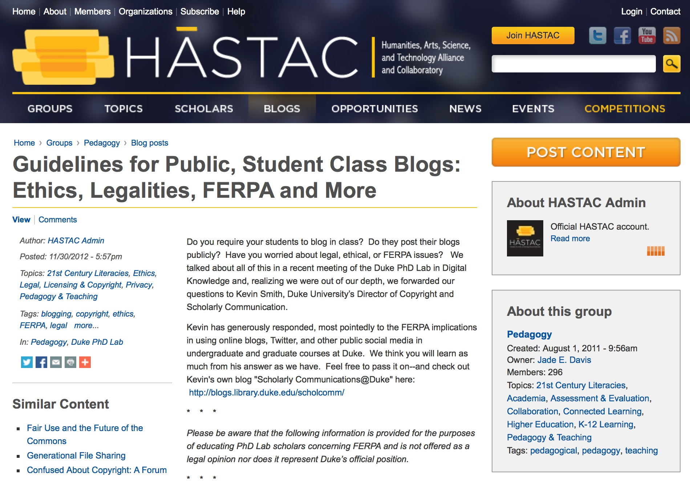

# HYBRID (Draft)

### [Jesse Stommel](http://www.jessestommel.com)
Director, Division of Teaching and Learning Technologies, University of Mary Washington

### [Sean Michael Morris](http://www.seanmichaelmorris.com)
Instructional Designer, Office of Digital Learning, Middlebury College

---

##### Publication Status:
* unreviewed draft
* draft version undergoing editorial review
* draft version undergoing peer-to-peer review
* **draft version undergoing MLA copyediting**
* awaiting pre-print copy
* published 

---

### Cross-Reference Keywords: interface, intersectionality, online, praxis, public

---  

## CURATORIAL STATEMENT

Traditionally, "hybrid" is taken to mean a blending of two or more elements. The word points to a mixture, sometimes productive, always experimental, and a locus of invention. In *Hybridity*, Marwan M. Kraidy writes, “hybridity has proven a useful concept to describe multipurpose electronic gadgets, designer agricultural seeds, environment-friendly cars with dual combustion and electrical engines, companies that blend American and Japanese management practices, multiracial people, dual citizens, and postcolonial cultures” (1). For Kraidy, the term resists easy signification, playing across fields and applications—from manufacturing and agriculture, to culture and society. Importantly, "hybrid" also points to binarisms, ways of seeing the world as essentially not-mixed.

Hybridity is influenced, in part, by the heated discussion of hybridity among postcolonial theorists. In “The Commitment to Theory,” from *The Location of Culture*, Homi Bhabha describes “the space of hybridity” as “the construction of a political object that is new, neither the one nor the other” (25). What is ineluctable about Bhabha's statement is the implication that humans (as political objects, but also as conscious, identity-forming beings) must occupy a space between "the one" and "the other," while also inhabiting both. Similarly, but with a clearer focus on the intersection between humans and machines, Donna Haraway in “A Cyborg Manifesto,” makes an explicit connection between postcolonial theory and what she describes as the colonizing work of machines: “By the late twentieth century, our time, a mythic time, we are all chimeras, theorized and fabricated hybrids of machine and organism, in short, we are cyborgs” (292). Haraway's observation is made manifest in the current age by the ubiquitous accompaniment of cell phones, tablets, Bluetooth technology, and the "internet of things." All of which press a reconsideration of whether human lives can be viewed as strictly analog or strictly digital, and not as unavoidably hybrid.

"Hybrid," then, when applied to digital pedagogy asks that we confront the binaries introduced and problematized by educational technology, such as:

* Physical Learning Space / Virtual Learning Space
* Academic Space / Extra-academic Space (or Private / [Public](https://github.com/curateteaching/digitalpedagogy/blob/master/keywords/public.md))
* On-ground Classrooms / [Online](https://github.com/curateteaching/digitalpedagogy/blob/master/keywords/online.md) Classrooms
* Teachers / Students
* Disciplinarity / Interdisciplinarity

When the meaning and implications of "hybrid" are thus broadened from a more simple definition as a "mixture," the tensions between binaries—their relationships, intersections, and frictions—offer a rich, complex understanding of what it means to be "hybrid," or to be located within an [intersectional](https://github.com/curateteaching/digitalpedagogy/blob/master/keywords/intersectionality.md) space that is between and also both. 

Specifically, digital pedagogy requires that the identity of a student who occupies both digital spaces and physical spaces be given play in their learning and education. With digital pedagogy and online education, the challenge is not to merely replace (or offer substitutes for) face-to-face instruction, but to find new and innovative ways to engage students in the practice of learning—ways that creatively integrate students' digital identities and practices with traditional and online teaching [praxis](https://github.com/curateteaching/digitalpedagogy/blob/master/keywords/praxis.md).

A careful distinction must be made between "blended" and "hybrid." According to Chris Friend, "blended learning seeks to create a path of instruction that best guides students through a prescribed path to reach predetermined outcomes. It emphasizes smooth integration of two delivery modes and a predictable, manageable approach to routine learning" (chrisfriend.us). When educators refer to “blended learning,” they are usually referring to the place where learning happens, a combination of the classroom and online. The word “hybrid” has deeper resonances, suggesting not just that the place of learning is changed but that hybridity requires a fundamental reimagining of our conception of place, and [interface](https://github.com/curateteaching/digitalpedagogy/blob/master/keywords/interface.md). “Hybrid" does not just describe an easy mixing of on-ground and online learning, but is about bringing the sorts of learning that happen in a physical place and the sorts of learning that happen in a virtual place into a more engaged and dynamic conversation.

The resources curated here show how digital tools can be used to extend the classroom beyond its own bounds: continuing discussion outside scheduled class time; connecting a classroom in one geographical place with communities elsewhere; creating genuine audiences for student work; and defending the right of students to be teachers. 

The keyword "hybrid" suggests a methodology for teachers to employ in constructing classes; however, teachers must also think about "hybrid" as a topic for students to investigate. For example, it could be important to consider what Rebekah Sheldon has called "the rhetoric of the room," the specific architecture of the space of learning students and teachers occupy. Learning can be strengthened in environments thought about critically and at a meta-level—specifically how the design of those environments influences the learning that happens within them. This is true of classrooms and libraries, but also learning management systems and social media platforms. So, each of the resources represented here is as much a tool for teachers as it is a potential text for students to use in beginning this investigation.

## CURATED ARTIFACTS

### "A Million Blue Pages"

* Artifact Type: Collaborative projects
* Source URL: <http://amillionbluepages.net/>
* Permissions: CC-BY-NC
* Creator and Affliation: Zach Whalen, University of Mary Washington

*House of Leaves* has produced an extensive network of digital marginalia. In 2011, Zach Whalen, Erin Templeton, Paul Benzon, Mark Sample, and Brian Croxall taught the novel together and [coauthored a collaborative assignment](http://www.briancroxall.net/dh/assignments/sharing-and-re-networking-house-of-leaves/) that bridged work done at each of their institutions. The resource I’m including here is a 2014 follow-up, which also connected classes at multiple institutions. *A Million Blue Pages* is a multimedia annotation of *House of Leaves*. It serves as an example of students and teachers using digital tools to work together outside the constraints of geography and institutional affiliation. And the contributions to the site have continued well after the various courses ended. This is one of the key components of a well-designed hybrid assignment—its ability to engage a community beyond its own bounds—to create learning spaces without a clear end.

### "A 12-week Assignment to Write a Wikipedia Article"

* Artifact Type: Assigments
* Source URL: <http://outreach.wikimedia.org/wiki/Education/Syllabi>
* Permissions: CC BY-SA 3.0
* Creator: Wikimedia Foundation

This assignment offers a guide to having students contribute to Wikipedia. Orienting students to the back-end of Wikipedia helps them think critically about networked communities and knowledge construction on the Web. In Fall 2014, Adeline Koh incorporated this activity into her hybrid [Feminist Theory Seminar](http://www.adelinekoh.org/blog/2014/08/20/syllabus-draft-gis-3614-seminar-in-feminist-theory-fall-2014/) as a major project aimed at improving “conceptual skills, critical thinking, and oral and written communication.” She contextualized the assignment within a discussion of how women are represented within the Encyclopedia, and how this representation is driven (or exactly not driven) by the dearth of female contributors. Asking students to write and rewrite Wikipedia encourages them to engage directly in public scholarship. Even if their revisions don’t *stick*, this work invites a critical discussion of agency that moves well beyond the too often closed space of a physical classroom.

### "Introduction to Digital Studies"

* Artifact Type: Course sites
* Source URL: <https://digitalstudies.pushpullfork.com/Home>
* Permissions: CC BY-SA 4.0
* Creator and Affiliation: Kris Shaffer, University of Mary Washington

"Introduction to Digital Studies" offers a digitally-enabled hybrid entry for students interested in the University of Mary Washington's Digital Studies minor. In the class, Kris Shaffer creates an environment that plays with the idea of interface and literacy by incorporating open texts (the syllabus actually replaces the traditional "Textbooks" heading with "The Internet"), platforms that include Slack for class communication, social media as a focus of investigation, a variety of media—books, TV shows, and movies all available digitally—and the UMW Domain of One's Own project. Students not only develop skills in designing, building and sharing ideas that can be expressed through the uniquely multimodal, procedural, and networked capabilities of digital tools, and build, promote and sustain an active and engaged digital identity in the class, even the grading schema is hybrid, a combination of self-evaluation, discussion, and teacher observation. 

### "Twitter Vs Zombies"

* Artifact Type: Collaborative projects
* Source URL: http://twittervszombies.com/
* Permissions: CC BY-NC-SA 3.0
* Creators and Affiliations: Pete Rorabaugh, Southern Polytechnic State University; and Jesse Stommel, University of Mary Washington

“Twitter vs. Zombies” is a game that aims at building networked communities, introducing new users to Twitter, and developing new media literacies. The initial rules were incredibly simple, a catalyst for play and improvisation. The outcomes were emergent with participants reflecting upon their learning in process on blogs, Storify, Twitter, and elsewhere. The game depends on a self-governing community and has been hacked in at least 5 subsequent versions. In February 2013, students in Pete Rorabaugh’s GSU class and Janine DeBaise’s SUNY class developed and ran the second iteration. Since then, students and teachers as far as Cairo, Egypt have forked and remixed the game. While this experiment happened on Twitter, my interest is ultimately less in advocating for a specific platform and more in how a hybrid teaching strategy asks us to think critically about the tools we use and how they can connect students to each other via the web.

### "Note Tweeting"

* Artifact Type: Assignments
* Source URL: <http://chuckrybak.com/tweeting-class-discussions-and-notes>
* Permissions: CC-BY-NC
* Creator and Affiliation: Chuck Rybak, University of Wisconsin-Green Bay

Chuck Rybak offers an excellent example of how students can use a tool like Twitter to extend an otherwise face-to-face discussion. Rybak uses social media in his courses to build a literal and figurative *open-door* classroom. Students turn “oral discussions into usable texts,” a set of dialogic (as opposed to monologic) notes for a discussion, both for students to review and as a way of allowing outsiders to eavesdrop. Students [Storify](http://www.hybridpedagogy.com/journal/how-to-storify-why-to-storify/) their tweets, which makes a more permanent curated collection of tweets than their experience of the discussion. The students move through several recursive layers: ideas in their brains, discussion in a physical room, tweets that act as a sort of Greek chorus, a Storify that curates those thoughts further, and feedback to the Storify, which can be used to prompt future face-to-face discussions.

### "A Public Literary Twitter Role-Play"

* Artifact Type: Assignments
* Source URL: <http://shelleysfrankenstein.wordpress.com/frankenstein-a-public-literary-twitter-role-play-on-twitter/>
* Permissions: CC-BY-NC
* Creator and Affiliation: Petra Dierkes-Thrun, Stanford University

Petra Dierkes-Thrun has run several iterations of the Public Literary Twitter Role-play, having students re-enact and inhabit texts like *The Portrait of Dorian Gray*, *Lolita*, and *Frankenstein*. Each experiment has had a different prompt used to engage students in her physical class and also virtual participants around the world. Her [larger goals](http://www.fhi.duke.edu/events/petra-dierkes-thrun-lecture) focus on “close-reading, critical thinking, and critical writing,” allowing students to comment on the text and also put their readings to use, drawing non-scholars into animated language-play and literary discussion. Dierkes-Thrun does not “make” students participate openly online but “invites” them to. When asking students to work on the open Web, it’s important to give thought to student privacy, data, and FERPA, but what is most important is that students be given space to make informed choices about how they will occupy the Web.

### "Social Media Design and Build"

* Artifact Type: Course sites
* Source URL: <http://kathiiberens.com/teaching/sample-syllabi/design-build/>
* Permissions: CC-BY-NC
* Creator: Kathi Inman Berens, USC Annenberg

In her hybrid USC Annenberg course, Kathi Inman Berens works with students face-to-face, but also using synchronous video platforms. The course focuses on how we engage one another via digital media, and the students work in teams on projects for real-world clients. From the syllabus: “I expect you to be on your laptops and smartphones during class. Connectivity is essential to our work.” She asks students to keep a “Distraction Log” to “make observations about their own media consumption habits.” The course spans media, geography, and traditional/non-traditional learning environments. Helping students understand how to move within and between these spaces is a key literacy for working in digital space. [She writes of her teaching philosophy,](http://kathiiberens.com/teaching/philosophy/) "It doesn’t matter to me if my classroom is a little rectangle in a building or a little rectangle above my keyboard. Doors are rectangles; rectangles are portals. We walk through."

### "Spine Poetry"

* Type of Artifact: Collaborative projects
* Source URL: <http://spinepoetry.com/>
* Permissions: CC-BY-NC
* Creator: Kathi Inman Berens, USC Annenberg; Lans Pacifico; Carrie Padian; Ken Schultz; Jesse Stommel, University of Mary Washington; Jessica Zisa

A hybrid learning environment deconstructs hierarchies, giving students a fuller sense of their own agency. In winter 2013, I co-taught with Kathi Inman Berens a small seminar with four non-traditional undergraduate students. Together, the students worked with the Library of Congress in Washington D.C. to build a social media campaign promoting the LOC's first exhibit of electronic literature. The students also coordinated a physical event at the Lake Oswego Library outside Portland, OR. Their goal was to bring the Library of Congress to Portland and the Web—and to bring Portland and the Web to the Library of Congress, using digital technology to connect physical work happening at two remote locations. From the [artist statement](http://spinepoetry.com/about): “Spine poems bridge the physical world of books with stories that are born digitally.” The project was the course, designed and developed by the students from the start with the teachers participating as co-learners.

### "The Kelly Writers House"

* Type of Artifact: Collaborative Projects
* Source URL: <http://writing.upenn.edu/wh/>
* Permissions: CC-BY-NC
* Creator: Al Filreis, University of Pennsylvania

The Kelly Writers House is housed in the Special Collections Department of Van Pelt Library at the University of Pennsylvania, but contributes to hybrid courses and projects. For example, a truly "Hybrid" Massive Open Online Course that Al Filreis began offering in 2012, "[Modern and Contemporary American Poetry](https://www.coursera.org/course/modernpoetry)," experiments with the MOOC format and hacks the Coursera platform to create opportunities for students to have a central role in both their own learning but also in the teaching of the course. Instead of focusing on video lectures at the head of each unit, Filreis hosts live discussions at the Kelly Writers House that feature himself, University of Pennsylvania students, as well as students from around the world that call in (and sometimes make visits to PA). The physical place of the Kelly Writers House becomes the fulcrum around which the online course pivots. Kelly Writers House is also home to other digital and hybrid projects, including [PennSound](http://writing.upenn.edu/pennsound/), a podcast, and online book groups, poetry readings, and more.

### "Guidelines for Public, Student Class Blogs: Ethics, Legalities, FERPA and More"

* Type of Artifact: Teaching guidelines
* Source URL: <https://www.hastac.org/blogs/superadmin/2012/11/30/guidelines-public-student-class-blogs-ethics-legalities-ferpa-and-more>
* Permissions: CC BY-SA 3.0
* Creator: Kevin Smith, Duke University

In this set of guidelines, Kevin Smith, Duke University’s Director of Copyright and Scholarly Communication, offers information (not a legal opinion, as noted) on the ethics and legalities of having students doing public work. Specifically, he tackles various methods for addressing FERPA concerns when having students working on public blogs. In short, inform students of the requirement from the start, offer the option of anonymity, remind them not to post private information, and offer alternatives if a student has major concerns about doing public work even under an alias. FERPA is in place to protect students, not to put artificial limits on their learning. As with any pedagogical decision, our first concern should be on protecting student agency—learners not teachers should make the critical choices about what, when, how, and where they learn.

## RELATED MATERIALS

Friend, Chris. ["On Vocabulary: 'Blended Learning' vs. 'Hybrid Pedagogy.'"](http://chrisfriend.us/on-vocabulary-blended-learning-vs-hybrid-pedagogy-2/) *chrisfriend.us*, http://chrisfriend.us/on-vocabulary-blended-learning-vs-hybrid-pedagogy-2/.

Davidson, Cathy N. ["10 Things I've Learned (so far) From Making a Meta-MOOC"](http://www.hybridpedagogy.com/journal/10-things-learned-from-making-a-meta-mooc/) *Hybrid Pedagogy*, www.hybridpedagogy.com/journal/10-things-learned-from-making-a-meta-mooc/.

Morris, Sean Michael and Jesse Stommel. ["The Discussion Forum is Dead; Long Live the Discussion Forum."](www.hybridpedagogy.com/journal/the-discussion-forum-is-dead-long-live-the-discussion-forum/) *Hybrid Pedagogy*, www.hybridpedagogy.com/journal/the-discussion-forum-is-dead-long-live-the-discussion-forum/.

Rheingold, Howard. [*Net Smart*](rheingold.com/books/net-smart/) rheingold.com/books/net-smart/.

University of Central Florida. *Blended Learning Toolkit*, http://blended.online.ucf.edu.

## WORKS CITED

Bhabha, Homi. "The Commitment to Theory." *The Location of Culture*. Routledge, 2004.

Dierkes-Thrun, Petra. "A Public Literary Twitter Role-play." *Mary Shelley's Frankenstein*, http://shelleysfrankenstein.wordpress.com/frankenstein-a-public-literary-twitter-role-play-on-twitter/.

Friend, Chris. ["On Vocabulary: 'Blended Learning' vs. 'Hybrid Pedagogy.'"](http://chrisfriend.us/on-vocabulary-blended-learning-vs-hybrid-pedagogy-2/) http://chrisfriend.us/on-vocabulary-blended-learning-vs-hybrid-pedagogy-2/.

Haraway, Donna. "A Cyborg Manifesto," in *Simians, Cyborgs and Women: The Reinvention of Nature*. *Georgetown University*, http://faculty.georgetown.edu/irvinem/theory/Haraway-CyborgManifesto-1.pdf.

Inman Berens, Kathi. "The New Learning is Ancient." http://kathiiberens.com/teaching/philosophy/.

Inman Berens, Kathi. *Social Media Design and Build*, http://kathiiberens.com/teaching/sample-syllabi/design-build/.

Inman Berens, Kathi, Lans Pacifico, Carrie Padian, Ken Schultz, Jesse Stommel, and Jessica Zisa. *Spine Poetry*, http://www.spinepoetry.com.

Koh, Adeline. *Seminar in Feminist Theory*, http://www.adelinekoh.org/blog/2014/08/20/syllabus-draft-gis-3614-seminar-in-feminist-theory-fall-2014/.

Kraidy, Marwan M. *Hybridity, or the Cultural Logic of Globalization*. Temple University Press, 2005.

Rorabaugh, Pete and Jesse Stommel. *Twitter vs. Zombies*, http://www.twittervszombies.com.

Rybak, Chuck. "Note Tweeting." http://chuckrybak.com/tweeting-class-discussions-and-notes.

Smith, Kevin. "Guidelines for Public, Student Class Blogs: Ethics, Legalities, FERPA and More." *HASTAC*, <http://www.hastac.org/blogs/cathy-davidson/2012/11/30/guidelines-public-student-class-blogs-ethics-legalities-ferpa-and-mo>

Whalen, Zach. *A Million Blue Pages*, http://amillionbluepages.net

Wikimedia Foundation. "A 12-week assignment to write a Wikipedia article." *Wikimedia Outreach*, http://outreach.wikimedia.org/wiki/Education/Syllabi

*Some language in the Curatorial Statement is drawn directly from:*

Stommel, Jesse. "Hybridity, pt. 2: What is Hybrid Pedagogy?" *Hybrid Pedagogy*, <http://www.hybridpedagogy.com/Journal/hybridity-pt-2-what-is-hybrid-pedagogy/>
