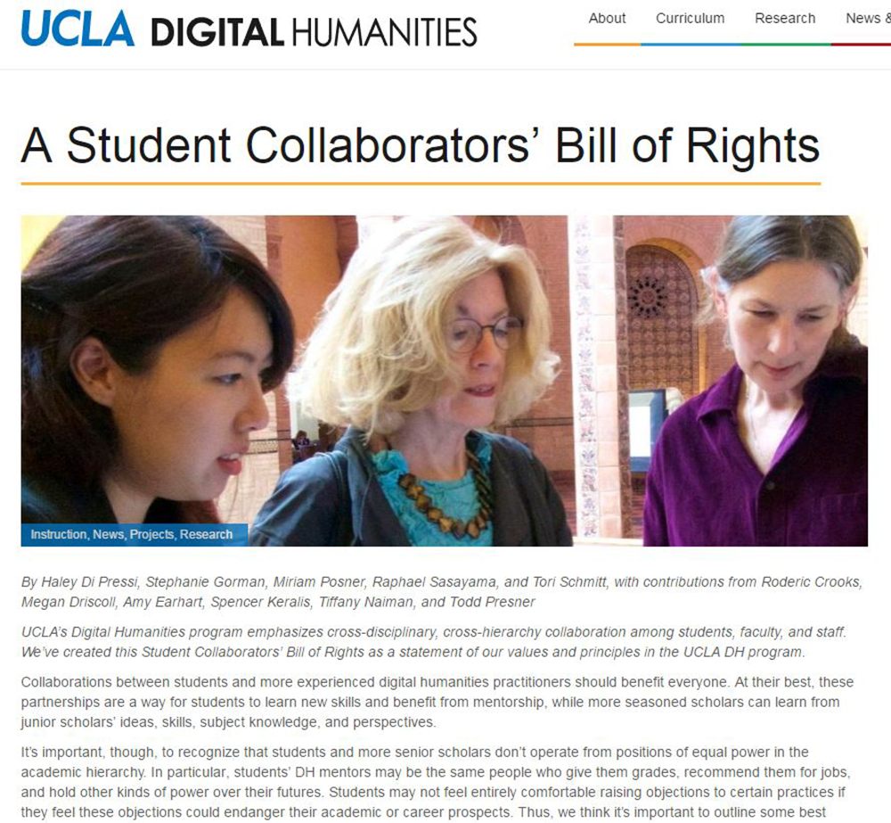
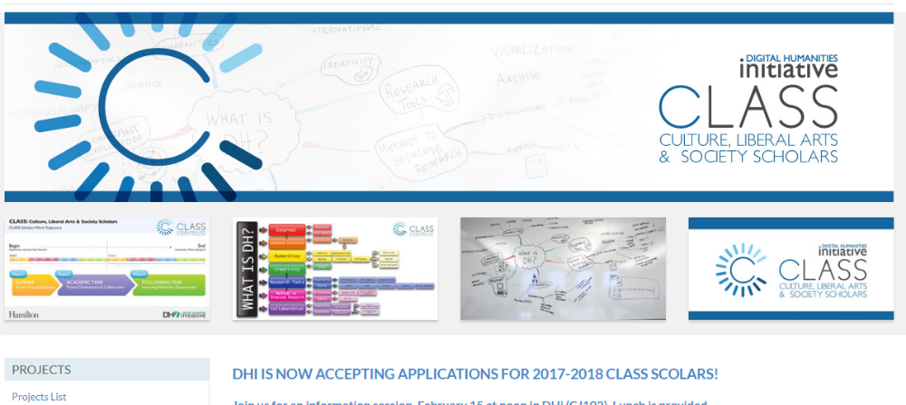
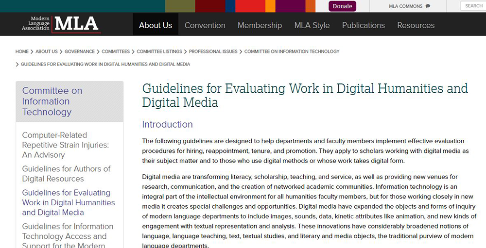
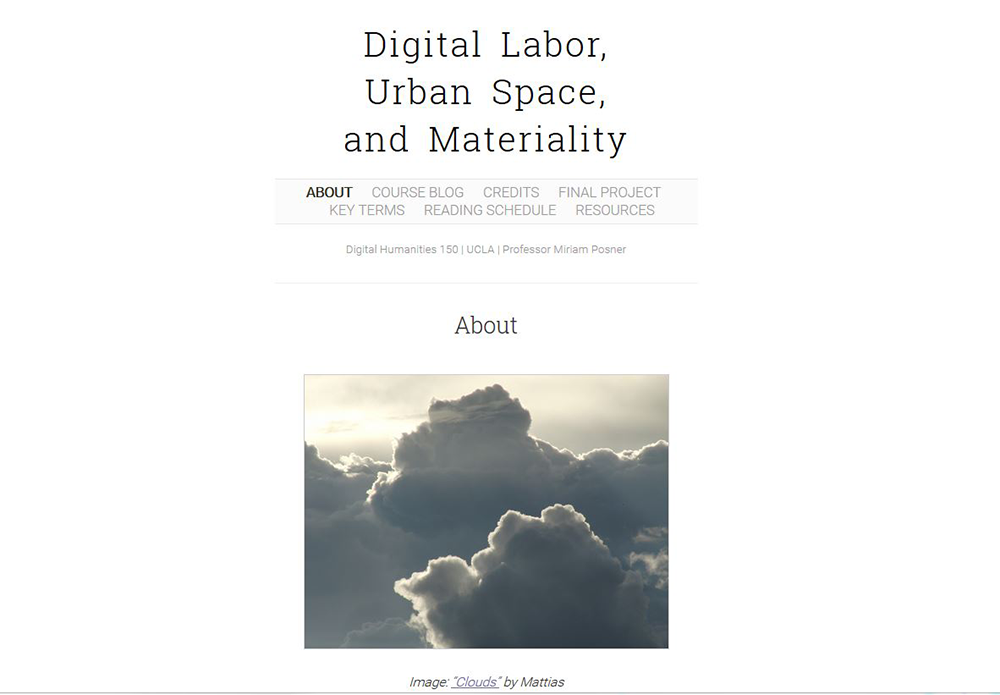
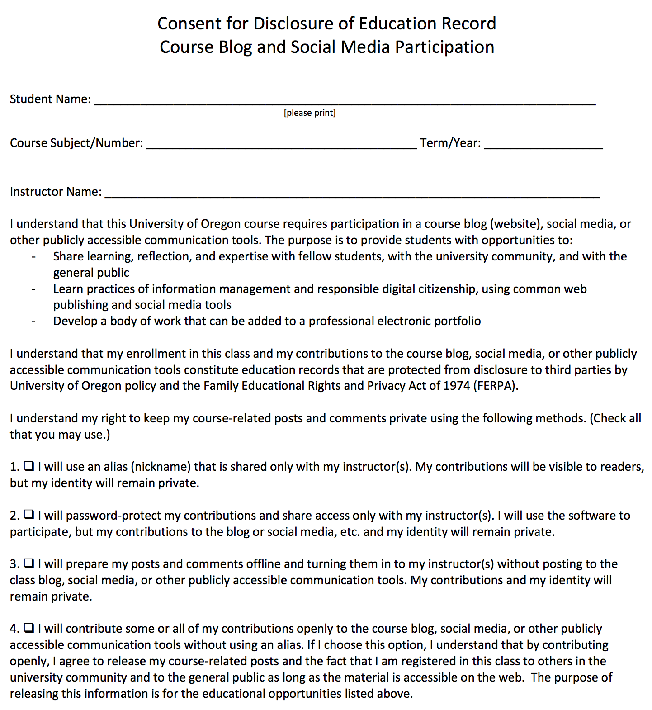
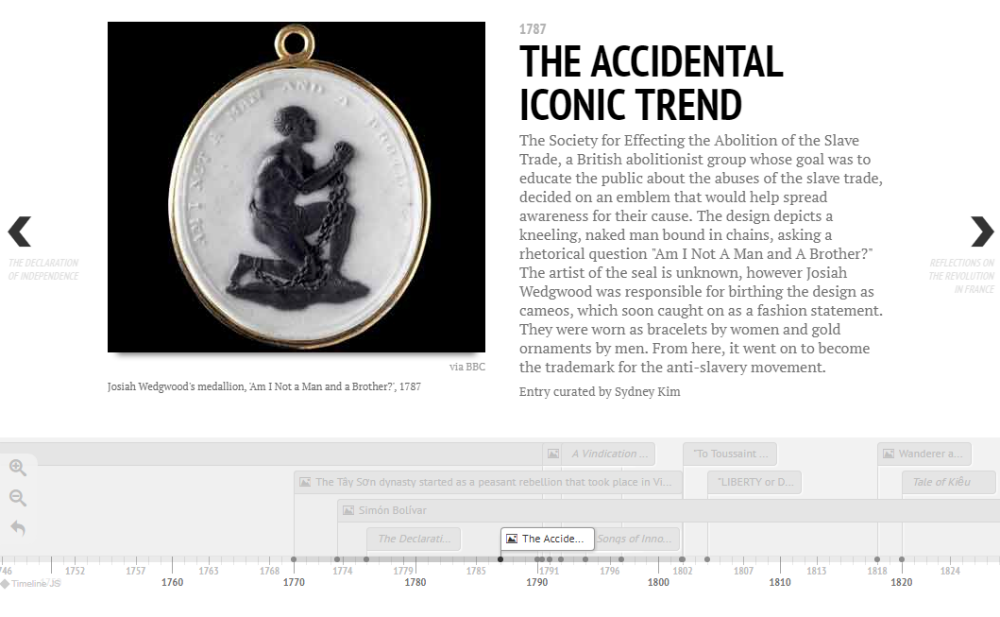
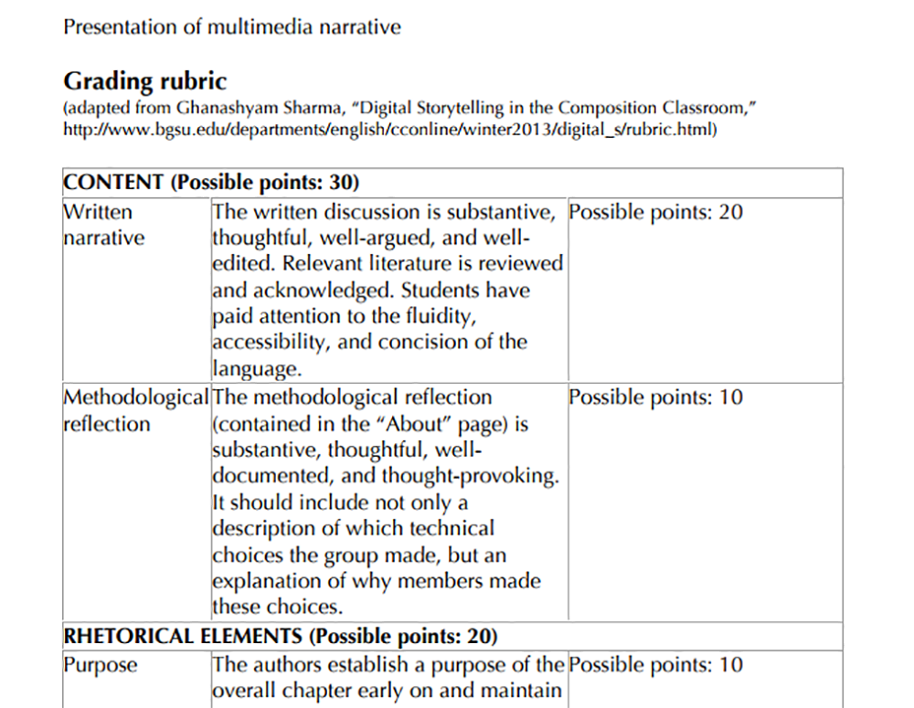

# Labor

### Spencer D.C. Keralis

University of North Texas | [http://spencerkeralis.com/](http://spencerkeralis.com/)

### Pamela Andrews

University of North Texas | [https://www.library.unt.edu](https://www.library.unt.edu/people/pamela-andrews) 

---

##### Publication Status:
* unreviewed draft
* draft version undergoing editorial review
* draft version undergoing peer-to-peer review
* **draft version undergoing MLA copyediting**
* awaiting pre-print copy
* published 

---

### Cross-Reference Keywords: archive, collaboration, professionalization, project management, social justice

---   

## CURATORIAL STATEMENT 

### The spectrality of labor

The language of labor permeates pedagogic discourse.  Homework, showing your work, and other classic invocations of labor in the classroom ensure that students and instructors find the concepts of education and labor to be interminably entwined. In the digital environment, the conflation of labor with its product makes it challenging to ensure that those doing the work on digital projects receive proper credit and compensation.  

Student exposure to digital production in the classroom often takes the form of performing labor on a faculty project without credit or compensation (Keralis). Under the rubrics of skills building and exposure to active research, this has become a common, if not entirely unchallenged, practice in digital humanities. While these rubrics demonstrate the importance of digital projects, they collapse the many variable factors that guide the development of a project. The labor network necessary to produce digital projects is complex, and can include the knowledge work that serves as the intellectual foundation of a project, the physical labor of maintaining the infrastructure underlying these projects, hybrid labor “in which machines combine with humans to perform tasks” in software, scripted tasks performed automatically within systems and the writing of those scripts, and the instrumentalized labor of workers who perform repetitive tasks that cannot be scripted (Burgess & Hamming). An individual at one point on a project may be wholly unaware of the labor of others going on elsewhere.  Their labor is invisible and easily taken for granted. With apologies to Marx, if there is a spectre haunting digital pedagogy, it is labor. The aim of this collection of artifacts is to perform a séance, to make visible the spectral labor that haunts our shared digital house.

### Curation

As with [archival selection](https://digitalpedagogy.commons.mla.org/keywords/archive/), the labor choices made on digital projects reflect the values of those scholars and project managers, within the context of institutional realities (Coats & Dean). When student labor is invisible, their choices and values are elided with those of the visible authors and are rendered less valuable outside of the class assignment framework. 

We are not arguing against students doing “work” in class. Some form of intellectual or practical labor to demonstrate understanding and applied skills is a necessary cornerstone of most pedagogy. The digital learning environment offers potential for humanities educators to diversify the way students learn and demonstrate mastery in our classes beyond the traditional seminar paper. However, there are many considerations that instructors must make when integrating digital labor into their pedagogy. 

Most university policies recognize student work as [“Creator-Owned Intellectual Property”](https://research.unt.edu/sites/default/files/08-Intellectual%20Property_%20Research%20Intellectual%20Property_0.pdf) (UNT). Instructors must be careful not to obscure students’ right to proper attribution and give credit (in addition to a letter grade) for this work. There are also implications under the Family Educational Rights and Privacy Act (FERPA) for sharing student work online or using [social media](http://er.educause.edu/articles/2014/2/is-your-use-of-social-media-ferpa-compliant) in the classroom (UO). Bringing these policies into discussion can also give students a language for recognizing the degree to which they may want their labor to be made visible, and how it can be valued at their desired level of visibility.  Helping students understand the value and risks of digital labor in tandem with helping them develop digital skills can prepare them well for the diverse labor marketplace they will enter upon graduation. 

This process of parallel critique and creation does not have to be onerous for instructors or students. The artifacts below offer models for engaging students in an informed critique of some of the inequities of digital labor, while simultaneously fostering practical skills that are both useful and marketable outside the humanities. Combining some basic technical skills with a solid understanding of the realities of the complex digital labor marketplace can better position our students for success beyond the academy. By giving students assignments that help them recognize and understand the people who perform the labor behind the websites and widgets, we can equip them to be articulate advocates for the value of their work and the work of others. In a landscape in which there are many forces competing to alienate and obscure the labor of students, women, people of color, and the underclass of the digital workforce, equipping students to own their labor provides them with a crucial survival skill.

The artifacts selected here offer models for advocacy and evaluation, and exercises that provide students the opportunity to both produce their own digital project, and to reflect on the modes of production necessary to do that work. 

## CURATED ARTIFACTS 

#### Student Collaborators Bill of Rights

* Artifact Type: teaching guidelines
* Source URL: [http://www.cdh.ucla.edu/news-events/a-student-collaborators-bill-of-rights/](http://www.cdh.ucla.edu/news-events/a-student-collaborators-bill-of-rights/) 
* Artifact Permissions: No site license noted.
* Copy of the Artifact: N/A
* Creators and Affiliations: Haley Di Pressi, Stephanie Gorman, Miriam Posner, Raphael Sasayama, and Tori Schmitt, all UCLA; with contributions from Roderic Crooks, Megan Driscoll, Amy Earhart, Spencer Keralis, Tiffany Naiman, and Todd Presner
* Tags: getting started

Published by the UCLA Center for Digital Humanities, the *Bill of Rights* was developed in collaboration with students, based on their experiences in digital humanities classes. The *Bill of Rights* reflects on the power inequities that are inevitable when student labor in the classroom is used to support faculty projects. The *Bill of Rights* could be effectively integrated into course syllabi as an up-front, positive declaration of the rights of students. This document could also be used as a point of discussion for students, empowering them to value their labor and recognize inequities when they occur. Students might also be encouraged to look outside the humanities for other examples of student rights advocacy. Do the sciences, which have a longer history of collaboration between students and faculty, but also a mixed record on the ethical treatment of students, have similar documents? How can these values be naturalized throughout the academy without negative remedies?

#### Culture, Liberal Arts, & Society Scholars

 

* Artifact Type: internship
* Source URL: [http://dhinitiative.org/projects/class/](http://dhinitiative.org/projects/class)
* Artifact Permissions: © 2017 Digital Humanities Initiative, Hamilton College	 	
* Copy of the Artifact: N/A
* Creators and Affiliations: Digital Humanities Initiative
* Tags: getting started

Internships are routine components of many professional degrees, and are increasingly common in digital media pedagogy and the arts. The Digital Humanities Initiative at Hamilton College offers three fellowships for faculty and students to participate in a sustained collaboration. The program commits to funding student participants with a stipend, budget for research expenses, and funded conference attendance. This model avoids the pitfalls of unpaid internships in which students pay tuition - and accrue debt - for unpaid labor (Hickman, et al.). Notably, Hamilton College demonstrates a commitment beyond skills-building. Participation in a sustained research project provides additional professional development as a scholar and visible collaborator. This resource provides a model for advocacy, demonstrating how the internship process can relate to outcomes beyond the research project, and how both faculty and student values and decisions can be incorporated into such a framework.

#### Guidelines for Evaluating Work in Digital Humanities and Digital Media

  

* Artifact Type: rubric
* Source URL: [https://www.mla.org/About-Us/Governance/Committees/Committee-Listings/Professional-Issues/Committee-on-Information-Technology/Guidelines-for-Evaluating-Work-in-Digital-Humanities-and-Digital-Media](https://www.mla.org/About-Us/Governance/Committees/Committee-Listings/Professional-Issues/Committee-on-Information-Technology/Guidelines-for-Evaluating-Work-in-Digital-Humanities-and-Digital-Media)
* Artifact Permissions:  © 2016 Modern Language Association of America
* Copy of the Artifact: N/A
* Creators and Affiliations: MLA Committee on Information Technology
* Tags: advanced

Professionalization is a necessary but often invisible component of pedagogy, especially at the graduate level. However, students are often unaware of the processes underlying faculty appointment and retention, the adjunctification of teaching labor, and the architectures of power that shape and institutionalize these processes. Originally drafted in 2000, these criteria on evaluating digital work introduce questions of media specificity, accessibility, and roles and responsibilities on projects that can be useful in reviewing classroom projects, or when examining exemplar projects. When combined with the [Short Guide To Evaluation Of Digital Work](http://journalofdigitalhumanities.org/1-4/short-guide-to-evaluation-of-digital-work-by-geoffrey-rockwell/), students can be asked to examine how labor is assessed of its value by different mechanisms within the academic community. Students might be invited to use these criteria in thinking about their own potential career paths. What skills do they need to develop—including non-technical skills like budgeting and project management—that are not covered in their departmental curriculum?

#### *The History Engine;* “The Keating-Owen Child Labor Act of 1916”

  

* Artifact Type: student work
* Source URL: [https://historyengine.richmond.edu/episodes/view/5309](https://historyengine.richmond.edu/episodes/view/5309)
* Artifact Permissions: Digital Scholarship Lab © 2008–2015 The University of Richmond, [https://historyengine.richmond.edu/pages/about/terms_of_service](https://historyengine.richmond.edu/pages/about/terms_of_service) 
* Copy of the Artifact: N/A
* Creators and Affiliations:  No author noted.
* Tags: getting started

*History Engine* purports to teach students “the craft of an historian” by giving them experience working with primary documents and related secondary sources, and writing analysis of the sources for public consumption. However, student authors are uncredited on the “episodes” they write, and author is not a searchable field within the database. *History Engine* can be used to empower students to ask questions about authorship and intellectual property. Useful exercises might include searching college websites to determine how much students paid per credit hour to contribute to the Engine, or discussing how to cite a work whose author has been rendered invisible. What does this invisibility teach them about “the craft of an historian”? Are there instances when it is more appropriate for student work to be anonymous? Are students aware of their rights under FERPA, and how these rights might be placed in dialogue, if not contrast, with their intellectual property rights? 

#### Digital Labor, Urban Space, and Materiality

  

* Artifact Type: syllabus
* Source URL: [http://digitalmateriallabor.org/](http://digitalmateriallabor.org/)
* Artifact Permissions: CC BY-NC 4.0 
* Copy of the Artifact: N/A
* Creators and Affiliations:  Miriam Posner, University of California Los Angeles
* Tags: advanced; Scroll Kit

This course examines the “real people in real places” who are involved in the transmission and storage of information. Through readings and hands-on exercises, students worked together to develop a digital publication, reflect on their methodology, explain the choices they made, and describe each team member’s role on the final project. The students’ final projects are available on the website, and each contributor is credited. Teamwork is a reality of digital labor that can be challenging to scholars accustomed to understanding their roles as sole author or single contributor. In this syllabus, student are able to examine their labors as the project develops, rather than at the end. These assignments enable students to develop valuable skills in both investigating and recovering the story of labor for these now ubiquitous objects.

#### Consent for Disclosure of Education Record

 

* Artifact Type: consent form
* Source URL: [http://bit.ly/ferpa-release](http://bit.ly/ferpa-release)
* Artifact Permissions: CC BY 4.0
* Copy of the Artifact: [http://bit.ly/ferpa-release](http://bit.ly/ferpa-release)
* Creators and Affiliations:  Spencer Keralis, University of North Texas; adapted from University of Oregon Libraries
* Tags: getting started; FERPA

If the syllabus constitutes a labor contract between the instructor and the student, the *Consent for Disclosure of Education Record* allows students to negotiate with the instructor and the institution to what degree their this labor may be made public (UO Libraries).  This negotiation is critical for classroom-based digital projects, as many platforms necessitate a public-facing output. The consent form provides three methods through which a student may participate according to their desired privacy level, while also providing information as to which activities will be private or public. The granularity of these options demonstrates that privacy and attribution do not have to be binary concepts when it comes to participation. This tool also provides students with an official, institution-sanctioned mechanism for asserting their rights without feeling that they are challenging the integrity of the instructor’s assignment. Including the form within a course also gives instructors a tangible means of enacting their commitment toward student rights, authorship, and privacy.

#### World Literature Timeline

  

* Artifact Type: assignment
* Source URL: [http://tiny.cc/ENGL2220S17](http://tiny.cc/ENGL2220S17)
* Artifact Permissions: CC BY SA 4.0.
* Copy of the Artifact: [http://tiny.cc/TimelineAssignment](http://tiny.cc/TimelineAssignment)
* Creators and Affiliations:  Sydney Kim, University of North Texas (timeline entry creator); Spencer Keralis, University of North Texas (instructor)
* Tags: getting started; Timeline JS.

Incorporating digital projects into humanities survey courses can be a challenge, as covering a wide range of material is the primary mission of the course. In this assignment, the Timeline project assists with the heavy lifting of providing historical context for the works on the syllabus, and gives students exposure to thinking about information as data, doing research in online databases, and reflecting on the process of producing their contribution. Timeline JS, part of the Knight Labs Storyteller Toolkit, uses a Google Sheets template to feed into the Timeline platform, so students need not learn code to produce a visually compelling end product. The assignment adapts the UO FERPA release to give students the option of completing the assignment anonymously or offline. Students are given agency in how they complete the assignment, and ownership of their contribution to the final product. 

#### Millican “Riot,” 1868

  

* Artifact Type: student work
* Source URL: [http://millican.omeka.net/](http://millican.omeka.net/)
* Artifact Permissions: No site license noted.
* Copy of the Artifact: N/A
* Creators and Affiliations:  Amy Earhart, Associate Professor, Department of English, Texas A&M; Nigel Lepianka, Doctoral Student and Graduate Assistant, Department of English, Texas A&M
* Tags: getting started; Omeka

Part of a growing suite of projects under Amy Earhart and Toneisha Taylor’s  *White Violence, Black Resistance* project, *Millican “Riot,” 1868* curates digital artifacts related to an early incident of race-motivated violence that has been effectively erased from the scholarly record. The project reflects on how events can be rendered invisible and demonstrates how digital platforms can recover these events by making artifacts visible to scholars and the public. This project offers a model of how Omeka.net (the free version of the platform) can be used for a class project in which students make individual, credited contributions. Students gain practical experience in metadata and controlled vocabularies, digitization, curation, and using content management systems. The exhibit provides another alternative model of digital publication, which could be enriched—either publicly or behind the scenes in the classroom—by the reflection component described in Posner’s or Keralis’s assignment.

#### Build Your Own Website

  

* Artifact Type: assignment
* Source URL: [http://f14tmn.ryancordell.org/assignments/build-your-own-website/](http://f14tmn.ryancordell.org/assignments/build-your-own-website/)
* Artifact Permissions: CC BY SA 4.0
* Copy of the Artifact: [http://f14tmn.ryancordell.org/assignments/build-your-own-website/](http://f14tmn.ryancordell.org/assignments/build-your-own-website/)
* Creators and Affiliations:  Ryan Cordell, Northeastern University
* Tags: getting started: Wordpress

This assignment gives students the opportunity to create their own website, with their own domain name, on which they can complete course assignments. While constructing a site provides students with some basic technical experience in working with a content management system such as Wordpress, the exercise also helps them become accustomed to sharing their work in a much larger environment than is typically expected for a class assignment. The option of blogging anonymously is offered, although the emphasis is on creating a web presence that can “rhetorically position yourself in relation to your studies and your career goals.” Building and populating a website also introduces students to the reality of the labor involved in building and maintaining a digital identity including a personal website, blogging, and across a variety of social media platforms. This care and feeding of online identity can itself be a full-time gig which is often effaced in academic workplaces.

#### Device Narratives Grading Rubric

  

* Artifact Type: rubric
* Source URL: [http://digitalmateriallabor.org/wp-content/uploads/2013/12/DH-150-14W-Final-project-assignment1.pdf](http://digitalmateriallabor.org/wp-content/uploads/2013/12/DH-150-14W-Final-project-assignment1.pdf)
* Artifact Permissions: CC BY-NC 4.0
* Copy of the Artifact: [Device Narratives Grading Rubric](files/labor-Device-Narratives-Grading-rubric.pdf)
* Creators and Affiliations:  Miriam Posner, University of California Los Angeles
* Tags: getting started

The Grading Rubric for the final project of Miriam Posner’s *Digital Labor, Urban Space, and Materiality* course provides guidelines for specific feedback on student contributions to the course project. The evaluation of the Methodological Reflection includes criteria students should consider in their reflection, including an explicit call to document individual member choices. Here, methodology is framed as both the technical decisions guiding the product, and the values informing these decisions by the student authors. By encouraging students to reflect on their contributions to the team project, the assignment and accompanying rubric provides a mechanism for credit for individual contributions, and a means for students to hold each other accountable for their engagement with the team project. Students’ labor is recognized and assessed based at least in part on input from their peers.

## RELATED MATERIALS

*Collaborator’s Bill of Rights.* Media Commons, 2011. [http://mediacommons.futureofthebook.org/mcpress/offthetracks/.](http://mediacommons.futureofthebook.org/mcpress/offthetracks/)

Modern Language Association. “Guidelines for Evaluating Work in Digital Humanities and Digital Media.” [https://www.mla.org/About-Us/Governance/Committees/Committee-Listings/Professional-Issues/Committee-on-InformationTechnology/Guidelines-for-Evaluating-Work-in-Digital-Humanities-and-Digital-Media](https://www.mla.org/About-Us/Governance/Committees/Committee-Listings/Professional-Issues/Committee-on-InformationTechnology/Guidelines-for-Evaluating-Work-in-Digital-Humanities-and-Digital-Media)

Posner, Miriam. “How did they make that?” *Miriam Posner’s Blog.* August 29, 2013. [http://miriamposner.com/blog/how-did-they-make-that/](http://miriamposner.com/blog/how-did-they-make-that/)

Wen, Shawn. “The Ladies Vanish.” *The New Inquiry.* November 11, 2014. [http://thenewinquiry.com/essays/the-ladies-vanish/](http://thenewinquiry.com/essays/the-ladies-vanish/)

Williams, Raymond. “Labour.” *Keywords: A Vocabulary of Culture and Society.* New York: Oxford University Press, 1983.

## ACKNOWLEDGEMENTS

My thoughts on this topic have been shaped by conversations with Amy Earhart, Dorothy Kim, Miriam Posner, Jesse Stommel, and Toneisha Taylor. The [Digital Frontiers](https://digital-frontiers.org/) community has provided a supportive and rigorous venue for me to explore these ideas and to put some of them into practice. I am also deeply indebted to my past research assistant Laura Schadt, who I couldn’t pay nearly enough.

## WORKS CITED

Burgess, Helen J. and Jeanne Hamming. “New Media in the Academy: Labor and the Production of Knowledge in Scholarly Multimedia.” *DHQ* Vol. 5 No. 3, 2011  [http://www.digitalhumanities.org/dhq/vol/5/3/000102/000102.html](http://www.digitalhumanities.org/dhq/vol/5/3/000102/000102.html)
 
Coats, Lauren, and Gabrielle Dean. “Archive.” *Digital Pedagogy in the Humanities: Concepts, Models, and Experiments*. MLACommons, 2015. [https://digitalpedagogy.commons.mla.org/keywords/archive/](https://digitalpedagogy.commons.mla.org/keywords/archive/)

Cordell, Ryan. “Build Your Own Website.” Texts, Maps, Networks: Digital Literary Studies. Northeastern University, Fall 2014. [http://f14tmn.ryancordell.org/assignments/build-your-own-website/](http://f14tmn.ryancordell.org/assignments/build-your-own-website/)

Di Pressi, Haley, Stephanie Gorman, Miriam Posner, Raphael Sasayama, and Tori Schmitt. *A Student Collaborators’ Bill of Rights.* UCLA Digital Humanities, 2015. [http://www.cdh.ucla.edu/news-events/a-student-collaborators-bill-of-rights/](http://www.cdh.ucla.edu/news-events/a-student-collaborators-bill-of-rights/)

Hamilton College Digital Humanities Initiative. “Culture, Liberal Arts & Society Scholars (CLASS) Program.” 2017. [http://www.dhinitiative.org/projects/class](http://www.dhinitiative.org/projects/class)  

Drake, Perry D. “Is Your Use of Social Media FERPA Compliant?” *EDUCAUSEreview* February 24, 2014. [http://er.educause.edu/articles/2014/2/is-your-use-of-social-media-ferpa-compliant](http://er.educause.edu/articles/2014/2/is-your-use-of-social-media-ferpa-compliant)

Earhart, Amy. Millican “Riot,” 1868. [http://millican.omeka.net/](http://millican.omeka.net/)

The History Engine. “The Keating-Owen Child Labor Act of 1916.”  [https://historyengine.richmond.edu/episodes/view/5309](https://historyengine.richmond.edu/episodes/view/5309)

Hickman, Blair, Mike Tigas, and Sisi Wei. “The Price of an Internship: Help Us Find Out How Much Students Pay to Work.” Pro Publica, 2013. [http://projects.propublica.org/internships/](http://projects.propublica.org/internships/)

Hoffman, Anna Lauren and Raina Bloom. “Digitizing Books, Obscuring Women’s Work.” *ADA: A Journal of Gender, New Media & Technology.* Issue No. 9, May 2015. [http://adanewmedia.org/2016/05/issue9-hoffmann-and-bloom/](http://adanewmedia.org/2016/05/issue9-hoffmann-and-bloom/)

*Hybrid Pedagaogy.* [http://www.digitalpedagogylab.com/hybridped/](http://www.digitalpedagogylab.com/hybridped/)

Keralis, Spencer D. C. “Milking the Deficit Internship.” Jesse Stommel and Dorothy Kim, editors. *Disrupting the Digital Humanities.* January 6, 2016. [http://www.disruptingdh.com/milking-the-deficit-internship/](http://www.disruptingdh.com/milking-the-deficit-internship/)

Knight Lab. Timeline JS [https://timeline.knightlab.com/](https://timeline.knightlab.com/)

Marx, Karl and Frederick Engels. *The Communist Manifesto.* London & New York: Verso Books, 1998. 

Media Commons. *Collaborator’s Bill of Rights*. 2011. [http://mediacommons.futureofthebook.org/mcpress/offthetracks/.](http://mediacommons.futureofthebook.org/mcpress/offthetracks/.)

Modern Language Association. “Guidelines for Evaluating Work in Digital Humanities and Digital Media.” [https://www.mla.org/About-Us/Governance/Committees/Committee-Listings/Professional-Issues/Committee-on-InformationTechnology/Guidelines-for-Evaluating-Work-in-Digital-Humanities-and-Digital-Media](https://www.mla.org/About-Us/Governance/Committees/Committee-Listings/Professional-Issues/Committee-on-InformationTechnology/Guidelines-for-Evaluating-Work-in-Digital-Humanities-and-Digital-Media)

Posner, Miriam. “DH 150 Final Project: Device Narratives.” *Digital Labor, Urban Space, and Materiality.* UCLA, Spring 2014. [http://digitalmateriallabor.org/wp-content/uploads/2013/12/DH-150-14W-Final-project-assignment1.pdf](http://digitalmateriallabor.org/wp-content/uploads/2013/12/DH-150-14W-Final-project-assignment1.pdf)

Posner, Miriam. Digital Labor, Urban Space, and Materiality. UCLA, Spring 2014. [http://digitalmateriallabor.org/](http://digitalmateriallabor.org/)

Posner, Miriam. “How did they make that?” Miriam Posner’s Blog. August 29, 2013. [http://miriamposner.com/blog/how-did-they-make-that/](http://miriamposner.com/blog/how-did-they-make-that/)

Rockwell, Geoffrey. “Short Guide to Evaluation of Digital Work.” *Journal of Digital Humanities.* Vol. 1, No. 4 Fall 2012. [http://journalofdigitalhumanities.org/1-4/short-guide-to-evaluation-of-digital-work-by-geoffrey-rockwell/](http://journalofdigitalhumanities.org/1-4/short-guide-to-evaluation-of-digital-work-by-geoffrey-rockwell/)

University of North Texas. “Policy 16.13.1 Research Intellectual Property.” Policies of the University of North Texas. [https://research.unt.edu/sites/default/files/08-Intellectual%20Property_%20Research%20Intellectual%20Property_0.pdf](https://research.unt.edu/sites/default/files/08-Intellectual%20Property_%20Research%20Intellectual%20Property_0.pdf)

University of Oregon Libraries. “For Instructors: Student Privacy and FERPA Compliance.” October 17, 2012. [http://library.uoregon.edu/cmet/blogprivacy](http://library.uoregon.edu/cmet/blogprivacy)

Wen, Shawn. “The Ladies Vanish.” *The New Inquiry.* November 11, 2014. [http://thenewinquiry.com/essays/the-ladies-vanish/](http://thenewinquiry.com/essays/the-ladies-vanish/)
