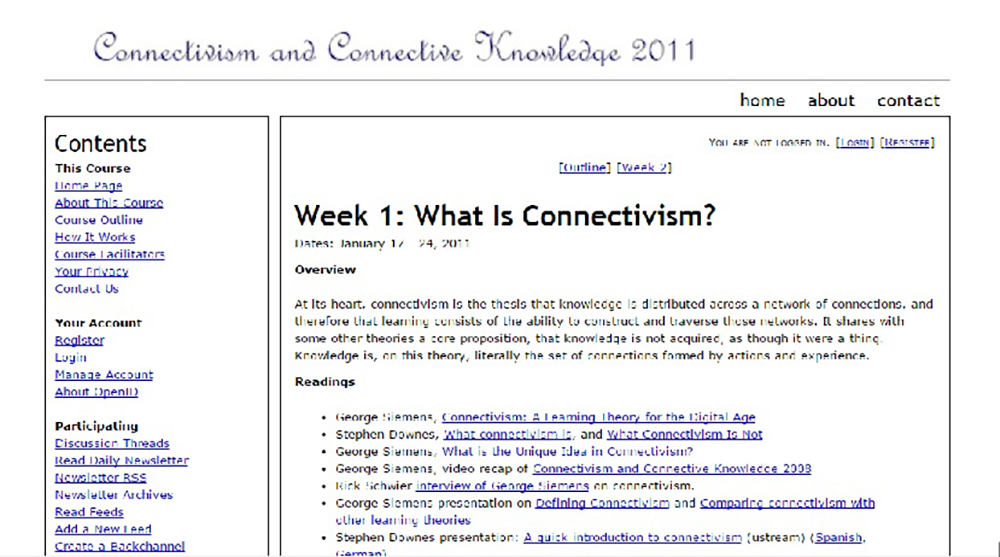
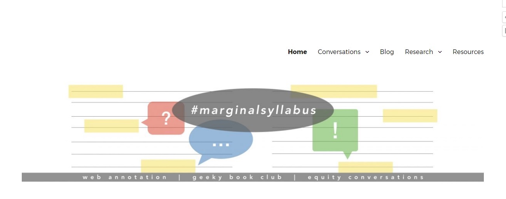
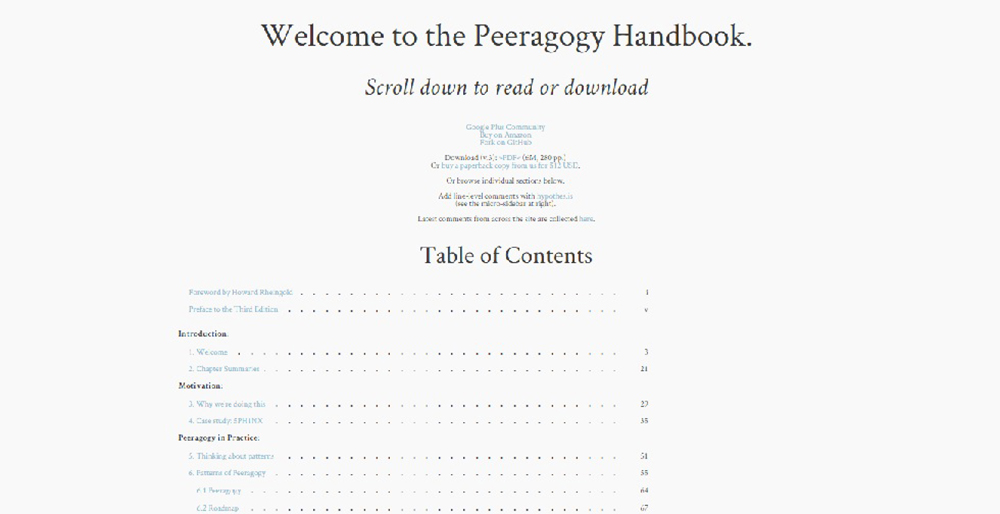
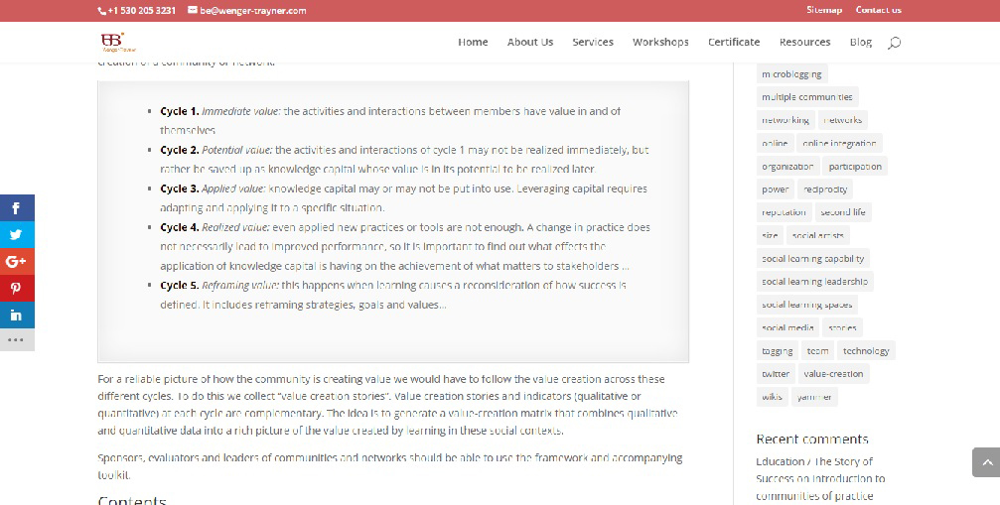
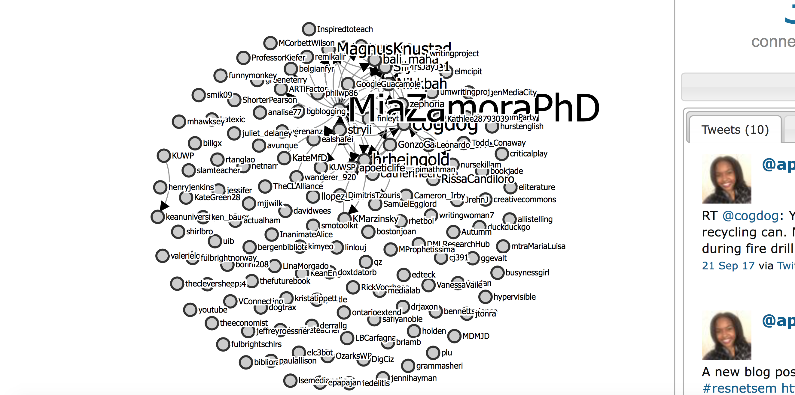
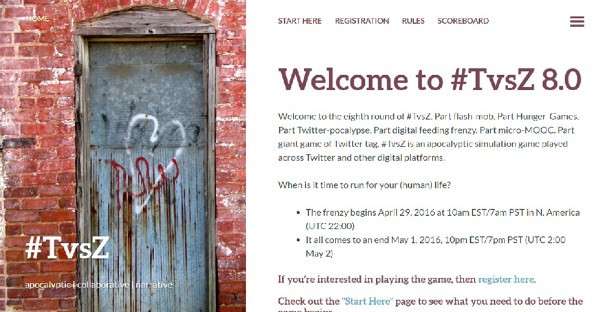
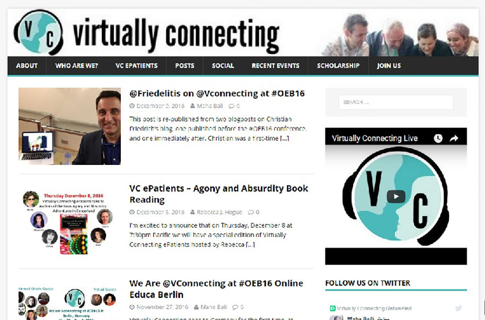

# NETWORK

## Mia Zamora 
Kean University | [Website](http://miazamoraphd.com)

## Maha Bali
American University in Cairo | [Website](http://blog.mahabali.me) 

---
##### Publication Status:
* unreviewed draft
* draft version undergoing editorial review
* draft version undergoing peer-to-peer review
* **draft version undergoing MLA copyediting**
* awaiting pre-print copy
* published 

--- 
## CURATORIAL STATEMENT 

A network is an interconnected system of conductive parts.  In its human form, a network is a complex net-like combination of communicative people who transmit and exchange information and ideas.  People often associate the term network with infrastructure, but this curation tackles the importance of the term as used for learning in the context of digital pedagogy and the social web. Our classrooms are no longer bound by walls.  Information is readily available, and the tap of a screen gives us access to the open web.  With this new capacity to access content in a split-second, how has this transformed teaching and learning? Networks can facilitate and expand the acquisition of knowledge, opening learning to a world beyond the immediate environment through connection.  Key considerations should be made when thinking about the network as a learning portal.  
As social media has leant us powerful new tools to inquire with, to connect with (or to simply watch each other with) we take account of the pedagogical use of such tools in order to design inspired and empowered learning environments.

The network refers to the set of relationships, personal interactions, and connections among participants, viewed as a set of nodes and links, with its affordances for information flows and helpful linkages.  A community of practice entails a shared domain as a source of identification. In harnessing the power of the digital network for the sake of teaching and learning, one makes use of a complex lattice of relationships, nodes, links and associations, facilitating interaction via a form of connectivity that drives both discovery and sharing.  As an example, the PLN (Personal Learning Network) is a vibrant, ever-evolving and flexible group of connections.  In addition, the hashtag is a digital tool that pays tribute to the network.  In developing our own curation of this keyword network, we relied on our own PLNs to crowdsource our initial ideas and build a comprehensive reading list [Bali & Zamora].

McConnell et al highlight the philosophical roots of networked learning in the work of Dewey and Freire.  Emphasizing relationships and collaboration rather than technology, networked learning highlights openness in attitude, learner collaboration, self-directed learning and authentic learning.  The more recent model of connectivism arose to describe networked learning enhanced by social media. McConnell et al suggest that the advent of social media supports networked learning more effectively than the confined learning model of the LMS (Learning Management System, e.g. Blackboard). Connectivism expands the meaning of openness to the open web, and interactions do not necessarily take place only in tight-knit communities or within the confines of a particular course, but are distributed over social media. Catherine Cronin considers how open online spaces are public, widening learners’ networks and possible identities, whereas bounded spaces (i.e. classes using LMSs) are private. 

Even though particular locations and tools are mentioned here, the technologies are secondary to the relationships that occur in communities and networks, and of course, these connections can occur in digital, analog or hybrid form. HASTAC and FemTechNet are both hybrid. Keith Brennan discusses a networked learning experience akin to MOOCs (Massive Open Online Courses) that occurred before there were even telephones.  The key to new learning opportunity is the instinct to reach for new connections that will further intellectual curiosity and personal growth.  So why would we dismiss social media which stands as a powerful tool for transformational learning?  Most educators understand the significant learning benefits of a strong (analog/in-person) network, but many are fearful of public vulnerability and risk when considering the open web.  In attempt to establish security, some educators and educational administrators are inclined to throw the proverbial baby out with the bathwater. 

### Selection Criteria:
Artifacts were chosen to show diverse ways of networking, many of which are meta: opportunities to  learn about networking while observing/experiencing networking. Artifacts include assignments, course sites, and collaborative projects, some are exemplars teachers can adapt, others can be used directly as they are.

## Curated Artifacts

### Connectivism & Connected Knowledge

 
* Artifact Type: Course site. CCK11 (updated from CCK08, first connectivist MOOC)
* Source URL: http://cck11.mooc.ca/index.html 
* Artifact Permissions: CC-BY-NC-SA
* Creators and Affiliation: George Siemens, University of Texas, Arlington and Stephen Downes, Learning and Performance Support Systems, National Research Council of Canada 
Description:

Readers may adopt the connectivist approach used here in an online or hybrid course.
Connectivism is a learning model developed by George Siemens and Stephen Downes. It emerged as previous theories of behaviorism, cognitivism and constructivism failed to explain distributed socially-networked learning. This artifact is a connectivist MOOC about connectivism. The [principles of connectivism](http://www.elearnspace.org/Articles/connectivism.htm) include that learning benefits from diversity of opinions, that the process of forming connections is more important than collecting knowledge, and that nurturing connections supports future learning of the unknowable unknown. [“How This Course Works”](http://cck11.mooc.ca/how.htm) is that participants aggregate, remix, repurpose and feed forward. The value is not content or assignments/activities suggested by
facilitators, but what the participants themselves make of it - facilitators
share an [aggregation of feeds from participant blogs/tweets](http://cck11.mooc.ca/feeds.htm). See sample [daily newsletter](http://cck11.mooc.ca/archive/11/04_01_newsletter.htm), incorporating participant content as well as facilitator-led activities. 

### FemTechNet Commons

* Artifact Type: collaborative project
* Source URL: [http://femtechnet.org](http://femtechnet.org)
* Artifact Permissions: CC-BY-NC-SA
* Copy of the Artifact 
* Creator and Affiliation: FemTechNet, Multiple Universities

FemTechNet is a network of scholars, artists, and students who work on, with, and at the borders of technology, science and feminism in a variety of fields including STS, Media & Visual Studies, Art, Women’s, Queer, and Ethnic Studies.  Members in the network collaborate on the design and creation of projects of feminist technological innovation. This artifact highlights how a network may support a variety of different kinds of learners. Some may participate in the [FemTechNet DOCC](http://femtechnet.newschool.edu/docc2013/) (“Distributed Open Collaborative Course” - a collaborative open course structure) through the creation of independent studies arranged by students and teachers in other learning contexts.  Others may connect as self-directed learners who participate on their own.  In addition, the network supports “drop-in learners” who tune in for a particular discussion. The power of the network is illustrated by the variety of FemTechNet projects which can be initiated by anyone through the FTN Commons.

### Marginal Syllabus

* Artifact Type: assignment
* Source URL: http://marginalsyllab.us/
* Artifact Permissions: CC-BY, and annotations are by default CC0
* Copy of the Artifact: (download the 2017/2018 syllabus? http://marginalsyllab.us/conversations/the-2017-18-syllabus/)
* Creator and Affiliation: A multi-stakeholder collaboration between Hypothesis, a non-profit organization building an open platform for discussion on the web, Aurora Public Schools in Aurora, CO, and Researchers and teacher educators from the University of Colorado Denver School of Education and Human Development in Denver, CO. 2017/2018 syllabus in collaboration with the National Writing Project

Digital annotation can expand our understanding of what is possible when we read together.  [Hypothes.is](https://hypothes.is/) facilitates the act of shared reading. It leverages group annotation to enable sentence-level critique and multimodal note-taking on any text found on the internet. An example of the networked use of this tool comes from [Marginal Syllabus](http://marginalsyllab.us/) which hosts monthly “annotatathons” on pre-selected articles. The 2017-2018 [syllabus](http://marginalsyllab.us/conversations/the-2017-18-syllabus/) co-organized with the National Writing Project. Students can participate in any of the scheduled annotatathons and experience networked learning in action, discussing articles with other students and educators globally.

### Open Learning Recipe

* Artifact Type: collaborative project
* Source URL: https://docs.google.com/document/d/14-V6ZQgIQ3Mpq6QCPvvFr2y-45zdzxIh721yPSlHbyo/pub
* Artifact Permissions:  bottom of document says Creative Commons 
* Copy of the Artifact: download the document 
* Creator and Affiliation: #rhizo15 MOOC participants (names listed in the document)

This is a crowdsourced document in which participants in a rhizomatic/connectivist open course (#rhizo15) worked together in the first week to create a recipe for open learning. It is created in an open Google document, where different participants entered the tips they feel would be helpful to someone new to the arena of open learning. Because participants could see each other’s tips, they could add to what already existed, add comments (viewable in the margins) and ask for clarification. The document is a good example of crowdsourcing knowledge in a network, and can be adapted for a variety of different learning contexts. 

### Peeragogy Handbook

* Artifact Type: collaborative project
* Source URL: [http://peeragogy.github.io](http://peeragogy.github.io)
* Artifact Permissions: CC0
* Copy of the Artifact (in HTML, PDF, DOCX, TXT, MD, RTF, MP3, MP4, MOV, PNG, or JPG), if possible 
* Creator and Affiliation: J. Corneli, C. J. Danoff, C. Pierce, P. Ricuarte, and L. Snow MacDonald, eds. The Peeragogy Handbook. 3rd ed. Chicago, IL./Somerville, MA.: PubDomEd/Pierce Press, 2016. Downloaded from http://peeragogy.org. 

A “how-to-do-it” resource on how a group of self-learners can organize via networked co-learning. The Peeragogy Handbook is a crowdsourced and collaboratively annotated compendium for any group of people who want to co-learn any subject together using the tools and knowledge available online.  When students are given an open group research project, this handbook guides co-learners in identifying shared purpose and defining self determined learning outcomes. The term “peeragogy” comes from [Howard Rheingold](http://rheingold.com/) via his [Social Media Classroom](http://socialmediaclassroom.com/).  Rheingold instigated this project, serving as a “catalyst” for the creation of this peer-created guide to pure peer-to-peer learning in the networked era. Peeragogy is a flexible framework of techniques for peer learning and peer knowledge production. Whereas pedagogy deals with the transmission of knowledge from teachers to students, peeragogy is what people use to produce and apply knowledge together. The strength of peeragogy is its flexibility and scalability through networked learning.  

### Promoting and assessing value creation in communities and networks: a conceptual framework

 

* Source: http://wenger-trayner.com/resources/publications/evaluation-framework 
* Artifact Permissions:  Copyright
* Type: teaching guidelines or grading rubric
* Creators: Wenger, E., Trayner, B., and de Laat, M. 

This framework, published by the Open University of the Netherlands, addresses the need to assess value of communities/networks using five levels of value creation
1. immediate (activities and interactions) , 
2. potential (knowledge capital), 
3. applied (changes in practice) , 
4. realized (performance improvement) and
5. reframing value (redefining success).

The first four of these are adapted from Kirkpatrick’s work, long used in the field of training. The document also describes differences between communities and networks, possible measures for each of the five levels, and approaches to writing narratives assessing value of communities/networks. They emphasize how the story of a network involves both personal and social networks with multiple perspectives. This artifact can be used pedagogically where learners can measure the value of a learning network as they experience networking.

### ResNetSem Visualization

* Title of Artifact: TAGSExplorer: #ResNetSem visualization 
* Artifact Type: assignment
* Source URL: https://tinyurl.com/ybl5spxl
* Artifact Permissions: CC-BY-NC
* Creator and Affiliation: Martin Hawksey, Innovation, Chief Community & Technology Officer, The Association for Learning Technology, UK; #ResNetSem participants

Watching the development of a Twitter hashtag community can be a useful way to understand the evolution of networked learning.  It can also help learners assess the ways in which they are contributing to a connected community “backchannel”.  The hastag #ResNetSem was established for the overall proceedings of the co-located research seminar conducted by Mia Zamora (University of Bergen-Norway) and Alan Levine (Kean University-NJ) in Fall 2017.  #ResNetSem made use of the TAGSExplorer SNA (social network analysis) tool developed by Martin Hawksey in order to visualize the interactions between seminar participants and a broader network of learners.  Anyone who uses a twitter hashtag for pedagogical use can also apply TAGSexplorer to create a social network visualization.  Students in #ResNetSem were asked periodically to evaluate the TAGSExplorer visualization and reflect on what they could apprehend about the changing nodes and connections represented there.  This self-assessment assignment aids students in apprehending the larger cultural conversation about their class material, while guiding them to consider their own forms of networked participation. 

### **Twitter Journal Club**

* Source URL: https://tjc16.wordpress.com/  
* Artifact Permissions: CC-BY-SA
* Type: collaborative project
* Creator: Laura Gogia (changed affiliations, was a PhD student at Virginia Commonwealth University at the time of writing)

Laura Gogia started Twitter Journal Club (originally #tjc15) while she was a graduate student; people agree to read an article together at a designated time period, and livetweet as they go (occasionally with the author responding on Twitter).  A hashtag on Twitter allows anyone to observe any time and jump in whenever they like; they do not need to be part of the community, nor does using a hashtag make them part of the community if they do not wish to use it regularly. Discussion can be synchronous, planned or spontaneous, or asynchronous over an extended time. Participation does not require membership in a community, but helps build PLN, as (Shelly Terrell explains)[http://dmlcentral.net/shelly-terrell-global-netweaver-curator-pln-builder/].  This artifact serves as a both as a model and a tutorial.
 See this [Storify](https://storify.com/GoogleGuacamole/may-2016-twitter-journal-club-tjc16) to see a sample Twitter chat in retrospect, and [this article](http://www.digitalpedagogylab.com/hybridped/careful-approach-to-digital-scholarship/) for the backstory behind TJC.

### TvsZ

* Artifact Type: assignment
* Source URL: [http://tvsz.us](http://tvsz.us)
* Artifact Permissions: not mentioned on website
* Copy of the Artifact: by Kevin Hodgson http://fliphtml5.com/segh/davk
* Creator and Affiliation: Pete Rorabaugh, Kennesaw State University and Jesse Stommel, University of Mary Washington (later redesigned and facilitated by others)

Rorabaugh & Stommel created “an epic zombified experiment in Twitter literacy, gamification, collaboration, and emergent learning.” #TvsZ is a Twitter adaptation of the game humans vs zombies (a game of tag played in college), meant to develop digital literacy. Often played by college students with anyone on Twitter who wishes to participate, it “offers no certificate or diploma, but an opportunity to connect with others”. People who play need to learn to collaborate with virtual strangers online during the condensed (around 3-day) period of play, experiencing accelerated network-building. A key feature  is emergent [game rules](http://tvsz.us/rules/), and that players themselves participate in suggesting changes. In 2015 Rorabaugh mentions how the game evolved. Its then-latest zombie-free version had 6 administrators from Canada, Egypt and US. It presents an approach to perforating  the classroom, introducing students to global, networked learning while learning digital literacy. [Curated artifacts from 6.0](http://fliphtml5.com/segh/davk) 

### Virtually Connecting

* Title of Artifact: Virtually Connecting
* Artifact Type: collaborative project
* Source URL: http://www.youtube.com/virtuallyconnecting and http://www.virtuallyconnecting.org
* Artifact Permissions: CC-BY-NC-ND for videos see https://virtuallyconnecting.org/reuse/
* Copy of the Artifact if possible (not possible really)
* Creator and Affiliation: Rebecca J. Hogue, University of Ottawa and Maha Bali, American University in Cairo

Virtually Connecting (VC) attempts to take Personal Learning Networks (PLN) to the next level and expand access to conferences to people who cannot attend for financial, social, logistical or health reasons. Some scholars have opportunities to meet their virtual PLN in person at conferences, but many do not. VC creates opportunities for people to participate in a conference _conversation_ virtually by meeting via synchronous video with onsite participants at that conference, going beyond virtual participation via  watching livestreams of selected sessions and using Twitter. Instead, VC invites virtual participants to converse with onsite participants (including keynote speakers) directly for an extended period of time. This supports the deepening and broadening of scholarly PLNs for graduate students, adjuncts, young moms and international scholars.  As a pedagogical gateway, instructors can work with VC to bring their class to conferences and demonstrate flattening of hierarchy possible. 

## Related Works

Bali, M., Crawford, M., Jessen, R., Signorelli, P., & Zamora, M. (2015). What Makes a cMOOC Community Endure? Multiple Participant Perspectives From Diverse MOOCs. Educational Media International, 100-115.

Bali, Maha, & Mia Zamora. “Crowdsourcing Curating Networks: It Has to Be Meta.” ProfHacker: The Chronicle of Higher Education. (2015) n. pag. Web. 7 December, 2015.

Cormier, David. (2008). Rhizomatic education: Community as curriculum. Innovate: Journal of Online Learning. 4(5). Republished and retrieved from http://nsuworks.nova.edu/cgi/viewcontent.cgi?article=1045&context=innovate

Dabbagh, N., & Kitsantas, A. (2012). Personal Learning Environments, social media, and self-regulated learning: A natural formula for connecting formal and informal learning. The Internet and Higher Education 15(1), 3-8. 

Downes, Stephen. “What connectivism is.” Web. 15 September 2007. (http://halfanhour.blogspot.com/2007/02/what-connectivism-is.html)

DML Central. Digital Media and Learning Research Hub, 2016. Web. 12 July 2016. (http://dmlcentral.net)

Ferreday, Debra and Vivien Hodgson. “The Tyranny of Participation and Collaboration in Networked Learning” Proceedings of the 6th International Conference on Networked Learning. Web. (http://www.networkedlearningconference.org.uk/past/nlc2008/abstracts/PDFs/Hodgson_640-647.pdf)

Gogia, Laura “2015 ELI Annual Meeting Poster Session: Exploring Microblogging Data through a Lens of Student Assessment.” Web. 25 January 2015. (https://googleguacamole.wordpress.com/2015/01/25/2015-eli-annual-meeting-poster-session-exploring-microblogging-data-through-a-lens-of-student-assessment/)[d]

Harasim, L. Hiltz, S.R., Teles, L. And M. Turoff. Learning Networks: A Field Guide to Teaching and Learning Online. Cambridge, MA: MIT Press, 1995.

Jenkins, Henry, Mizuko Ito, & danah boyd.  Participatory Culture in a Networked Era: A Conversation on Youth, Learning, Commerce, and Politics.  (Polity Press, 2016)

Mason, Robin and Kaye, Tony. (Eds). "Mindweave: Communication, Computers, and Distance Education.” Oxford: Pergamon Press, 1989.

Meeks, Elijah & Maya Krishnan. Introduction to Network Analysis and Representation. Stanford U, 2016. 12 July 2016. (http://dhs.stanford.edu/dh/networks/)
Raine, Lee and Barry Wellman. Networked: The New Social Operating System. (Cambridge, MA: MIT Press, 2012).

Skallerup-Bessette, Lee. “What if Never See You Again?” 7 February 2016. (http://readywriting.org/uncategorized/what-if-i-never-see-you-again/) 

Spelic, Sherri, “Resistance Training”. Web. 12 February 2016. (https://medium.com/@edifiedlistener/resistance-training-33f322a210d0#.barya2ncn)

Stewart, Bonnie. “In Public: The Shifting Consequences of Twitter Scholarship.” Hybrid Pedagogy. Web. 14. 2015. (http://www.digitalpedagogylab.com/hybridped/in-public-the-shifting-consequences-of-twitter-scholarship/) [e]

Stewart, Bonnie. “Open to Influence: What counts as academic influence in scholarly networked Twitter participation.” Learning, Media and Technology: Critical Approaches to Open Education. 40:3, 287-309. (2015): Web. 12 July 2016.
Stewart, Bonnie. “Contributions and Connections.” Inside HigherEd. Web. 6 April 2015. (https://www.insidehighered.com/blogs/higher-ed-beta/contributions-and-connections)

Watters, Audrey.  “Learning Networks, Not Teaching Machines.” Hack Education. Web. 10 June 2015. (http://hackeducation.com/2015/06/10/eden2015)[f]

Zamora, Mia, & Maha Bali. “Creating Cyber Connections”. DML Central: Digital Media & Learning: The Power of Participation. (2015) n. pag. Web. 4 December, 2015. (http://dmlcentral.net/creating-cyber-connections/)

Zamora, Mia. “Reading as a Social Act”. DML Central: Digital Media & Learning: The Power of Participation. (2016) n. pag. Web. 24 March, 2016. (http://dmlcentral.net/reading-social-act/)

Zamora, Mia. “Dear Future President”. DML Central: Digital Media & Learning: The Power of Participation. (2016) n. pag. Web. 26 May, 2016. (http://dmlcentral.net/dear-future-president/)
 
10th International Conference on Networked Learning 2016. “Past Conference Proceedings.” Web. (http://www.lancaster.ac.uk/fss/organisations/netlc/past/index.htm)

## Works Cited

Abdelmoneim, Maha. Personal communication, December 7, 2015

Bali, Maha, & Mia Zamora. “Crowdsourcing Curating Networks: It Has to Be Meta.” ProfHacker: The Chronicle of Higher Education. (2015) n. pag. Web. 7 December, 2015.

Brennan, Keith. “The Victorian MOOC.” Web. 23 February 2016. (http://www.digitalpedagogylab.com/hybridped/the-victorian-mooc/)
                                        
Cronin, Catherine. “Networked learning and identity development in open online spaces” Proceedings of the 9th International Conference on Networked Learning. Web. 2014. (http://www.lancaster.ac.uk/fss/organisations/netlc/past/nlc2014/abstracts/pdf/cronin.pdf)

Cronin, Catherine. Personal communication, December 7, 2015

Goodyear, Peter. Personal communication, December 7, 2015

Harasim, Linda. Personal communication, December 7, 2015

Hodgson, Kevin. Personal communication, December 7, 2015

Hogue, Rebecca J., Personal communication, December 7, 2015

Ito, Mimi. Personal communication, December 7, 2015

Keefer, Jeffrey. Personal communication, December 7, 2015

Laura Gogia, and Simon Warren. “A Careful Approach to Digital Scholarship.” Hybrid Pedagogy, July 14, 2015. (http://www.digitalpedagogylab.com/hybridped/careful-approach-to-digital-scholarship/).

Marginal Syllabus. Marginal Syllabus. Web. (http://marginalsyllab.us/)
Mcconnell, David, Vivien Hodgson, & Lone Dirckinck-Holmfeld. “Networked Learning: A Brief History and New Trends.” Exploring the Theory, Pedagogy and Practice of Networked Learning. Research Gate: Dec. 2011. 3-24 (http://www.researchgate.net/publication/279350626_Networked_Learning_A_Brief_History_and_New_Trends)

Merrell, Jeff. Personal communication, December 7, 2015

National Writing Project and Marginal Syllabus. 2017-2018 Syllabus, Marginal Syllabus. Web. (http://marginalsyllab.us/conversations/the-2017-18-syllabus/)

Rehn, Andrea  Personal communication, December 7, 2015

Rheingold, Howard. Net Smart: How to Thrive Online. Cambridge, MA: MIT Press, 2012.

Rheingold, Howard. “Shelly Terrell: Global Netweaver, Curator, PLN Builder - DML Central.” DML Central: Digital Media & Learning: The Power of Participation, October 15, 2010. http://dmlcentral.net/shelly-terrell-global-netweaver-curator-pln-builder/.

Rheingold, Howard. Personal communication, December 7, 2015

Rorabaugh, Peter. “The Evolution of #TvsZ.” Web. 19 February 2015. (http://peterorabaugh.org/tvsz/the-evolution-of-tvsz/) 

Ryberg, Thomas. Personal communication, December 7, 2015

Stommel, Jesse. “Twitter Vs. Zombies: New Media Literacy & the Virtual Flash Mob.” Web. 21 July 2013. (http://jessestommel.com/twitter-vs-zombies-new-media-literacy-the-virtual-flash-mob/) 

Siemens, George “Learning Ecology, Communities, and Networks: Extending the Classroom”  Web. 17 October , 2003. (http://www.elearnspace.org/Articles/learning_communities.htm) 

Vaile, Vanessa. Personal communication, December 7, 2015

Weller, Michael. Personal communication, December 7, 2015

Wenger, E. (2010) “Communities of practice and social learning systems: the career of a concept.” In Blackmore, C. (Editor) Social Learning Systems and communities of practice. Springer Verlag and the Open University.

Wenger, E. & B Trayner. “How is a community of practice different from an informal network in regard to social learning?” Web. 28 December 2011. (http://wenger-trayner.com/resources/communities-versus-networks/) 

Yonkers, Virginia. Personal communication, December 7, 2015

