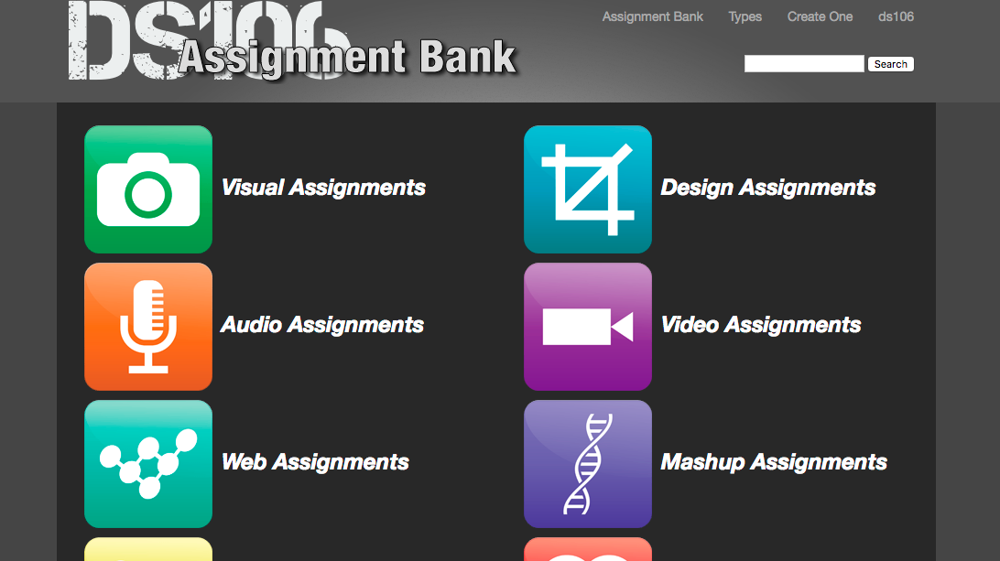
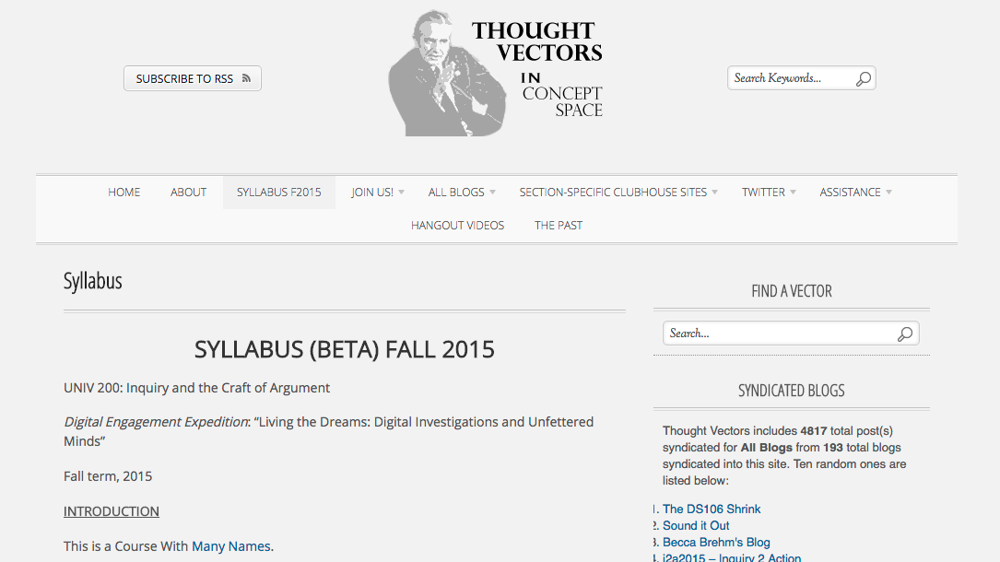
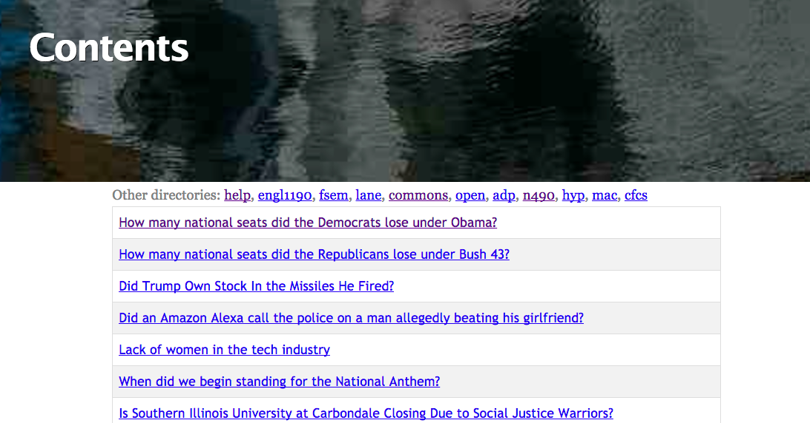
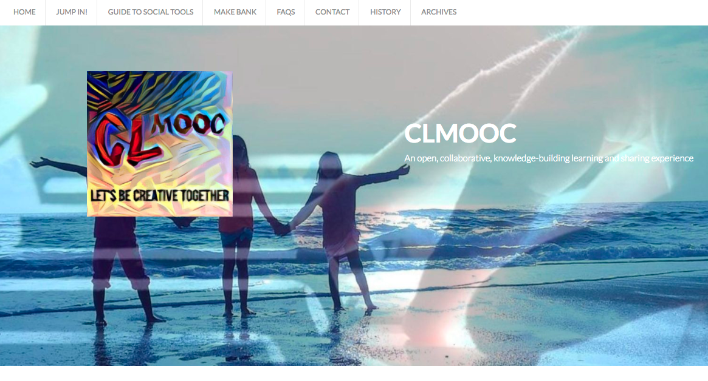
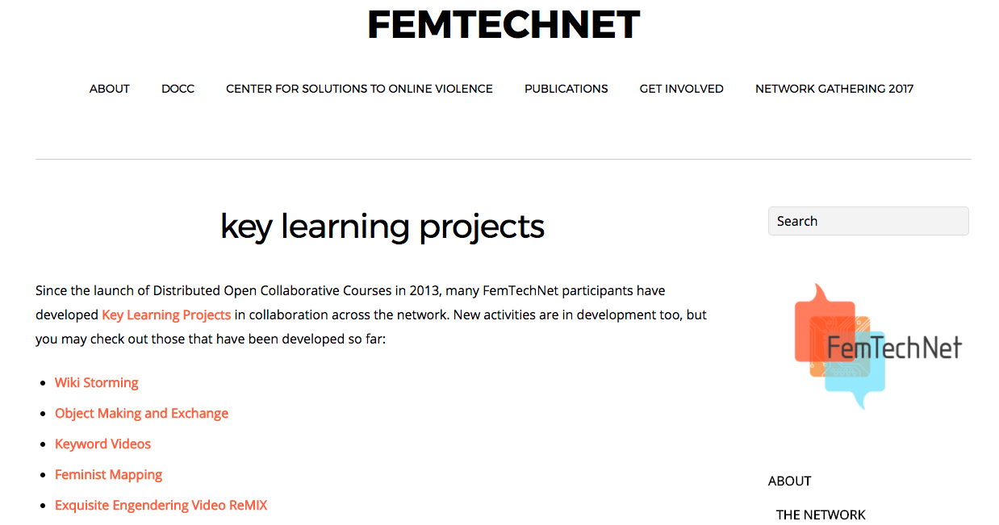
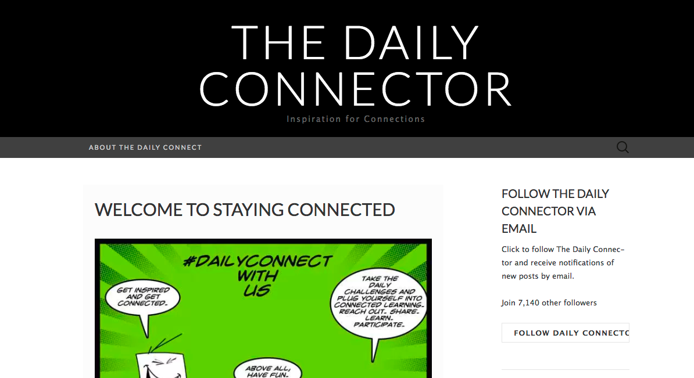
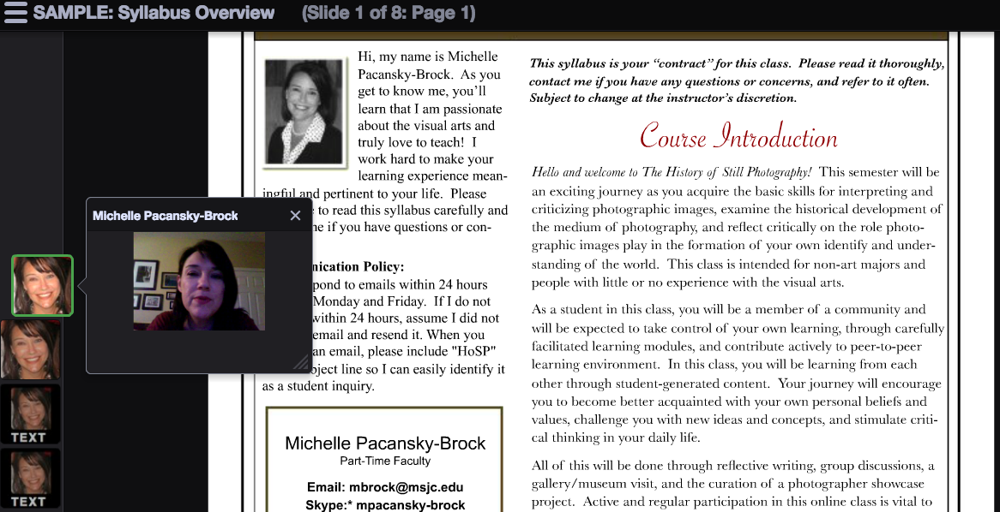
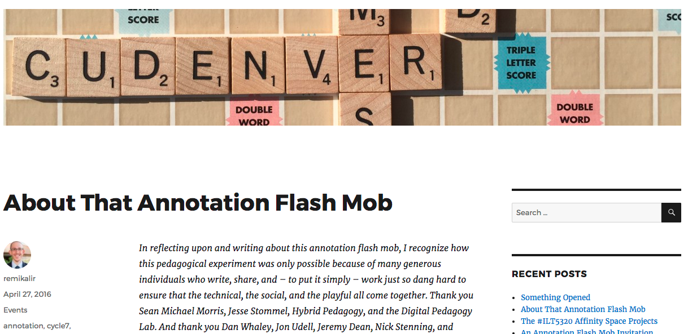

# Online

### Amy Collier
Middlebury College | [Website](http://digitallearning.middcreate.net)

---

##### Publication Status:
* unreviewed draft
* draft version undergoing editorial review
* draft version undergoing peer-to-peer review  [https://digitalpedagogy.commons.mla.org/](https://digitalpedagogy.commons.mla.org/)
* **draft version undergoing MLA copyediting**
* published 

---

### Cross-Reference Keywords: annotation, authorship, community, interface, network, public, remix

---  

## CURATORIAL STATEMENT

In higher education, the term “online” has become synonymous with eLearning-style training and MOOCs. This narrow view of online, with a focus on content delivery and automated assessment, is spread via higher education industry media, as in this recent quote from *Inside Higher Ed:* “Online education can offer personalized pathways through course content with short lecture videos and well-timed quizzes that help students retain knowledge…” (Straumsheim). This perspective values online learning for its efficiency, flexibility, and convenience, claiming the appeal of “anytime, anywhere” education (Richardson & Swan 69). The focus on efficiency favors templated models, such as those advanced by Learning Management Systems, that treat learners as homogenous and that erase students’ agency in the digital spaces they occupy. The Learning Management System, which has become the default mechanism for offering online learning, prioritizes containment over creativity, fails to help students develop critical digital literacy skills, and encourages silos between courses, programs, and students (Groom & Lamb). 

As a result of our narrow definition of what it means to teach and learn online, students may not be learning how to engage critically with digital spaces and tools. “Significantly, most students haven’t been taught to think about how the natures of knowledge, authority, composition, and learning have changed/are changing. The Internet provides digital spaces and applications that are ripe for redefinition in ways that many educational structures have not reconciled” (Morgen & Rorabaugh). Online learning can be about more than content and quizzes; it can be an experience that unsettles transmission-based approaches and opens up emergent ways of learning in digital spaces. Faculty must be willing, however, to step into the messiness and not-yetness (Ross & Collier) that accompany emergent models of digital learning and that resist templated approaches.

This collection of resources highlights educators who have embraced online learning beyond content and beyond LMS-templated learning. These resources elevate new ways of thinking about online-ness and ask students to participate fully and critically in the online experience. They encompass some of the digital literacies considered essential for today’s teachers and learners (see Rheingold, “Attention and other 21st century social media literacies”) and are divided into three focus areas: authorship, community/networked participation, and presence/embodiment. Though treated separately, some examples demonstrate the ways in which all three can be addressed in meaningful learning contexts

### Authorship

Authorship is creation and agency as part of participation in online networks and spaces. Implicit in the notion of authorship are the language, skills, and support teachers and learners need to create on the web (Rheingold, *NetSmart*, 31). Too many technologies and models of online learning relegate the learner to a consumer role and give authorship rights only to the instructor (or sometimes, only to the designer of an online course). Examples in this section push back against a plug-and-play view of online spaces and embrace the uncertainty and complexities of digital authorship, including questions raised by  [public](https://github.com/curateteaching/digitalpedagogy/blob/master/keywords/public.md) authorship, sharing, and [remixing](https://github.com/curateteaching/digitalpedagogy/blob/master/keywords/remix.md).

### Community and networked participation

Perhaps the greatest, and often unrealized, opportunity for meaningful online learning is through connections to people and networks within and outside of a class. Students work in online “walled gardens,” such as Learning Management Systems, and are not encouraged to venture beyond those digital walls to connect to people and networks. Gardner Campbell ("Networked Learning as Experiential Learning") argued that we must encourage students to build and participate within a “digitally mediated network of discovery and collaboration” as part of their experiential learning requirements. Resources in this collection provide examples for intentional building and fostering of networks and communities as part of online learning.

### Presence/Embodiment

The third area of online education that this collection investigates is presence and embodiment. Siân Bayne (105) says, “The distanced, unstable relationship between body and subject with which we engage when we communicate online involves us in modes of identity formation and pedagogical relations which are very different from those which, as learners and teachers, we experience in the face to face classroom.” The lack of physical embodiment and co-presence may be most detrimental to online learners, as those can contribute to feelings that online learning lacks authenticity or veracity (Land 531). 

As expected, questions of embodiment and presence pervade the literature on online learning, highlighting concerns that online learning can create isolation and distance. The disembodied or absent online learner is characterized as a “lurker” and strategies for dealing with lurkers often devolve to compliance (number of logins, number of discussion posts, etc.). Research points to the importance of establishing social, cognitive, and teaching presence in online learning experiences, the integration of which is said to foster a Community of Inquiry (Garrison) among teachers and learners. Examples in this section explore or reimagine presence and provide a sense of eventness for online learning experiences.

## CURATED ARTIFACTS

### Authorship

#### Fork U! Resource Page

* Artifact type: Assignments, guide for learning and using Github
* Source URL: [http://oudiglearn.github.io/forku/](http://oudiglearn.github.io/forku/)
* Artifact permissions: CC-BY 4.0
* Copy of Artifact: [Fork U! Resource Page](files/online-forku.pdf)
* Creator and Affiliation: Adam Croom & John Stewart, University of Oklahoma

GitHub is a platform for authorship, collaboration, and peer review. Originally created for software developers to share code, GitHub gained popularity because of its “fork” functionality, which allows users to copy code to their own GitHub account and make changes without affecting original files. The Fork U! resource, assembled by Croom and Stewart, offers low-risk GitHub activities. Fork U! resources are forkable (i.e., can be copied and reused without affecting the “master” project) and can be used to explore digital authorship, as it allows students to author projects, share and discuss copies of those projects, and copy/edit resources authored by others. Group projects authored via GitHub could deepen collaboration and extend shared authorship. Other examples of Github resources include these [Musicianship resources](https://github.com/kshaffer/musicianshipResources) (Schaeffer), course materials for [Humanizing Technology](https://github.com/karlstolley/ht) (Stoller), assignments for [Fashioning Circuits](https://github.com/fashioning-circuits) (Knight & Massey), and peer assessment activities for [Reproducible Data](https://github.com/rdpeng/RepData_PeerAssessment1) (Peng et al). 

#### ds106 Assignment Bank creator

* Artifact type: Github repository
* Source URL: [https://github.com/cogdog/ds106bank](https://github.com/cogdog/ds106bank)
* Artifact permissions: GNU General Public Licence
* Creator and Affiliation: Alan Levine

GitHub allows users to “fork” files from other users and make changes to projects without affecting the master file. Alan Levine’s Assignments Bank Github repository enables teachers and students to author their own Assignments Bank and build a community around the assignments they create and complete. Examples of such communities, including ds106 and the Connected Learning MOOC, are listed on Levine’s Github page. An Assignments Bank could allow teachers and students to author and complete learning activities and to share those activities with others. This gives students agency over the activities they create and complete, and the opportunity to network with communities and experts outside of the class via these shared activities. Assignments Banks can be created outside of the LMS in order to make the work of the community visible and accessible to a broader network; Levine’s Assignment Bank GitHub repository is for a WordPress-based tool.

#### ThoughtVectors in Concept Space syllabus

* Artifact type: Syllabus
* Source URL: [http://thoughtvectors.net/syllabus/](http://thoughtvectors.net/syllabus/)
* Artifact permissions: CC-BY-NC	
* Copy of Artifact: [ThoughtVectors in Concept Space syllabus](files/online-thoughtvectorssyllabus.pdf) 
* Creator and Affiliation: Gardner Campbell, Virginia Commonwealth University

Thought Vectors, a course offered at Virginia Commonwealth University, follows the model of [Domain of One’s Own](https://medium.com/bright/the-web-we-need-to-give-students-311d97713713#.y7hguujk3) an initiative based on the idea that every learner should have a domain on the web that they control, and upon which they can install tools they want to use as part of their digital identity and work. Gardner Campbell (Campbell, “A Personal Cyberinfrastructure) noted, “In building that personal cyberinfrastructure [through domain of one’s own], students not only would acquire crucial technical skills for their digital lives but also would engage in work that provides richly teachable moments ranging from multimodal writing to information science, knowledge management, bibliographic instruction, and social networking.” The Thought Vectors syllabus features a video from the course librarian, Jenny Stout, that helps students to think about the importance of sharing their ideas, through participation on the web, saying “we don’t really know what could happen…amazing things could happen.”

#### digipo: The Digital Polarization Initiative

* Artifact type: Assignment
* Source URL: [https://www.digipo.io/wiki/commons/index.htm](https://www.digipo.io/wiki/commons/index.htm)
* Artifact permissions: Wikity content is CC-0
* Copy of Artifact: [digipo: The Digital Polarization Initiative](files/online-digipo.pdf)
* Creator and Affiliation: Mike Caulfield, Washington State University - Vancouver

Mike Caulfield launched digipo, a wiki where students from any university or college can evaluate information and claims made on the web, in response to the alarming prevalence of inaccurate and fake information on the web. Through digipo assignments, students develop skills in evaluating digital information and media, such as online news stories, memes, and images, and then author analyses on the digipo wiki. Students develop key digital and information literacy skills, such as understanding  the context for information they find on the web, and the process of creating information on the web (for more, see the [Association of College and Research Libraries Framework for Information Literacy in Higher Education](http://www.ala.org/acrl/standards/ilframework). Instructors who want to use digipo in their classes can visit the [digipo help page](https://www.digipo.io/wiki/help/index.htm)

### Community

#### clMOOC

* Artifact type: Online community and course
* Source URL: [http://clmooc.educatorinnovator.org/2015/](http://clmooc.educatorinnovator.org/2015/)
* Artifact permissions: CC-BY-SA 4.0
* Creator and Affiliation: Educator Innovator / National Writing Project

Many of today’s MOOCs—explicitly or implicitly—do not aim to foster community. But the first MOOCs, which started well before Coursera and EdX were established, focused on creating networks of learners that could be responsive to evolving interests and needs. These MOOCs demonstrated the power of connected learning, that “is not simply a ‘technique’ for improving individual educational outcomes, but rather seeks to build communities and collective capacities for learning and opportunity…” (Ito et al., 8). Communities to which students connect, more than the instructor alone, can provide ongoing resources and can be a source of new connections as a learner develops areas of interest, inquiry, and work. clMOOC shows how a course can be designed to intentionally foster community and makes explicit its goal of providing ample opportunities for learners to connect. In particular, see examples of [Twitter chats](http://clmooc.educatorinnovator.org/2015/guide-to-social-tools/getting-started-with-twitter-and-twitter-chats/), [Make Cycles](http://clmooc.educatorinnovator.org/2015/make-cycles/), [Blog Hub](http://clmooc.educatorinnovator.org/2015/blog-hub/), [Make Bank](https://clmoocmb.educatorinnovator.org/home/), and [social tools](http://clmooc.educatorinnovator.org/2015/guide-to-social-tools/).

#### FemTechNet: Key Learning Projects

* Artifact type: Assignments
* Source URL: [http://femtechnet.org/get-involved/self-directed-learners/key-learning-project/](http://femtechnet.org/get-involved/self-directed-learners/key-learning-project/)
* Artifact permissions: Copyright 2017 FemTechNet
* Creator and Affiliation: FemTechNet organizers

FemTechNet is a community that sponsors DoCCs—Distributed Open Collaborative Courses. DoCCs center on community building as a part of a feminist pedagogy orientation. The key learning projects are both the product of a community and an opportunity to create further community. The Community Participation via Blog Commenting project is a great model for giving learners skills and opportunities to engage with a professional community of their choosing. The project teaches students about intentionally participating in an online community and how preparation for engaging with that community (e.g., through formulating a rhetorical stance) can help them to connect to experts and to understand how communities work (and sometimes don’t work) in online settings. Additional key learning projects have been highlighted in this collection, including [the Situated Knowledges Map](https://digitalpedagogy.commons.mla.org/keywords/gender/), and the [Exquisite Engendering Remix](https://digitalpedagogy.commons.mla.org/keywords/remix/).

#### The Daily Connector

* Artifact type: Assignments
* Source URL: [https://dailyconnector.wordpress.com/](https://dailyconnector.wordpress.com/)
* Artifact permissions: CC-BY 4.0 
* Copy of Artifact: [The Daily Connector](files/online-dailyconnector.pdf)
* Creator and Affiliation: Connected Courses

Henry Jenkins et al. (5) describe participatory culture as a culture with low barriers to entry, support for the sharing of creations among community members, informal mentorship, and social connections that help community members to feel that their contributions are important. The Daily Connector provides activities and assignments that aim to grow connections between individuals in a course or across multiple courses, helping to foster connections that validate the contributions of members of the community. These activities encourage community building online as part of intentional daily practice and provide helpful strategies to help learners make those intentional connections. For example, the [Twitter Poetry](https://dailyconnector.wordpress.com/2015/02/04/ccourses-bonus-dailyconnect-twitter-poetry/) activity asks students to use the service Poetweet to create a poem from a connected colleague’s Twitter feed. This activity encourages students to look at the Twitter feeds of other students and view them as part of their community.

### Presence

#### Introduction to Still Photography syllabus

* Artifact type: Syllabus
* Source URL: [https://voicethread.com/myvoice/#thread/2610203](https://voicethread.com/myvoice/#thread/2610203)
* Artifact permissions: CC-BY-NC-ND
* Copy of Artifact: [Introduction to Still Photography syllabus](files/online-introphotography.pdf)
* Creator and Affiliation: Michelle Pacansky-Brock, California State University Channel Islands

In her paper on embodiment in online learning, Sîan Bayne notes, “that, in cyberspace and elsewhere, mind and body are indivisible entities is not to prevent us from looking to new technological environments as spaces where the conventional constraints and significations of embodiment can be challenged and shifted. The challenge to learners and teachers in cyberspace is in devising creative pedagogical approaches which work with these new articulations.” Voice-sharing technologies may help to combat disengagement in online courses. Voice can provide a sense of embodiment in online courses, where interactions may be limited to audio and video. Michelle Pacansky-Brock voice-annotates her syllabus and assignments, and she voices feedback to students. Her approach becomes a model for students on how to share their vocal presence with others in the course. Pacansky-Brock invites students to annotate course resources and assignments together giving students a chance to embody their work with their voices. 

#### The Daily Create

* Artifact type: Assignments
* Source URL: [http://daily.ds106.us/](http://daily.ds106.us/)
* Artifact permissions: CC-0
* Copy of Artifact: [The Daily Create](files/online-dailycreate.pdf)
* Creator and Affiliation: Alan Levine

Henry Jenkins et al. (5) describe participatory culture as having low barriers to entry, support for the sharing of creations among community members, informal mentorship, and social connections that help community members to feel that their contributions are important. Daily Create embodies these characteristics and, as it encourages a participatory culture, helps faculty and students to remain actively engaged. Daily Create activities are brief, providing easy and fun ways for students to remain engaged, thus contributing to the eventness of a course. [Paperback Paradise](http://daily.ds106.us/tdc1618/) demonstrates how the activities can be open-ended to allow for students’ creativity and personal connections. Students alter an image from the web and share their remixed creation via Twitter using a course hashtag. As students see the work of others being syndicated to The Daily Create site, they recognize that their work is part of a community and that their presence in that community is important.

#### Annotation Flash Mob

* Artifact type: Blog post with links to assignment details
* Source URL: [https://gamesandlearning.wordpress.com/2016/04/27/about-that-annotation-flash-mob/](https://gamesandlearning.wordpress.com/2016/04/27/about-that-annotation-flash-mob/)
* Artifact permissions: CC-BY 4.0 
* Copy of Artifact: [Annotation Flash Mob](files/online-annotationflashmob.pdf)
* Creator and Affiliation: Remi Holden, CU Denver

Inspired by Sean Michael Morris’ [Teaching in our right minds: Critical Digital Pedagogy and the Response to the New](http://www.digitalpedagogylab.com/hybridped/teaching-in-our-right-minds/) Remi Holden organized an annotation flash mob in his course, where his students were already using the social annotation tool, hypothes.is for collaborative annotation. Holden’s blog post with instructions on how to participate in the flash mob [is here](https://gamesandlearning.wordpress.com/2016/04/24/an-annotation-flash-mob-invitation/). The annotation flash mob is a fascinating example of bringing eventness to the collaborative web. Several of Holden’s students and many individuals outside of the course jumped in to annotate Morris’ article. One participant’s comments captured the feeling of eventness, “Love[d] getting to play in the digital annotation flashmob – I’m reminded of the frequently referenced analogy of the digital mimicking sandbox play.” 
More generally, instructors are using hypothes.is in their courses for collaborative annotation, as in this [example from Brian Watkins at Austin College](http://acdigitalpedagogy.org/category/hypothes-is/).

## RELATED MATERIALS

Campbell, Gardner. “A personal cyberinfrastructure.” *Educause Review*. vol. 44, no. 5 (September/October 2009): 58–59. Accessed 1 May 2016. [http://er.educause.edu/articles/2009/9/a-personal-cyberinfrastructure](http://er.educause.edu/articles/2009/9/a-personal-cyberinfrastructure)

Pacansky-Brock, Michelle. “Love letter to online learning.” 26 April 2016. [http://brocansky.com/2016/04/26/love-letter-to-online-learning/](http://brocansky.com/2016/04/26/love-letter-to-online-learning/)

Rheingold, Howard. *Net Smart: How to Thrive Online*. Cambridge: The MIT Press, 2014. 

Ross, Jen et al. “Manifesto for Online Teaching.” [https://onlineteachingmanifesto.wordpress.com/](https://onlineteachingmanifesto.wordpress.com/)

Stommel, Jesse. “Online learning: A Manifesto.” *Hybrid Pedagogy*. 3 December 2012. Accessed 1 May 2016. [http://www.digitalpedagogylab.com/hybridped/online-learning-a-manifesto/](http://www.digitalpedagogylab.com/hybridped/online-learning-a-manifesto/)

## WORKS CITED

Association of College and Research Libraries. "Framework for Information Literacy for Higher Education." 11 January 2016. Accessed 27 September 2017. [http://www.ala.org/acrl/standards/ilframework](http://www.ala.org/acrl/standards/ilframework)

Bayne, Siân. “The Embodiment of the Online Learner.” *Beyond the comfort zone: Proceedings of the 21st ASCILITE Conference*. (2004): pp. 105-115. Accessed 1 May 2016. [http://www.ascilite.org/conferences/perth04/procs/pdf/bayne.pdf](http://www.ascilite.org/conferences/perth04/procs/pdf/bayne.pdf)

Campbell, Gardner. “A personal cyberinfrastructure.” *Educause Review*. vol. 44, no. 5 (September/October 2009): 58–59. Accessed 1 May 2016. [http://er.educause.edu/articles/2009/9/a-personal-cyberinfrastructure](http://er.educause.edu/articles/2009/9/a-personal-cyberinfrastructure)

Campbell, Gardner. “Networked Learning as Experiential Learning.” *Educause Review*. 51, no. 1 (January/February 2016) Accessed 1 May 2016. [http://er.educause.edu/articles/2016/1/networked-learning-as-experiential-learning](http://er.educause.edu/articles/2016/1/networked-learning-as-experiential-learning)

Campbell, Gardner. “Thought Vectors in Concept Space: Syllabus.” Fall 2015. Accessed 1 May 2016. [http://thoughtvectors.net/syllabus/](http://thoughtvectors.net/syllabus/)

Caulfield, Mike. “digipo.” Website. Accessed 11 September 2017. [https://www.digipo.io/wiki/commons/index.htm](https://www.digipo.io/wiki/commons/index.htm)

clMOOC. Accessed 1 May 2016. [http://clmooc.educatorinnovator.org/2015/](http://clmooc.educatorinnovator.org/2015/)

Connected Courses. “The Daily Connector.” Accessed 1 May 2016. [https://dailyconnector.wordpress.com/](https://dailyconnector.wordpress.com/)

Croom, Adam & John Stewart. “ForkU! Resource Page.” Accessed 1 May 2016. [http://oudiglearn.github.io/forku/](http://oudiglearn.github.io/forku/)

FemTechNet. “Key Learning Projects.” Accessed 1 May 2016. [http://femtechnet.org/get-involved/self-directed-learners/key-learning-project/\](http://femtechnet.org/get-involved/self-directed-learners/key-learning-project/\)

Garrison, D. R. “Online Community of Inquiry Review: Social, Cognitive, and Teaching Presence Issues.” *Journal of Asynchronous Learning Networks*, v11 n1 (2007): pp. 61-72. Accessed 1 May 2016. [http://onlinelearningconsortium.org/sites/default/files/v11n1_8garrison.pdf](http://onlinelearningconsortium.org/sites/default/files/v11n1_8garrison.pdf)

Groom, Jim & Brian Lamb. Reclaiming Innovation. Educause Review. 49, no. 3 (May/June 2014). Accessed 13 September 2017. [http://www.educause.edu/visuals/shared/er/extras/2014/ReclaimingInnovation/default.html](http://www.educause.edu/visuals/shared/er/extras/2014/ReclaimingInnovation/default.html)

Holden, Remi. “About that Annotation Flash Mob.” 27 April 2016. Accessed 1 May 2016. [https://gamesandlearning.wordpress.com/2016/04/27/about-that-annotation-flash-mob/](https://gamesandlearning.wordpress.com/2016/04/27/about-that-annotation-flash-mob/)

Jenkins, Henry et al. “Confronting the Challenges of Participatory Culture: Media Education for the 21st Century.” MIT Press. 2009. Accessed 10 June 2016. [https://mitpress.mit.edu/sites/default/files/titles/free_download/9780262513623_Confronting_the_Challenges.pdf](https://mitpress.mit.edu/sites/default/files/titles/free_download/9780262513623_Confronting_the_Challenges.pdf)

Knight, Kim & Harrison Massey. "Fashioning Circuits." Accessed 27 September 2017. [https://github.com/fashioning-circuits](https://github.com/fashioning-circuits)

Ito, Mizuko et al. “Connected Learning: An Agenda for Research and Design.” Connected Learning Research Network. 2012. Accessed 10 June 2016. [http://dmlhub.net/wp-content/uploads/files/Connected_Learning_report.pdf](http://dmlhub.net/wp-content/uploads/files/Connected_Learning_report.pdf)

Land, Ray. “Issues of embodiment and risk.” *Beyond the comfort zone: Proceedings of the 21st ASCILITE Conference*. (2004): pp. 105-115. Accessed 1 May 2016. [http://www.ascilite.org/conferences/perth04/procs/land.html](http://www.ascilite.org/conferences/perth04/procs/land.html)

Levine, Alan. “Assignment Bank Creator. Accessed 1 May 2016. [https://github.com/cogdog/ds106bank](https://github.com/cogdog/ds106bank)

Levine, Alan. “The Daily Create.” Accessed 1 May 2016. [http://daily.ds106.us/](http://daily.ds106.us/)

Morgen, Davis & Pete Rorabaugh. “Building community and critical literacies with the domain of one’s own incubator.” *Hybrid Pedagogy*. 28 January 2014. Accessed 12 June 2016. [http://www.digitalpedagogylab.com/hybridped/building-community-critical-literacies-domain-ones-incubator/](http://www.digitalpedagogylab.com/hybridped/building-community-critical-literacies-domain-ones-incubator/)

Morris, Sean Michael. “Decoding digital pedagogy, Pt. 1: Beyond the LMS.” *Hybrid Pedagogy*. 5 March 2013. Accessed 12 June 2016. [http://www.digitalpedagogylab.com/hybridped/decoding-digital-pedagogy-pt-1-beyond-the-lms/](http://www.digitalpedagogylab.com/hybridped/decoding-digital-pedagogy-pt-1-beyond-the-lms/)

Pacansky-Brock, Michelle. “Introduction to Still Photography syllabus.” Accessed 1 May 2016. [https://voicethread.com/myvoice/#thread/2610203](https://voicethread.com/myvoice/#thread/2610203)

Peng, Roger D. et al. "Rep Data Peer Assessment." Accessed 27 September 2017. [https://github.com/rdpeng/RepData_PeerAssessment1](https://github.com/rdpeng/RepData_PeerAssessment1)

Rheingold, Howard. Attention, and other 21st-century social media literacies. *Educause Review*. vol. 45, no. 5 (September/October 2010): 14–24. Accessed 12 June 2016. [http://er.educause.edu/articles/2010/10/attention-and-other-21stcentury-social-media-literacies](http://er.educause.edu/articles/2010/10/attention-and-other-21stcentury-social-media-literacies)

Rheingold, Howard. *Net Smart: How to Thrive Online*. Cambridge: The MIT Press, 2014. 

Richardson, Jennifer & Karen Swan. “Examing Social Presence in Online Courses in Relation to Students’ Perceived Learning and Satisfaction.” *Journal of Asynchronous Learning Networks*, vol7, issue 1, 2003. [https://www.ideals.illinois.edu/bitstream/handle/2142/18713/RichardsonSwan%20JALN7%281%29.pdf?sequence=2](https://www.ideals.illinois.edu/bitstream/handle/2142/18713/RichardsonSwan%20JALN7%281%29.pdf?sequence=2)

Ross, Jen & Amy Collier. “Complexity, Mess, and Not-yetness: Teaching Online with Emerging Technologies.” In George Veletsianos (Ed.), *Emergence and Innovation in Digital Learning: Foundations and Applications.* May 2016. Accessed 12 June 2016. [http://www.aupress.ca/index.php/books/120258](http://www.aupress.ca/index.php/books/120258)

Ross, Jen et al. “Manifesto for Online Teaching.” Accessed 1 May 2016. [https://onlineteachingmanifesto.wordpress.com/](https://onlineteachingmanifesto.wordpress.com/)

Schaeffer, Kris. "Musicianship resources." Accessed 27 September 2017. [https://github.com/kshaffer/musicianshipResources](https://github.com/kshaffer/musicianshipResources)

Schaeffer, Kris. “Push, Pull, Fork: GitHub for Academics.” *Hybrid Pedagogy*. 26 May 2013. Accessed 12 June 2016. [http://www.digitalpedagogylab.com/hybridped/push-pull-fork-github-for-academics/](http://www.digitalpedagogylab.com/hybridped/push-pull-fork-github-for-academics/)

Stoller, Karl. "Humanizing technology." Accessed 27 September 2017. [https://github.com/karlstolley/ht](https://github.com/karlstolley/ht)

Stommel, Jesse. “Online learning: A Manifesto.” *Hybrid Pedagogy*. 3 December 2012. Accessed 1 May 2016. [http://www.digitalpedagogylab.com/hybridped/online-learning-a-manifesto/](http://www.digitalpedagogylab.com/hybridped/online-learning-a-manifesto/)

Straumsheim, Carl. “Love letter to Blended Learning.” *Inside Higher Ed*. 20 April 2016. Accessed 1 May 2016. [https://www.insidehighered.com/news/2016/04/20/mit-online-learning-report-notes-importance-teachers-instructional-designers](https://www.insidehighered.com/news/2016/04/20/mit-online-learning-report-notes-importance-teachers-instructional-designers)

Watkins, Brian. "Better Reading Through Annotating: An Anthropology Example." *Digital Pedagogy @ Austin College.* 21 April 2016. 27 September 2017.

Watters, Audrey. "The Web We Need to Give Students." *Medium* 15 July 2015. Accessed 27 September 2017. [https://medium.com/bright/the-web-we-need-to-give-students-311d97713713#.y7hguujk3](https://medium.com/bright/the-web-we-need-to-give-students-311d97713713#.y7hguujk3)
