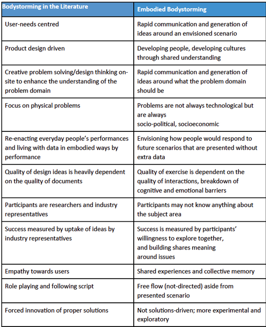
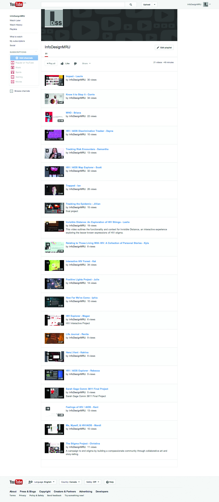
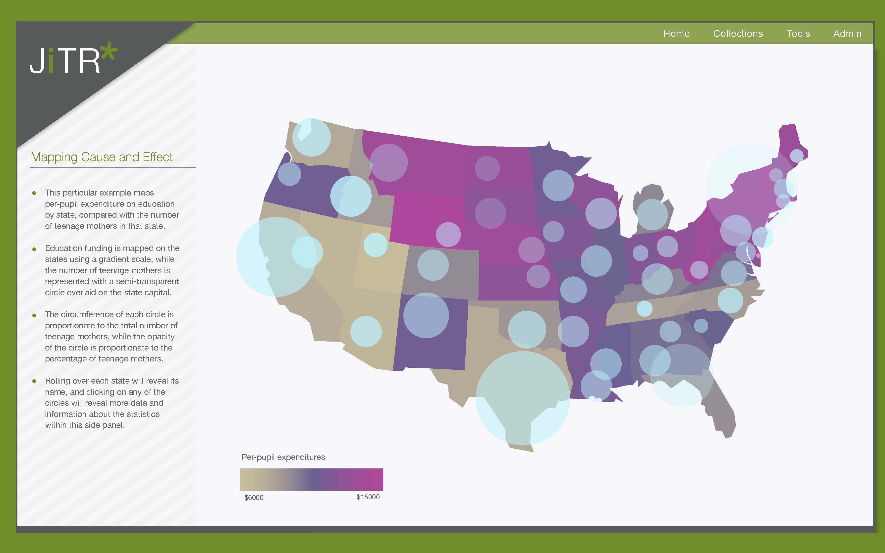
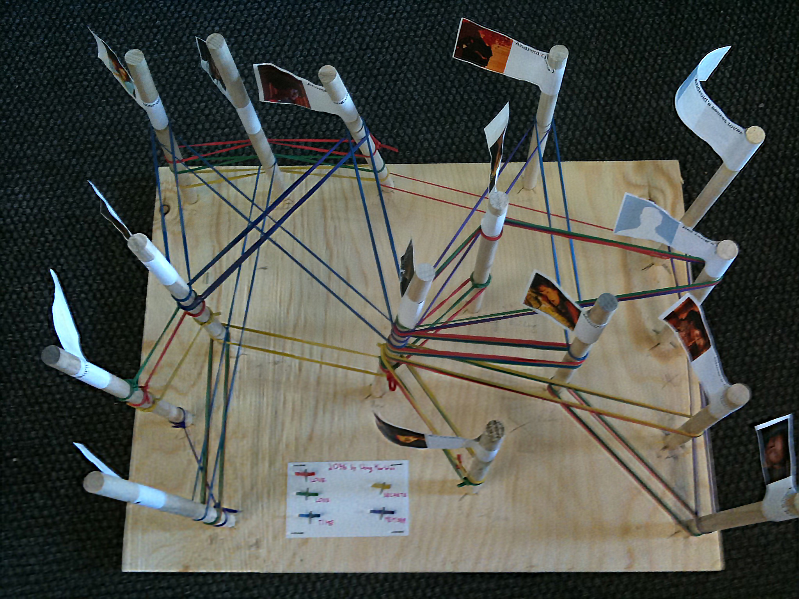
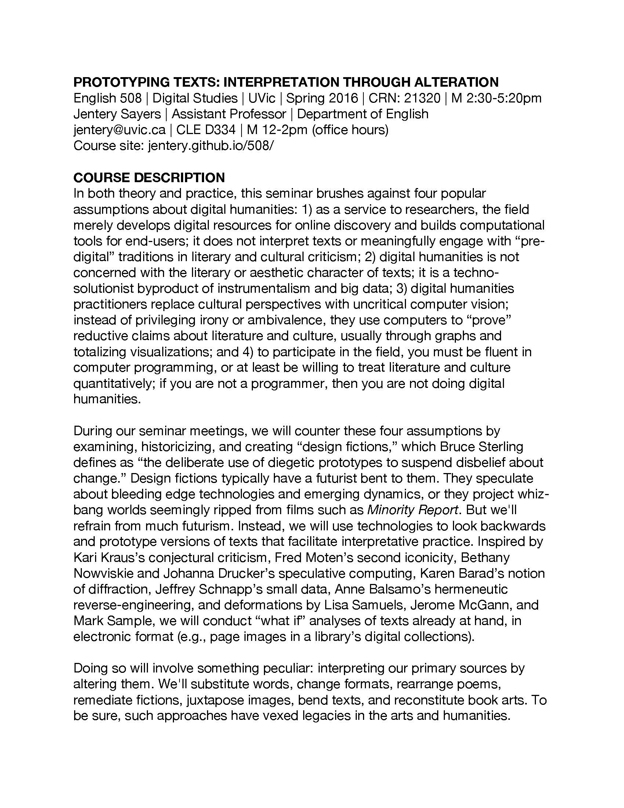

# PROTOTYPE

### Stan Ruecker [IIT Institute of Design](http://www.id.iit.edu), Celso Scaletsky [Unisinos](http://www.unisinos.br/design), Guilherme Meyer [Unisinos](http://www.unisinos.br/design), Chiara Del Gaudio [Unisinos](http://www.unisinos.br/design), Piotr Michura [Jan Matejko Academy of Fine Arts in Krakow](http://www.asp.krakow.pl), and Gerry Derksen [Winthrop University](http://www.winthrop.edu/cba/digitalinformationdesign/default.aspx?id=11776)

---

##### Publication Status:
* unreviewed draft
* draft version undergoing editorial review
* draft version undergoing peer-to-peer review
* **draft version undergoing MLA copyediting**
* published 

--- 

## CURATORIAL STATEMENT

### Prototyping helps students to engage with ideas 

Prototypes are provisional models of ideas that help us investigate, communicate, and remember specific aspects of those ideas. A prototype, like a design or a scenario, is a model of something that might exist in the future. The word “prototype” has two meanings: first, a prototype could be a template for copying; second, it could be an expression of some aspect of what might exist. For example, one series of physical prototypes might explore possible forms (e.g. dimensions; rounded corners or square), while others might look at various materials (e.g. plastic, aluminum, steel). One experience prototype (for the design of a shopping experience, for example) might deal with what people will see, while another might focus on what they will hear. Computer scientists speak of horizontal vs vertical prototypes: the former shows all features, including those that cannot yet be used; the latter shows only some  features, but they are developed enough to try out. Many projects create T-shaped prototypes, where (on the crossbar of the T) all the elements of the design are there at a superficial level, and some parts (the trunk of the T) function much the way they will in the final version. These are just some of the ways in which prototypes can model ideas.

Having students develop prototypes in the classroom is therefore a good way of having them engage with ideas. First, a prototype can be used for interrogating a concept. Second, it will involve a particular strategy for addressing the concept. Third, a prototype has specific details that can serve as topics for discussion. Fourth, as Dobson et al. point out in "The Interface Implications of Understanding Readers," prototypes can also provide ideas about other concepts, because they start people thinking not just about the concept in front of them, but also about adjacent ones.

Going further, we have argued in "A Brief Taxonomy of Prototypes for the Digital Humanities" that prototypes can be used for three different purposes, which are experiment, development, and provocation. They overlap a bit, but are distinct enough to provide some pins in the map. They all model ideas, but they differ in their goals, and therefore in the kinds of ideas involved.

An experimental prototype is one created in order to get at ideas that are robust enough to be useful, not for one design project in particular, but instead for many subsequent design projects. For example, a researcher might be interested in the extent to which having a pre-assigned role in a game allows people to join more quickly in. To address this idea, one strategy would be to build a game where one version had pre-assigned roles, and another did not. By bringing in new players under both conditions and observing how long it takes them to get up to speed, the researcher might get some evidence to address this question. When an experimental prototype is intended to help develop research questions, the features of the prototype should express or embody or reify specific aspects of the research question.

By contrast, a development prototype for a game would be focused on ideas useful in particular for the current design project. They might include ideas in the sense of attributes such as shape, color, materials, interactions, and so on. A development prototype is one in a series that will result in a polished version at the end (the template for copying). The rough drawings would get refined; the features would be formalized; there would need to be packaging and a catchy name and all the other components that go into a finished producet. None of those crucial issues for a development prototype are important for an experimental prototype, because the goals are different.

Finally, there are provocative prototypes (e.g. Mogensen 1992), which are intended to help people change their point of view, or perhaps even realize that they have one. Keywords related to provocative prototypes are speculative design, design fiction, and provotypes. These activities are probably the closest that design comes to the fine arts, while still remaining design. For example, Susana Soares has a series of laboratory glass diagnostic objects that incorporate living bees [(http://www.susanasoares.com/index.php?id=56)](http://www.susanasoares.com/index.php?id=56), since research has shown that they can be trained to smell a wide range of diseases at early stages.

Some people might argue that all prototypes are part of a development process, and that the provocative ones are just closer to the beginning, followed by the experimental ones, and ending with the development ones. If that is the case, and it could very well be, then not all projects involve all three kinds, nor should they.

### Principles of Curation

The goal in selecting these materials was to provide as wide a range as possible of examples where prototypes are used in the classroom, whether with undergraduate or graduate students. In addition, activities involving prototypes can be useful for students in many fields, and not just for students in design or other disciplines that are familiar with the production of inventive knowledge.

## CURATED ARTIFACTS

#### “Campus Mysteries”

* Type: Student work
* Copy of the artifact: [http://interactives.artsrn.ualberta.ca/?page_id=145](http://interactives.artsrn.ualberta.ca/?page_id=145)
* MA students in Humanities Computing, University of Alberta, Edmonton

This exercise uses prototypes as one of the steps toward production. When most people hear the word “prototype,” this is the kind that comes to mind. The students are tasked with solving a problem by creating a series of prototypes that converge on a solution.

Use this exercise at the beginning of the term. Choose a prototyping exercise that will challenge students with concepts that they may have already encountered in some form, but which will be addressed in greater detail later in the term. 

Ask them to break into teams that will each create a prototype to the best of their abilities. By having them struggle in a hands-on way to make use of ideas that that will be explored in more detail later, they will hopefully be more motivated to focus on those ideas when the time comes to examine them in class.

#### “Bodystorming”

* Type: Assignment
* Copy of the artifact: [http://designresearchtechniques.com/casestudies/bodystorming/](http://designresearchtechniques.com/casestudies/bodystorming/)
* Dennis Schleicher, Red Privet 
* Peter Jones, Redesign, Ontario College of Art & Design
* Oksana Kachur, Ontario College of Art & Design 

This assignment uses bodystorming as an exploratory means of generating ideas. Students might use a "real" location and do the iterative design thinking right on site, or they can recreate the intended environment using cardboard or foamcore, then carry out the physical activity within the mocked-up space.

Bodystorming is a way of getting students out of their chairs and thinking with their bodies. Its play-acting dimension will appeal to more theatrically-inclined students, but the theatricality can be downplayed for others.

To use it in a class, choose an experience associated with a location or environment. Take the students there, or create a simulation, then have them prototype the experience by acting out the roles involved. Make a video record of the activity, and review it later with the students, looking for moments of insight. To make the experience of review easier, you may want to pre-select short clips for discussion. 

#### “Prototypes of an Article”

* Type: Student work
* Xinyue Zhou, MDes student, IIT Institute of Design, Chicago

For this assignment, students are asked to read a paper, then create a prototype that can help the class think about the implications of the topic. In this case, the students had read Langdon Winner’s chapter “Do Artifacts Have Politics?” in _The Whale and the Reactor_, but any article will do. The exercise has several steps that can be spread over multiple weeks: (1) discuss the paper (2) generate sketches for at least 3 concepts (3) produce a prototype of the selected concept (4) revise the prototype based on feedback.

To adapt this for a class, choose an article that the students will read as usual beforehand. Ideally it should be a paper that will engage their imaginations; it should also lend itself to thinking about things that can be prototyped, such as communications, objects, or experiences. Then have the students carry out the 4 steps above.

#### “Prototype Video for Kickstarter”

* Type: Student work
* BComm students Mount Royal University

In this assignment, students create a provocative prototype by recording a 2-5 minute Kickstarter-like video advertising their solution to a problem.

The exercise allows students to reinforce the most important elements of their rationale for making particular decisions during the development phases. They could also distance themselves from their work by changing roles from designer to storyteller. Finally, they were to try to address their topic in a short and efficient manner—probably the most demanding task of the whole project.

To try a similar project in class, it is useful to have a prior project that can form the basis of the video. Connecting the videos to the idea of the Kickstarter platform helps the students understand that they need to be making something short and compelling. Kickstarter also provides an endless list of possible examples to draw upon.

#### “Experimental Interface Design”

* Type: Assignment
* [files/prototype-structured_surface.pdf](files/prototype-structured_surface.pdf)
* Milena Radzikowska, Professor, Mount Royal University

This exercise is about bringing aspects of research prototyping into the classroom. 
In the example, students could choose between two experiments. The first was in structured surfaces, where a data visualization (like a map, for example) is used as the basis for an argument that is made by superimposing additional information (like pins into the map). The second was in attempting to accommodate big data on a wall-sized display.

As a classroom activity, this exercise does not require that the students have some skill in normal forms of interface design, since those skills may help with the technical aspects, but may interfere with the imaginative activity of representing data. What is important is that the students are proficient in some form of representation, whether through sketching by hand, using tools like those in the Adobe Creative Suite, or using online tools for prototyping. 

#### “Prototyping Character Interaction”

* Type: Student work
* Marley Liepert, MLIS student, University of Illinois

This exercise encourages students to think in physical terms for analysing character interactions. Teams produce a horizontal board with a vertical peg for every character, indicated by a flag with a picture and brief description. They then wrap strings, ribbons, or elastic bands between the pegs to illustrate the sequence of interactions, starting at the bottom and working to the top. 

As in this example, various physical aspects can be made meaningful. These include proximity of the pegs for closeness of relationship, the colors of the connecting bands for a theme or the emotional tenor. The thickness of the bands might be used to suggest duration. 

To use this in a class, choose a book or movie that will lend itself to a sufficiently complex set of interactions among enough characters to make the project challenging, without having too many interactions or characters to make it impossible to model. 

#### “Prototyping User Stories”

* Type: Assignment
* Dalsu Ozgen, Middle East Technical University, Ankara, Turkey

The goal of this assignment is for students to learn about using elements of conventional story-telling to strengthen user scenarios.

The activity uses a narrative board and prompts to help them collect user stories as part of the participatory design process. Eliciting meaningful information about an organization and its challenges is a central activity of the user-centered design process, and a wide variety of techniques are used. 

In this exercise, the student serving in the design role guides other students in the creation of a  story with a number of inflection points. Each inflection point then serves as a possible location for design interventions that can change the rest of the story.

To use this in the classroom, have students describe characters that are close to themselves or someone they know. Choose a topic that the students know about and are interested in where some problems are not hard to identify.

#### “Prototypes as Objects of Study”

* Type: Student work
* Copy of the artifact: [files/prototype--4-research-tools.pdf](files/prototype-4-research-tools.pdf)
* Maryam Heidaripour, PhD student, IIT Institute of Design, Chicago

For many disciplines, the object of study does not yet exist—it is a possible future. In this assignment, students are asked to design a set of research tools consisting of a prototype, pilot study, experimental design, and quasi-experimental design (which mines existing data for factors that would have been controlled had the researcher set up the original study). The different approaches can be compared in terms of the resources required and the kind of knowledge that can be gained.

For use in a course, it may be helpful to plan a series of classes where each of the research tools is discussed in turn, with examples from the literature. The students can then describe ways in which their own research could be supported with each approach, resulting in a report that describes how those research tools would be created and deployed in each case.

#### “Prototyping Texts”

* Type: Syllabus
* [http://jentery.github.io/508/notes.html](http://jentery.github.io/508/notes.html)

This series of exercises encourages students to learn about text through deformation. The exercise might consist of simple remediation (e.g. from plain ascii text to XML-encoded text) or the deformations might be more fundamental (e.g. changing binary genders to non-binary ones). 

In either case, the purpose is to have students think about texts—even historically “canonical” ones—as the results of processes that can be identified and experimented with in order to better understand their effects. 

To use this in the classroom, choose documents that the students would normally be encountering, then invite them to (a) deform the texts in one or more ways, then (b) discuss or have them report on how those deformations changed the text and changed how they understand the text.

#### “Science Fiction to Science Fabrication”

* Type: Syllabus
* [http://scifi2scifab.media.mit.edu/syllabus-3/](http://scifi2scifab.media.mit.edu/syllabus-3/)
* Sophia Brueckner and Dan Novy

This course has students respond to science fiction with their own prototypes. The students read novels and short stories organized by topic (e.g. nanotech, cyborgs), and prototype some of the science fiction ideas.

Using science fiction encourages the students to think of the prototype as a guess about the future. Depending in part on the level of detail in the story about the objects, experiences, technologies, or environments, the students can either draw directly on the text, or else respond to the text without actually instantiating something in it.

To use this in the classroom, choose a science fiction text with sufficient scope to allow the students a reasonable number of options. Students might be directed to prototype something directly from the text, something they believe would fit in the environment, or something that is a critical response to encourage debate. Use the prototypes as the basis for class discussions.

## RELATED MATERIALS

The prototyping exercises described here can be done in a variety of ways—as sketches on paper, with physical materials, as software, or using electronic hardware. Here is a list of some useful resources for software and hardware projects.

* [https://balsamiq.com/](https://balsamiq.com/)
* [https://https://wireframe.cc/](https://wireframe.cc/)
* [https://marvelapp.com/](https://marvelapp.com/)
* [http://d3js.org/](http://d3js.org/)
* [http://littlebits.cc/bitcraft](http://littlebits.cc/bitcraft)
* [http://www.makeymakey.com/](http://www.makeymakey.com/)
* [https://www.arduino.cc/](https://www.arduino.cc/)
* [https://www.raspberrypi.org/products/raspberry-pi-2-model-b/](https://www.raspberrypi.org/products/raspberry-pi-2-model-b/)

## WORKS CITED

Dobson, Teresa M., Monica Brown, Dustin Grue, Ernesto Peña, Geoff Roeder, and the INKE Research Team (2015). The Interface Implications of Understanding Readers. Special Issue: The Future of Reading. Ed. Stan Ruecker. _Interdisciplinary Science Reviews_ 40.1 (March).

Galey, Alan, Stan Ruecker, and the INKE Research Group. “How a Prototype Argues.” Literary and Linguistic Computing. 25(3). 2010.

Meyer, Guilherme, Chiara Del Gaudio, Stan Ruecker, Piotr Michura, and Celso Carnos Scaletsky (2016). ”Learning to Create Prototypes to Address Research Questions.” _Proceedings of the International Conference on Educational Technology Research_, Izmir, Turkey. Feb 11-13, 2016.

Mogensen, P., (1992). “Towards a Provotyping Approach in Systems Development,” _Scandinavian Journal of Information Systems_ 4(1): Article 5.

Ruecker, Stan and the INKE Research Group. “A Brief Taxonomy of Prototypes for the Digital Humanities.” _Scholarly and Research Communication_. 6(2), 2015.

Scaletsky, Celso, Santosh Basapur, and Stan Ruecker. “The Generative Similarities of Designs, Prototypes, and Scenarios.” _Proceedings of the 11th Annual Research and Development + Design Conference_ (P&D Design 2014). Sept 29-Oct 12, 2014. Gramado, Brazil.

Schleicher, Dennis, Peter Jones, and Oksana Kachur. Bodystorming as Embodied Designing. ACM Interactions Nov-Dec, 2010.

Winner, Langdon. (1986). “Do Artifacts Have Politics” In _The Whale and the Reactor: A Search for Limits in an Age of High Technology_. Chicago: University of Chicago Press.

