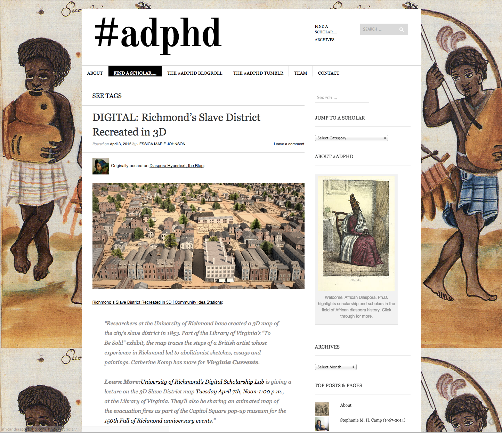
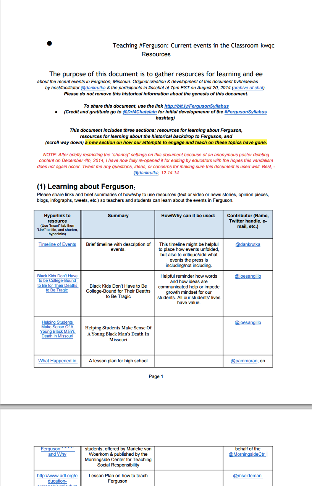
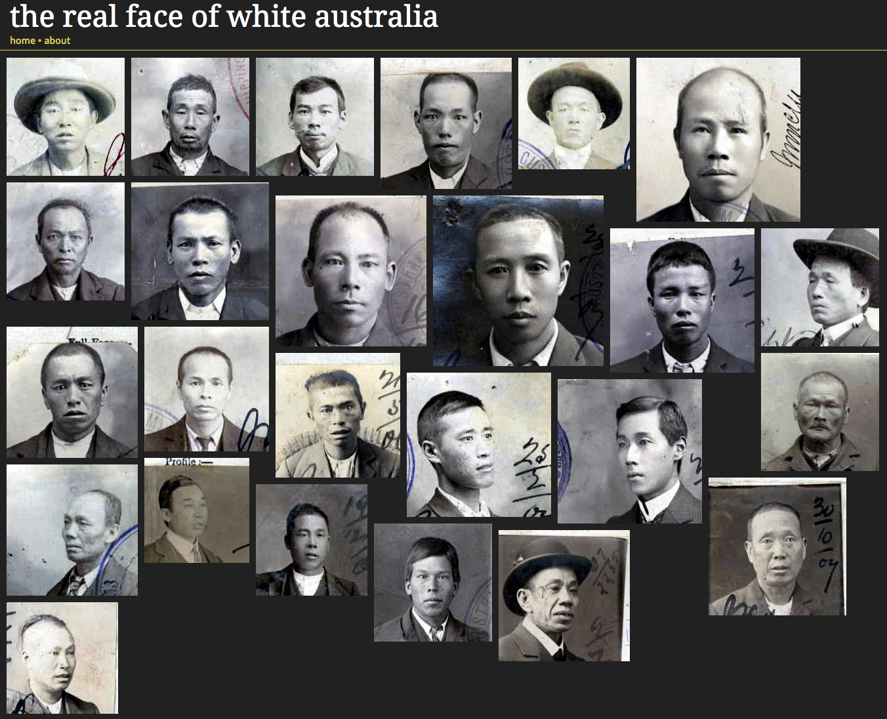
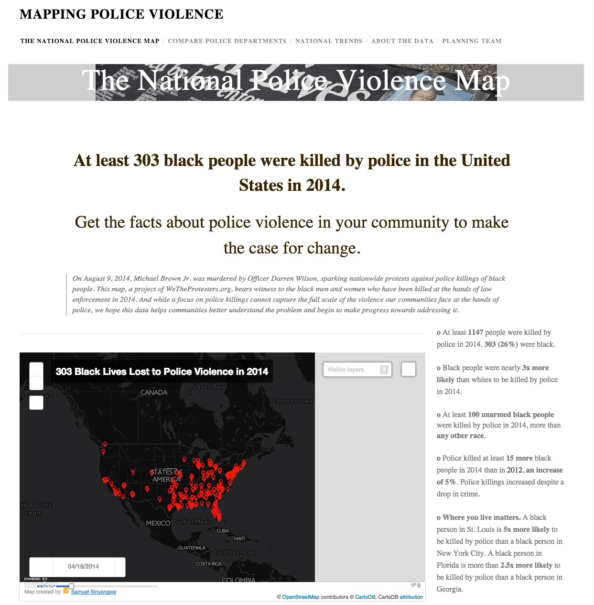
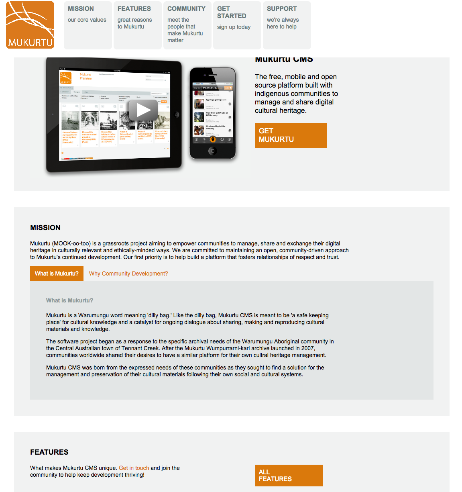
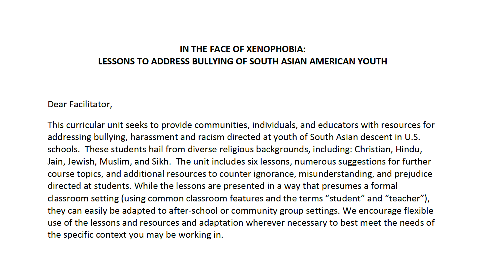
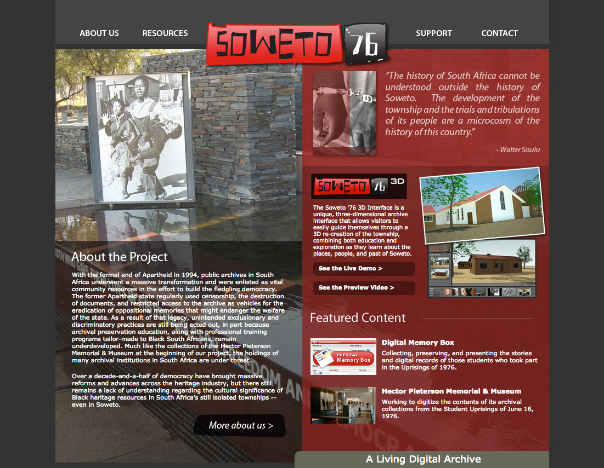
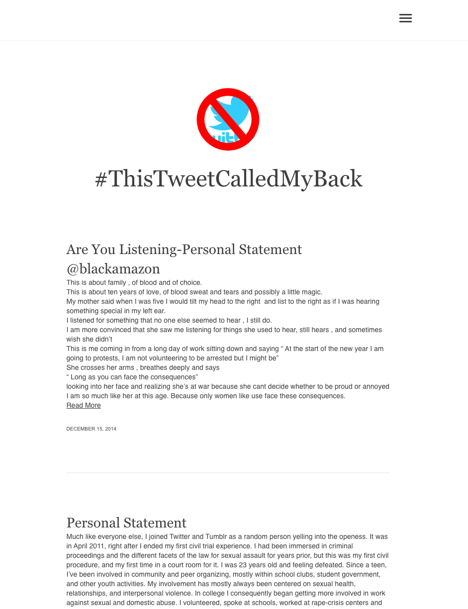
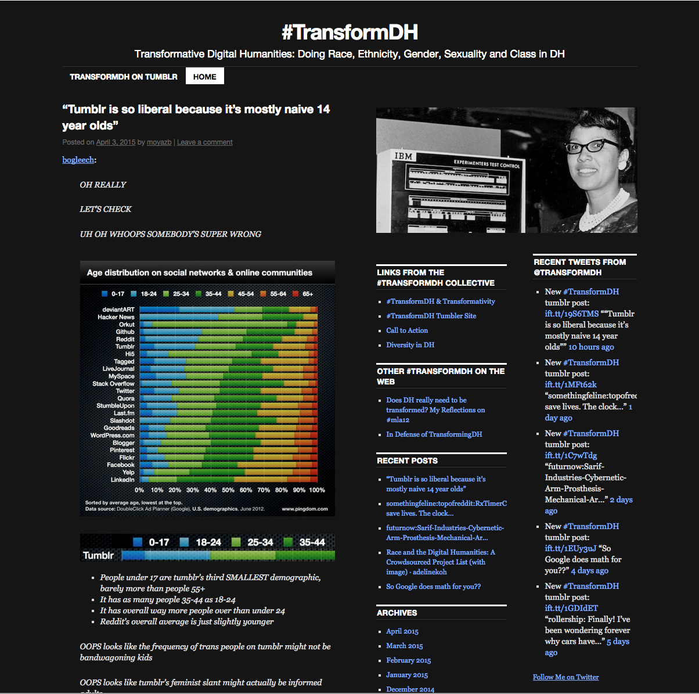
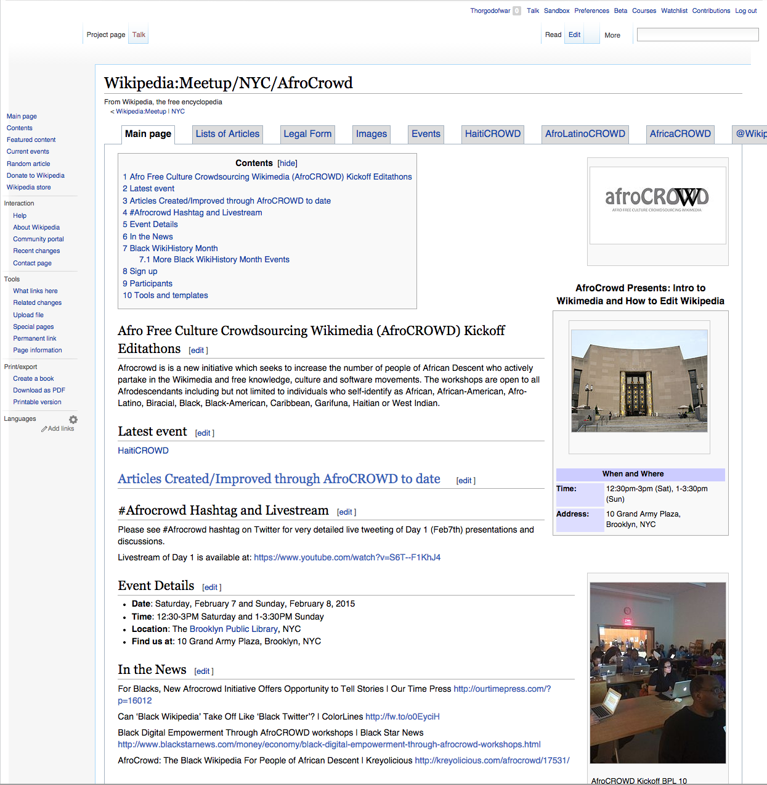

--- 
title: Digital Pedagogy in the Humanities
subtitle: Concepts, Models, and Experiments 
chapter: Race
URL: keywords/race.md
authors: 
- family: Koh
  given: Adeline
- family: Lasmana
  given: Viola
editor: 
- family: Davis
  given: Rebecca Frost
publisher: Modern Language Association
type: book
---

# RACE (Draft)

## AUTHORS:
### Adeline Koh
[adelinekoh.org](http://adelinekoh.org)

### Viola Lasmana
University of Southern California

##### Publication Status:
* unreviewed draft
* draft version undergoing editorial review
* draft version undergoing peer-to-peer review
* **draft version undergoing MLA copyediting**
* awaiting pre-print copy
* published 

---
### Cross-Reference Keywords: archive, collaboration, community, curation, diaspora, digital divides, history, hashtag, indigenous, intersectionality, network, social justice

--- 

## CURATORIAL STATEMENT 

The classroom is a space and place of entanglements. With the intersections of race, class, ethnicity, disability, gender, and sexuality
as vital aspects to consider in various activites in and out of the classroom, how do we foster pedagogical practices attentive to
multilayered sets of identities and relations, while opening up opportunities for exploring diverse texts and materials that deal with 
issues of race and ethnicity in new and critical ways? In *Digital Humanities Pedagogy: Practices, Principles and Politics*, Brett D. 
Hirsch calls attention to the importance of digital pedagogy in addressing these key topics, while also being mindful of the fact that 
"the opportunities for pedagogy to bring these issues into useful discussion--and for digital humanities classrooms to create a more 
inclusive, diverse environment--remain largely unexplored" (27). This collection offers some resources and assignments that can be used in 
studies related to issues of race and ethnicity, as part of what the co-curators envision for a transformative and engaged model of 
digital pedagogy. 

While it may not seem like it on first inspection, issues of race and ethnicity are deeply embedded in technology. European colonial
discourses from the eighteenth century onwards deployed the ideology that “civilized” groups deserved supremacy over others because of
their superior technology. They located this superiority in multiple fields, from advances in Western scientific knowledge to the West’s 
development of modern military equipment and artillery. Postcolonial scholarship has largely challenged this assumption, with critics 
with critics such as Dipesh Chakrabarty, Aihwa Ong, Gyan Prakash, and Cheikh Anta Diop, among others, arguing that the modernity of non-
Europeans actually predates the European construct of modernity, or that notions of modernity need to be expanded. Even in contemporary 
discourse, technology continues to be racialized by the assumption that people in “developing” nations or from minority populations are 
outsiders to technology. This belief is inaccurate. For example, as Anna Everett has shown, far from being outsiders to the early years of
cyberspace, African Americans and African diasporic peoples were actually early adopters of information age technology. The persistence of 
this mode of thought in contemporary times indicates the cultural significance of race and ethnicity in technology and digital cultures. 

Through this curation, this collection moves toward a definition of digital pedagogy in the humanities as one that uses the digital space 
in innovative ways to create, build upon, and sustain communities and networks; the collection is inspired by bell hooks’ “engaged 
pedagogy,” which emphasizes the self-actualization of both teacher and students, and transforms the classroom into a collaborative 
community learning together the social, material, and political relationships that exist in and out of the classroom. This collection also 
draws upon Jesse Stommel’s concept of “critical digital pedagogy,” which “centers its practice on community and collaboration; must remain 
open to diverse, international voices […]; will not, cannot, be defined by a single voice but must gather a cacophony of voices; must have 
use and application outside traditional institutions of education.”

This collection, therefore, sees the digital as a tremendous space of possibility for humanities scholars, as it actively expands the 
boundaries of the humanities and humanities pedagogy beyond the academy itself, demonstrating the value of humanities questions to a 
larger public. Like Edward Said’s call for a spirit of amateurism in “Professionals and Amateurs,” this collection has been carefully 
curated as a potential model for pedagogical activities “fueled by care and affection,” and by “the desire to be moved not by profit or 
reward but by love for an unquenchable interest in the larger picture, in making connections across lines and barriers” (76). The spirit 
of amateurism can, indeed, be mobilized as an ethical, critical, and radical practice in creating the best pedagogical spaces with care 
and diligence. 

The projects that make up this curated list exemplify these definitions of engaged pedagogy, critical digital pedagogy, and amateurism. 
Some of the criteria in selecting these artifacts are as follows:
* artifacts that break down the barrier between academia and the rest of the world
* artifacts that represent accessible technology (that includes rather than excludes)
* artifacts that represent activist technology
* artifacts that engage students with communities
* artifacts that pull students into larger networks
* artifacts that use technology to empower rather than disenfranchise 
* artifacts that help students develop their own understanding of diversity
* artifacts that exemplify how the classroom as a community learns together the social, material and political relationships that exist within the classroom and without.

This curated list is by no means an exhaustive one. As the beginnings of an attempt to explore what digital pedagogy can offer for the 
study of race and ethnicity in humanities classrooms, this collection exists as one of many articulations of what a transformative, 
critical, and engaged digital pedagogy might resemble in a globalized, networked 21st century world. 

## CURATED ARTIFACTS

### African Diaspora PhD

* Artifact Type: directory 
* Source URL: http://africandiasporaphd.com/ 
* Permissions: CC BY-NC-SA 3.0 license
* Creator and Affiliation: Jessica Marie Johnson, Africana Studies and History, Johns Hopkins University 
* Tags: getting started and advanced, networking  

A curated blog that highlights scholarship and scholars in the field of Atlantic African diaspora history, *African Diaspora, Ph.D.* is a valuable resource for students to gain an overview of current issues in Atlantic African diaspora history and its relevance to contemporary race issues. This artifact represents scholarly activist technology in that it encourages students to be pulled into a larger network of Afrodiasporic knowledge production and knowledge producers. Some potential assignments include 1) creating a literature review on topics within Atlantic African diaspora history by researching the directory/index of scholars; 2) researching the profiles and works of Afrodisasporic scholars who study contemporary race issues; 3) contacting specific scholars for interviews.

### Ferguson Syllabus 

* Artifact Type: syllabus 
* Source URL: https://docs.google.com/document/d/1kwZl23Q9tgZ23dxSJWS-WpjZhOZ_mzVPtWL8-pWuLt8/edit/edit?pli=1#heading=h.l15kj4sa2rn0
* Permissions: public 
* Creator and Affiliation: Marcia Chatelain, hashtag originator, Georgetown University; Dan Krutka, Google document host & faciliator, Texas Women's University
* Tags: getting started and advanced, crowdsourcing, curriculum  

This crowdsourced Google document, a product of the #FergusonSyllabus hashtag, contains resources, ideas, links, and annotations that are helpful for instructors dedicated to anti-racist pedagogy, and who want to teach the history of race in the United States in conjunction with the resurgence of white nationalism, especially during the Trump administration era. The list of resources can be used for a class unit discussing the historical contexts and the larger pattens of systemic racism that precede events like the 2014 Michael Brown shooting in Ferguson, Missouri, and the 2017 white nationalist rally in Charlottesville, Virginia. 

### Invisible Australians: The Real Face of White Australia 

* Artifact Type: visual archive, online exhibit
* Source URL: http://invisibleaustralians.org/faces/ 
* Permissions: CC BY 3.0 license.
* Creator and Affiliation: Kate Bagnall, ANU College of Asia and the Pacific; Tim Sherratt, National Library of Australia, University of Canberra
* Tags: advance, archive, visual 

This visual wall of non-white Australians documents the inaccuracy of the myth of an all-white Australia and the monitoring and restriction of people who were targets of the "White Australia Policy.” *Invisible Australians* is relevant for courses on global race and ethnicity, particularly to introduce students to archival sources and their use in government policy. This website can also be used in conjunction with [Digitizing Chinese Englishmen](http://chineseenglishmen.adelinekoh.org/) in courses on colonial/postcolonial literature. In particular, instructors can pair a reading of this online visual archive with core postcolonial texts that have critiqued colonialism, such as Michel-Rolph Trouillot’s *Silencing the Past*, V.Y. Mudimbe’s concept of the “colonial library” in *The Invention of Africa* and Edward Said’s *Orientalism*. Core questions can include: how have technologies been utilized in a variety of archives to authorize particular versions of history? How does the visual and visuality factor in to issues of race, colonialism, and postcolonialism?

### Mapping Police Violence 

* Artifact Type: mapping tool
* Source URL: http://mappingpoliceviolence.org/ 
* Permissions:
* Creator and Affiliation: Deray McKesson, Netta, Samuel Sinyangwe, all of WeTheProtestors.org
* Tags: getting started and advanced, data visualization, mapping

This site offers visualizations of crowdsourced data on people who have been shot and/or killed by police. As a model of activist technology, this artifact engages students with wider communities and encourages them to participate in a larger network of knowledge construction, especially as it relates to race and state violence. *Mapping Police Violence* can be easily used in conjunction with the analysis of the police [Stop and Frisk public database analysis assignment](https://docs.google.com/document/d/1hAes7gK2s5w_pmyg6cnv1R0Jm350ZxA9Ddt97JTKoss/edit#heading=h.tnglmrae3sjl) developed by  Faith Adichie, Anne Cong-Huyen, Elizabeth Constable, John Locke, Andrew Lucchesi, Heidi Knoblauch, and Andrea Rehn in [Digital Pedagogy Lab 2015](http://digitalpedagogylab.com), which trains students on how to do close readings of datasets and to visualize this data using different tools. Integrating *Mapping Police Violence* with the *Stop and Frisk* public database can transform the classroom into a learning community that constructs and deconstructs the social, material and political relationships within the classroom and outside of it.  

### Mukurtu 

* Artifact Type: content management system
* Source URL: http://www.mukurtu.org/ 
* Permissions: Open-source code available on github under GNU General Public License (or “GPL”) https://github.com/MukurtuCMS/mukurtucms
* Creator and Affiliation: Kim Christen, University of Washington, Pullman; Michael Ashley, University of California, Berkeley
* Tags: advanced, database 

Mukurtu is a free, open-source content management system aimed at empowering indigenous communities to manage, share and exchange digital heritage in relevant and ethically-minded ways. Items contained within the database can be given different levels of permission for viewing and interacting, thereby providing greater flexibility for communities unwilling for their heritage collections to be completely open to the public. This artifact serves as another model of an empowering, activist technology that that engages students with communities and larger networks, as well as helps students develop their own understanding of diversity.

Students can be tasked with exploring the CMS's functionality and reporting on its affordances and limitations in comparison with other similar database exhibition tools (for example, Omeka, Scalar, Wordpress, Drupal etc.), culminating in a final project of working together with a local community to build their own particular instance of Mukurtu for their uses.

### "In the Face of Xenophobia: Lessons to address bullying of South Asian American youth"

* Artifact Type: lesson plans
* Source URL: https://saalt.org/wp-content/uploads/2013/06/InTheFaceOfXenophobia-Final-11.4.2013.pdf
* Permissions: CC BY-NC-ND
* Creator and Affiliation: South Asian Americans Leading Together (SAALT)
* Tags: getting started, curriculum

This curriculum provides educators with a set of tools and lesson plans that can be utilized as part of an anti-racist pedagogy. It serves as a resource for addressing issues of racism, harassment, and bullying in the Trump era of heightened nationalism and white supremacy, allowing students to understand the historical origins of xenophobia, teaching them the meanings of key terms such as xenophobia, micro-aggressions, etc., while also putting emphasis on the under-represented community of South Asian Americans that has had a long history of xenophobic attacks, including in the last decade. The [South Asian American Digital Archive](https://www.saada.org) would be an excellent online repository for students to explore as part of the curriculum. 
    
### Soweto76

* Artifact Type: student project, 3D digital archive
* Source URL: http://www.soweto76archive.org/ 
* Permissions: Yes
* Creator and Affiliation: Angel David Nieves, Hamilton College
* Tags: advanced, archive, interactive, visualization, multiplatform

This is a 3D virtual representation of the black township of Soweto, South Africa, in 1976, created on Unity, a multiplatform game engine. The materials in the archive will be an excellent advanced-level addition to courses on South Africa or about global race and ethnicity by introducing elements of visualization and geography into study of this historical protest. The three-dimensional quality of this resource helps students to understand the importance of space, place and physical location in racial segregation during Apartheid, where black and colored people were physically barred from entering spaces for whites. A possible assignment might be for students to work on the archive demo along with Google maps to compare how Soweto has changed since 1976, and to discuss the implications of these changes. A 3D demo of the archive is available for public use here: [http://soweto76archive.org/3d/](http://soweto76archive.org/3d/)

### #ThisTweetCalledMyBack 

* Artifact Type: Hashtag
* Source URL: https://twitter.com/search?f=realtime&q=%23thistweetcalledmyback&src=typd 
* Permissions: public
* Creator and Affiliation: @tgirlinterruptd, @chiefelk, @bad_dominicana, @aurabogado, @so_treu, @blackamazon, @thetrudz 
* Tags: getting started, crowdsourcing, Twitter

&#35;ThisTweetCalledMyBack is a hashtag movement from late 2014, where women of color activists on Twitter called attention to the appropriation of their work on social media by both journalists, activists and academics. The hashtag references the seminal 1981 book *This Bridge Called My Back: Writings by Radical Women of Color* by Cherríe Moraga, Gloria Anzaldua and Toni Cade Bambara. The hashtag can be taught in conjunction with themes of the appropriation of works by women of color in feminist movements, and in relation to hashtag activism, new social media feminist movements, and their pre-internet counterparts. An excellent complementary reading is Dorothy Kim’s “[The Rules of Twitter](http://www.hybridpedagogy.com/journal/rules-twitter/).” Students could be tasked to do a comparison of the major metaphors in both the original text and the tweetstream: what constitutes the “bridge”? Who travels on it? What does this show about change (or lack thereof) in intersectional feminisms today?

### #TransformDH 

* Artifact Type: collaborative project 
* Source URL: http://transformdh.org/ 
* Permissions: Yes
* Creator and Affiliation: Anne Cong-Huyen, Whittier College; Alexis Lothian, University of Maryland; Amanda Phillips, University of California, Davis; Melanie Kohnen, New York University; Moya Bailey, Northeastern  University; Marta S. Rivera Monclova, PhDeviate; Tanner Higgin, Common Sense Media; Fiona Barnett, Duke University; Anna Everett, University of California, Santa Barbara; Lisa Nakamura, University of Michigan; Tara McPherson, University of Southern California; Natalia Cecire, University of Sussex; Jessica M. Johnson, Michigan State University
* Tags: advanced, collaboration

&#35;TransformDH is a collaborative, fluid collective of people and ideas invested in the intersection between digital humanities and social justice, as well as the representation and scholarship of marginalized communities in the digital humanities. This artifact demonstrates the creation of a community and effort to pull students into larger networks. #TransformDH can be assigned as a reading in digital humanities classes, particularly for considering the relationship of its content to the Digital Humanities field at large, providing students with a wide variety of stories and perspectives related to digital humanities and social justice issues. Comparative readings could be made with other digital humanities publications, such as*Debates in the Digital Humanities* and the *Digital Humanities Quarterly* to discuss the differences and parallels in approaches, theories, and methodologies.

### Afro Free Culture Wikimedia (AfroCROWD) Kickoff Edit-a-thons

* Artifact Type: Wikipedia Edit-A-Thon 
* Source URL: https://en.wikipedia.org/wiki/Wikipedia:Meetup/NYC/AfroCrowd
* Permissions: CC BY-SA 3.0 license
* Creator and Affiliation: Multiple Wikipedia editors
* Tags: getting started and advanced, wikipedia

AfroCROWD is a Wikimedia initiative to increase the number of people of African descent who actively take part in Wikimedia and free knowledge, culture and software movements. The event is part of Black WikiHistory Month, and is open to all Afrodescents who self-identify as being part of the diaspora. Student clubs and organizations focused on the African diaspora might be interested in organizing in-person nodes for these edit-a-thons, thereby engaging in a larger network of knowledge production. Instructors who are teaching more racially and ethnically diverse classes can also help add to the project by contributing to the [WikiProject African Diaspora](https://en.wikipedia.org/wiki/Wikipedia:WikiProject_African_diaspora) Educators who want to get started teaching with Wikipedia can look at [my blog post on resources on getting started](http://www.adelinekoh.org/blog/2015/03/05/resources-on-integrating-wikipedia-into-your-classroom/), and contact the [Wiki Education Foundation](http://wikiedu.org/), an organization that has been developed especially to give classroom support for education. 

## RELATED MATERIALS

* Everett, Anna. *Digital Diaspora: A Race for Cyberspace* Albany, NY: SUNY Press, 2009. 

* Harding, Sandra, ed. *The Postcolonial Science and Technology Reader* Durham: Duke University Press, 2011. 

* Koh, Adeline. *NITLE Race and the Digital Humanities Zotero Bibliography* (https://www.zotero.org/groups/nitle_race_and_digital_humanities/items)

* McPherson, Tara. "Why Are the Digital Humanities So White? Or Rethinking the Histories of Race and Computation" *Debates in the Digital Humanities* ed: Matt Gold. Minnesota, University of Minnesota Press. [<http://dhdebates.gc.cuny.edu/debates/text/29>](http://dhdebates.gc.cuny.edu/debates/text/29) 

* Nakamura, Lisa and Peter Chow-White (eds). *Race After the Internet* New York: Routledge, 2011. 

## WORKS CITED

Adichie, Faith, Anne Cong-Huyen, Elizabeth Constable, John Locke, Andrew Lucchesi, Heidi Knoblauch, and Andrea Rehn. [Stop and Frisk Public Database Analysis Social Justice Assignment](https://docs.google.com/document/d/1hAes7gK2s5w_pmyg6cnv1R0Jm350ZxA9Ddt97JTKoss/edit#heading=h.tnglmrae3sjl).  [Digital Pedagogy Lab](http://www.digitalpedagogylab.com/identity). Web. 1 Sep. 2015

*AfroCROWD* Web. [<https://en.wikipedia.org/wiki/Wikipedia:Meetup/NYC/AfroCrowd>](https://en.wikipedia.org/wiki/Wikipedia:Meetup/NYC/AfroCrowd) 3 Apr. 2015. 

Bagnall, Kate and Tim Sherratt. *Invisible Australians: The Real Face of White Australia*
Web. [<http://invisibleaustralians.org/faces/>](http://invisibleaustralians.org/faces/) 3 Apr. 2015.

Bajaj, Moniha, Ameena Ghaffar-Kucher and Karishma Desai. *In the Face of Xenophobia: Lessons to address bullying of South Asian American youth.* Takoma Park, MD: South Asian Americans Leading Together (SAALT), 2013. 

Chakrabarty, Dipesh. *Provincializing Europe: Postcolonial Thought and Historical Difference.* Princeton: Princeton University Press, 2007.

Christen, Kim and Michael Ashley. *Mukurtu* Web. [<http://www.mukurtu.org/>](http://www.mukurtu.org/) 3. Apr. 2015. 

Cong-Huyen, Anne et al. *#TransformDH*  Web. [<http://transformdh.org/>](http://transformdh.org/) 3 Apr. 2015.

Chatelain, Marcia. *#Ferguson Syllabus* Web. [<https://docs.google.com/document/d/1kwZl23Q9tgZ23dxSJWS-WpjZhOZ_mzVPtWL8-pWuLt8/edit/edit?pli=1#heading=h.l15kj4sa2rn0]>](https://docs.google.com/document/d/1kwZl23Q9tgZ23dxSJWS-WpjZhOZ_mzVPtWL8-pWuLt8/edit/edit?pli=1#heading=h.l15kj4sa2rn0]) 3. Apr. 2015. 

Diop, Cheikh Anta. 1974. *The African Origin of Civilization: Myth or Reality.* Chicago: Chicago Review Press, 2012.

Earhart, Amy. “Can Information be Unfettered? Race and the New Digital Humanities Canon.” *Debates in the Digital Humanities.* Ed. Matt Gold. Minneapolis: University of Minnesota Press, 2012.

Everett, Anna. *Digital Diaspora: The Race for Cyberspace.* Albany, NY: SUNY Press, 2009.

Harding, Sandra, ed. *The Postcolonial Science and Technology Reader* Durham: Duke University Press, 2011. 

Hirsch, Brett D., ed. *Digital Humanities Pedagogy: Practices, Principles and Politics.* Open Book Publishers, 2012.

hooks, bell. *Teaching to Transgress: Education as the Practice of Freedom.* New York: Routledge, 1994.

Johnson, Jessica M. *African Diaspora PhD* Web. [<http://africandiasporaphd.com/>](http://africandiasporaphd.com/) 3 Apr. 2015.

Kim, Dorothy. “The Rules of Twitter.” Hybrid Pedagogy. http://www.hybridpedagogy.com/journal/rules-twitter/ 4. Dec 2014. Web.

Koh, Adeline. Digitizing Chinese Englishmen. Web. http://chineseenglishmen.adelinekoh.org. 1 Sept 2015.

---. “Inspecting the Nineteenth-century Literary Digital Archive: Omissions of Empire.” *Journal of Victorian Culture.* 19.3 (2014): 385-395.

---. *NITLE Race and the Digital Humanities Zotero Bibliography* (https://www.zotero.org/groups/nitle_race_and_digital_humanities/items)

---. “Resources on Integrating Wikipedia Into Your Classroom.” http://www.adelinekoh.org/blog/2015/03/05/resources-on-integrating-wikipedia-into-your-classroom/ Sep 1 2015. Web. 

Mallick, Samip. *SAADA (South Asian American Digital Archive.)* Web. [<https://www.saadigitalarchive.org/>](https://www.saadigitalarchive.org/) 3 Apr. 2015.

McKesson, Deray, et al. *Mapping Police Violence* Web. [<http://mappingpoliceviolence.org/>](http://mappingpoliceviolence.org/) 

McPherson, Tara. "Why Are the Digital Humanities So White? Or Rethinking the Histories of Race and Computation" *Debates in the Digital Humanities* ed: Matt Gold. Minnesota, University of Minnesota Press. [<http://dhdebates.gc.cuny.edu/debates/text/29>](http://dhdebates.gc.cuny.edu/debates/text/29) 

Mudimbe, V.Y. The Invention of Africa: Gnosis, Philosophy and the Order of Knowledge. Purdue: Indiana University Press, 1988. 

Nakamura, Lisa and Peter Chow-White (eds). *Race After the Internet* New York: Routledge, 2011. 

Nieves, Angel David. *Soweto76* Web. [<http://www.soweto76archive.org/>](http://www.soweto76archive.org/)

Nonini, David M. and Aihwa Ong. *Ungrounded Empires: The Cultural Politics of Modern Chinese Nationalism.* New York: Routledge, 1997.

Prakash, Gyan. *Another Reason: Science and the Imagination of Modern India.* Princeton: Princeton University Press, 1999.

Said, *Orientalism.* New York: Vintage Books, 1978. 

---. "Professionals and Amateurs." *Representations of the Intellectual.* New York: Vintage Books, 1996.

Saint Nihal Sing, “Color Line in the United States of America…” Modern Review, 1908. The South Asian American Digital Archive. 1 Sep 2015, Web. https://www.saada.org/item/20110621-216 

Stommel, Jesse. “Critical Digital Pedagogy: A Definition.” *Hybrid Pedagogy.* November 18, 2014. [<http://www.hybridpedagogy.com/journal/critical-digital-pedagogy-definition/>](http://www.hybridpedagogy.com/journal/critical-digital-pedagogy-definition/)

@tgirlinterruptd, et al. *ThisTweetCalledMyBack* Web. [<https://twitter.com/search?f=realtime&q=%23thistweetcalledmyback&src=typd>](https://twitter.com/search?f=realtime&q=%23thistweetcalledmyback&src=typd) 3 Apr. 2015.

Trouillot, Michel-Rolph. Silencing the Past: Power and the Production of History. Boston: Beacon Press, 1997. 

Wiki Education Foundation. http://wikiedu.org/ 1 Sep
