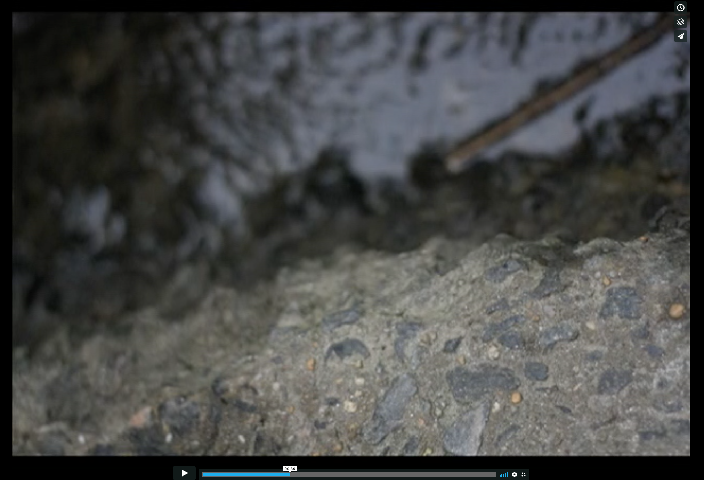
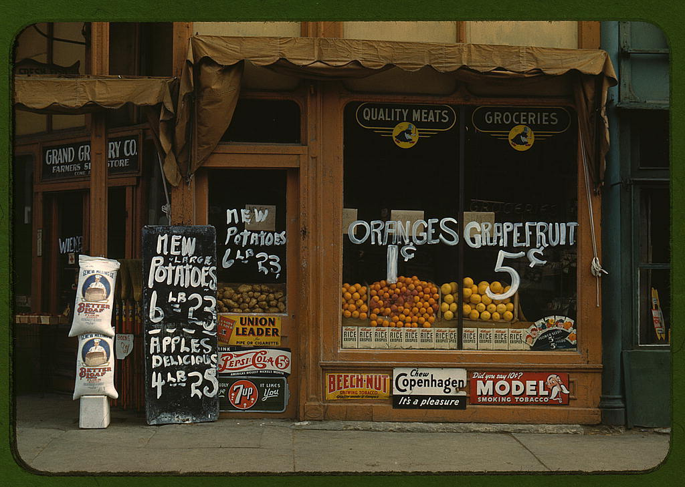
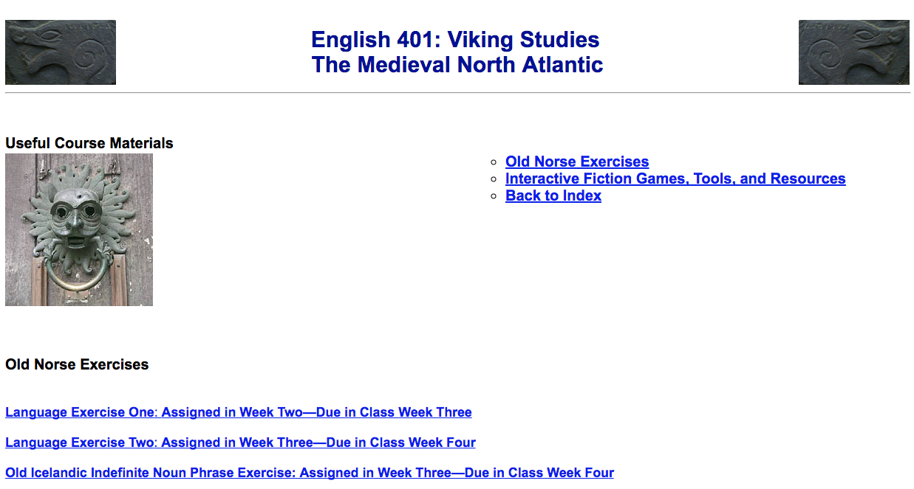
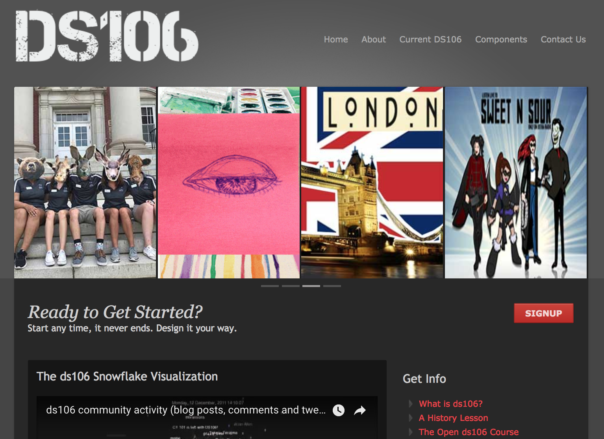
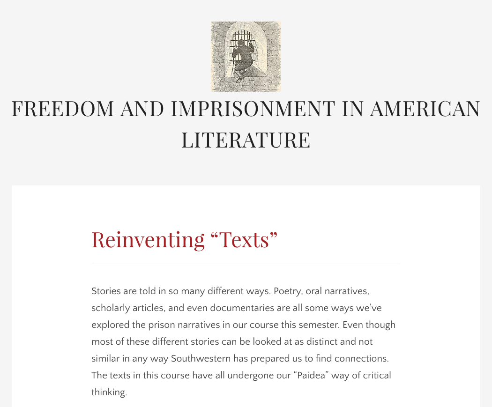

# Storytelling

### Bryan Alexander

Bryan Alexander Consulting | [https://bryanalexander.org/](https://bryanalexander.org/)

##### Publication Status:
* unreviewed draft
* draft version undergoing editorial review
* draft version undergoing peer-to-peer review
* **draft version undergoing MLA copyediting**
* awaiting pre-print copy
* published 

---

### Cross-Reference Keywords: blogging, classroom, collaboration, gaming, multimodal, remix 

---  

## CURATORIAL STATEMENT

Storytelling is a synthetic approach to teaching and learning, combining multiple domains, practices, and media. Digital storytelling adds new formal and material features to narrative as an object of study, a means of sharing research, and as a method for student expression. Stories serve a pedagogical function, since storytelling has long been a classic object of study across the humanities. Analyzing narratives is, after all, a core function of literary criticism. Interpreting historical narratives is also a major aspect of historiography. We can track stories across most of the rest of the humanities, as anthropology, music, communication, classical studies, archaeology, ethnography, philosophy, performance studies all select, represent, examine, and respond to stories through their respective methodological lenses. In this light, story emerges as a major, if not the central preoccupation of the humanities, appearing in professional scholarship, undergraduate curriculum, and the continuum of work between those two poles, including undergraduate research.

Technological developments have changed storytelling’s affordances. New digital tools have reduced the barriers to producing media, including capturing, editing, and repurposing. New narrative forms have appeared, such as hypertext, locative media, and gaming.  Human creativity has new scope at the level of individual users and small groups, leading to democratic possibilities for story creation and interaction. This democratization complements or challenges the grand-scale, capital intensive media empires of the twentieth century, opening possibilities for creating counter-narratives and new spaces for critical media literacy.

Pedagogical benefits and opportunities are evident, most particularly in terms of teaching students to be critical, creative consumers and producers of digital media.  Considered as part of a constructivist pedagogy, creating or co-creating stories can help a student rethink educational materials, producing meaning through narrative structure and [remix](https://github.com/curateteaching/digitalpedagogy/blob/master/keywords/remix.md).  Storytelling can combine [multiple media](https://github.com/curateteaching/digitalpedagogy/blob/master/keywords/multimodal.md), from analog forms (voice, props) to digital technologies (video, audio, augmented reality, etc.).  The instructor as storyteller offers another take on teaching as performance, turning class content into narrative while revising the [classroom](https://github.com/curateteaching/digitalpedagogy/blob/master/keywords/classroom.md) space into a performative zone of [collaborative](https://github.com/curateteaching/digitalpedagogy/blob/master/keywords/collaboration.md) creation.

The composition of a story now involves the possibility of capturing scenes from life via writing, data, audio, pictures, and video. Creators can integrate those materials with content created from professional sources or amateur makers. Storytelling allows for this kind of interplay of materials, their remixing and critical rearrangement, their synthesis within a creator’s line of thought or inquiry. The Romantic model of a lone creator, generating ideas and art out of their isolated mind, does not accurately describe our present situation; fair use practices and the Creative Commons project may be more apt. Our younger students have grown up in this new milieu, generally immersed more thoroughly in the digital context than their elders. That constitutes another reason to teach with stories in campuses which draw students from that population, in addition to the media literacy rationale of engaging with media as they formally change.

Historically, the digital storytelling movement began in the 1990s, establishing a very specific curriculum and format for story creation. The brainchild of a San Francisco community theater project, the Center for Digital Storytelling (CDS, recently renamed [Storycenter](http://www.storycenter.org/)) developed a three day workshop for the composition of short, autobiographical videos, then started offering small classes which run to this day. The CDS/Storycenter curriculum inspired many similar projects internationally, with facilitators helping people create three-minute autobiographical video narratives. These narratives exist as videos, but do not necessarily include video content per se. Instead they rely heavily on images and voiceovers, with the possible inclusion of other media objects: music, video transitions, title cards, and sound effects. Technology training occurs at a minimal level, just enough to get the digital video editing and composition process across, rendering the tools more accessible to learners.

While that curriculum crystallized and spread by 2000, digital technologies have advanced rapidly since that time, allowing new forms of storytelling to appear.  The narrative impulse has created projects in digital photography, podcasts, [blogging](https://github.com/curateteaching/digitalpedagogy/blob/master/keywords/blogging.md), social media, and new styles of media-integrated web publication (the New York Times’ “Snowfall” by John Branch or the [Cowbird](http://cowbird.com/) and [Voicethread](https://voicethread.com/) platforms).  Above all of these looms the vast culture industry that is computer gaming, with its nearly cinematic production levels at one end of the market, and manic creativity of small indygames on the other.  tory can now appear as clearly identified artifacts, as with the [Flickr Tell a story in 5 frames (Visual story telling) community](https://www.flickr.com/groups/visualstory/.).  Alternatively we see story elements added to larger artifacts, as when a game introduces characters to frame gameplay.  

### Rationale and Criteria

The following artifacts express these aspects of storytelling, pointing to its recent developments and future potential.  They embody several concepts.   
The objects demonstrate the wide range of digital media currently and historically used in storytelling.  They include both autobiographical and non-autobiographical stories, reflecting the important role of the CDS/StoryCenter model as well as stories beyond that form into technologies other than video..  
Pedagogical instances exemplify a variety of academic institutions, curricula, and assignments.  Some are created by students, while others by faculty members and support staff. Several were composed for classes, while others emerged from different academic positions (faculty and student autobiography). They include completed assignments (stories) as well as instructional materials (guides and a rubric).

## CURATED ARTIFACTS

#### First in Our Families

* Artifact Type: digital stories
* Source URL: [http://www.macalester.edu/cec/collegeaccess/FirstGenerationDigitalStorytelling/](http://www.macalester.edu/cec/collegeaccess/FirstGenerationDigitalStorytelling/) 
* Permissions: © Macalester College 2016
* Creator and Affiliation: various, Macalaster College

These short videos explore what it means to be a first generation college student, either at the time of composition or earlier in a creator’s life.  The college’s Civic Engagement Center organized this digital storytelling exercise, hosting a workshop “during Fall semester 2015” that was conducted by an outside expert, a University of Washington professor, Jane Van Galen, affiliated with a nonprofit, Class Action.  The goal was to raise community awareness of this population, situated within an elite liberal arts campus.

These stories offer autobiographical reflections, as per the CDS/StoryCenter model. They also demonstrate other aspects of that form, including a reliance on photos and voiceover, at a length circling around three minutes.  This site is valuable as an example of a suite of stories arranged around a single theme, as well as for representing an underrepresented yet crucial population. A class or academic program could generate these to build community and shared purpose, while explaining their work and identity to a larger audience.

#### My Story

* Artifact Type: digital story
* Source URL: [https://www.laguardia.edu/dstory/mystory.htm](https://www.laguardia.edu/dstory/mystory.htm)
* Artifact Permissions: copyright asserted, Copyright © E. Iannotti & D. Sayeed
* Creator and Affiliation: Maria Merlos, LaGuardia Community College 

This story offers an autobiographical reflection on literacy and schooling, giving personal content to a student’s current English as a Second Language (ESL) studies, as well as serving as an account of trauma and its aftermath.  It was created by a program hosted by a community college, which supported the effort with a combination of faculty expertise, low-cost software (Windows MovieMaker), and online resources.   The college publishes “My Story” as a Flash file, rather than a more common video format, for unknown reasons.  The pedagogical goal appears to be to connect a student’s life with their studies.  

This story is in many ways classic CDS/StoryCenterwork, using an autobiographical narrative as organizing principle, accompanied by photographs.  That model’s emphasis on personal speaking, “the gift of voice”, is powerfully embodied here, as the narrator’s voice shakes when describing trauma, and her accent and intonation reflects her ESL work. 

#### Aquaphobia 

* Artifact Type: digital video story
* Source URL: [https://vimeo.com/17627563](https://vimeo.com/17627563)
* Artifact permissions: CC BY-NC-ND 3.0
* Creator and Affiliation: june xie, Swarthmore College

In this story, a student reflects on her fear of water, stemming from a childhood incident. Once more we see an autobiographical story in the CDS/StoryCenter mode, but one more closely integrated with curriculum.  An environmental studies class asked students to create a story exploring their personal relationship with the natural world, using media they obtained and edited, blurring the line between the personal and the academic domains. The personal narrative story (childhood to adulthood) grounds the intellectual reflection on water’s properties and its relationship to the human body.
 
The visuals combine video, images (some stills from video), and a Sylvia Plath quotation.   They track the voiceover very closely, even to visually echoing individual words.  The author (or a stand in) gradually appears in the course of the short narrative, possibly expressing her growing understanding of the phobia.  Through this reflection the student integrates multiple disciplinary strands of the curriculum with her personal experience.

#### Farm to Food (LoC)

* Artifact Type: Flickr page
* Source URL: https://www.flickr.com/groups/visualstory/discuss/72157603786255599/
* Permissions: 
* Creator and Affiliation: Eli the Bearded

This is a visual story, relying almost entirely on photographs for its content and narrative power.  The only non-image content in the story itself is the title, which establishes and frames the story.  There are no subtitles, although several commentators other than the creator added notes. The number of images, five, is based on the formal restrictions of a community on the social photo site Flickr; that community serves as an informal learning network.  The story’s purpose seems limited to fulfilling those formal limitations – telling a story in five photos – and exploring the title’s meaning.

“Farm to Food (LoC)” is also an example of a remix story, as the visual content was drawn from a public archive published by the Library of Congress.  Each photograph is removed from context and recontextualized by the title and position within the image sequence.  Creators can build stories out of such pre-existing material without having to shoot their own photos or create other media.   Humanities instructors can provide students with pre-selected materials from a certain domain, or have them locate their own, then arrange them into a narrative.

#### English 401: Viking Studies The Medieval North Atlantic

* Artifact Type: class web page
* Source URL: http://public.gettysburg.edu/~cfee/courses/English4012001/topic3.htm
* Permissions:  Copyright 1999-2010 Gettysburg College and Christopher R. Fee 
* Creator and Affiliation: Christopher R. Fee; Gettysburg College

This college class website offers conventional syllabus-related materials, but is included here because of its content regarding storytelling games.  The class requires students to create interactive fiction (IF) projects based on medieval archaeological sites, such as fortifications and settlements.  Students were expected to use game functions and narrative structure to give players a story experience based on those locations.  The spatial nature of the represented material is central to these games, shaping the stories as narratives of spatial exploration.

The page points readers to several IF tools: Inform, for game authoring; Gluxe and Frotz, to parse (run) games.  There is also information about *Andreas Ragnarok Cross* and *The Secret of Otter's Ransom*, exemplary story games created by the professor.

#### Mad City Mystery: Developing Scientific Argumentation Skills with a Place-based Augmented Reality Game on Handheld Computers

* Artifact Type: augmented reality game
* Source URL: https://link.springer.com/article/10.1007/s10956-006-9037-z
* Permissions:  Open Access 
* Creator and Affiliation: Kurt D. Squire and Mingfong Jan; University of Wisconsin-Madison

This article describes an experimental pedagogical project combining storytelling, gaming, and augmented reality.  The goal was to teach primary and secondary school students about public health, with associated topics of chemistry, biology, and local politics.  The story was a mystery, complete with a murder victim, clues, and places and people to investigate.  It used several gaming devices: competition between team, non-player characters, and role playing.  Augmented reality technology (before smartphones!) let students learn about physical locations through associated digital content.  Students did not create the story, but learned and acted within its framework.

The article offers a detailed account of how the authors assessed student learning through this unusual framework, referencing prior studies from science education and other fields.

#### DS106

* Artifact Type: class website
* Source URL: http://ds106.us/   
* Permissions:   
* Creator and Affiliation:  Jim Groom, University of Mary Washington 

This site is a resource page for a course on digital storytelling.  It is an unusual course, a massively open online course (MOOC) variant that relies on user-created content as expressed through the web and social media.  The site describes DS106 instances offered wholly online and in face-to-face environments.  No institutional affiliation is required for someone to begin teaching a DS106 instance; in this way it is a kind of open source, open content class.

Rather than describing a single class, this site offers examples of classes already offered in various ways, in addition to resources that future classes can deploy.  Those resources include a crowdsourced assignment bank, a Twitter-driven collaborative web radio station, feedback from previous students, examples of student storytelling work, and a daily creative prompt.

#### Reinventing Texts

* Artifact Type: blog post
* Source URL:  https://freedomandimprisonment.wordpress.com/2015/04/17/reinventing-texts/   
* Permissions: unclear; copyright presumed  
* Creator and Affiliation:  Bertha Faudoa, Southwestern University

This blog post reflecting on textuality comes from a student engaged in a semester of intensive story work, as described by Charlotte Nunes reflecting on the course, “Freedom and Imprisonment.”.  Students collected, transcribed, and edited prison inmates’ oral histories into rich video files, co-creating digital stories.  At the same time they worked with stories curated by the Texas After Violence project, read prison narratives, watched a documentary, and shared their process thoughts through social media and annotation software.

The pedagogical goals included giving voice to the typically voiceless, and humanizing those all too easily dehumanized. Specifically the class targeted conventional prison narratives, using new story work to deconstruct, challenge, and offer alternatives to them.  This links academic work with a social justice practice, a practice deepened by the students sharing their work with archives and the world.  This pedagogy also works across disciplines, using story and literary critical methods (close reading, etc.) to address history, culture, and law.

#### Digital Storytelling Tips and Resources

* Artifact Type: pdf guide
* Source URL: [https://events.educause.edu/ir/library/pdf/ELI08167B.pdf](https://events.educause.edu/ir/library/pdf/ELI08167B.pdf)
* Artifact Permissions: Copyright Gail Matthews-deNatale 
* Creator and Affiliation: Gail Matthews-deNatale, Northeastern University

This guide presents practices and strategies for implementing digital storytelling in classes.  It begins with an introduction to digital storytelling, then addresses preparatory support arrangements, reorganizing a syllabus, assignment structures, tools, open media resources, lessons, rubrics, a peer reviews feedback form, community action stories, and further resources.  The implicit audience is faculty members and support staff, although the assessment rubric would work well within a syllabus for students. The student work assessment rubric is especially rich, combining video production elements with story details.    

The document does not specifically situate itself for a particular class, discipline, or institution.  Assignments are multiple and diverse.  Instead, it serves as a general guide, although the language is very humanities-friendly.

#### Implementing a Digital Story – Checklist

* Artifact Type: pdf resource guide
* Source URL: [https://www.mercy.edu/sites/default/files/media/browser/Digital%20Story%20%C2%ADImplementation%20Checklist.pdf](https://www.mercy.edu/sites/default/files/media/browser/Digital%20Story%20%C2%ADImplementation%20Checklist.pdf)
* Artifact Permissions: Creative Commons Attribution-NonCommercial 4.0 International License
* Creator and Affiliation: Matt Lewis, Mustafa Sakarya, and Sabrina Timperman; Mercy College

This document is a guide in the form of a checklist for faculty and support staff helping students create digital stories.  It addresses assignment structure, syllabus integration, exercises, on-campus and textual resources.  It does not recommend specific technologies, but instead directs the reader through questions to identify the one(s) best suited to her.  Similarly, it does not outline a particular support mechanism, but uses questions to help the reader determine a local solution.  No academic department or disciplinary context is specified, but the tenor is of a writing or composition assignment, as in a writing across the curriculum document.

The checklist recommends adding digital storytelling materials to the class curriculum, such as offering examples, the instructor creating a story, and exploration of narrative.  It also draws on some CDS/StoryCenter practices, including the story circle and a climactic group showing of results.

## RELATED MATERIALS

Alexander, Bryan.  *The New Digital Storytelling*.  Second edition.  2017.  Santa Barbara: Praeger.

Lambert, Joe. *Digital Storytelling: Capturing Lives, Creating Community*. 4th ed. 2012. New York: Routledge.

Lenette, Caroline, Leonie Cox, and Mark Brough. “Digital Storytelling as a Social Work Tool: Learning from Ethnographic Research with Women from Refugee Backgrounds.” 2015. *British Journal of Social Work* 45: 988–1005. 29 October 2017 (doi:10.1093/bjsw/bct184). 

Niemi, Hannele, Vilhelmiina Harju, Marianna Vivitsou, Kirsi Viitanen, Jari Multisilta, and Anne Kuokkanen. “Digital Storytelling for 21st-Century Skills in Virtual Learning Environments.” 2014. *Creative Education* 5 : 657–71. Published Online May 2014 in SciRes. 29 October 2017 (http://dx.doi.org/10.4236/ce.2014.59078). 

Vierecke, Linda. “Young Holocaust Victim Has over 1,700 Friends on Facebook.” November 19, 2009.  *Deutsche Welle*. 28 October 2017 (http://www.dw-world.de/dw/article/0,,4908523,00.html). 

## Works Cited

Andersen, Ingrid, and Elizabeth J. Tisdell. 2016. “Ghost and the Machine: Bringing Untold Personal Spiritual and Cultural Experiences to Life Through the Medium of Digital Storytelling,” *Adult Education Research Conference Proceedings*. (http://newprairiepress.org/aerc/2016/papers/2). 

Branch, John. “Snow Fall”. *New York Times*. 20 December 2012.  New York Times.  28 October 2017 (http://www.nytimes.com/projects/2012/snow-fall/#/?part=tunnel-creek).
 
Cowbird.  Historical archive mode.  2017. Cowbird.  28 October 2017 (http://cowbird.com/).
 
Creative Commons. 2001-present. Web site. 29 October 2017  (https://creativecommons.org/).
 
DS106. 2010-present.  Website.  29 October 2017 (http://ds106.us/). 

Eli the Bearded. “Farm to Food.”  2008. Flickr group contribution. 29 October 2017 (https://www.flickr.com/groups/visualstory/discuss/72157603786255599/). 

Fee, Christopher R.  “English 401: Viking Studies The Medieval North Atlantic”. 2010. Web page. 29 October 2017 (http://public.gettysburg.edu/~cfee/courses/English4012001/topic3.htm). 

“First Gen Digital Storytelling”.  N.d. Class Action.  28 October 2017  (http://www.classism.org/programs/resources-generation-college-students/digital-storytelling-project/).
 
“First in Our Families”.  2015.  Web page.   29 October 2017 (http://www.macalester.edu/cec/collegeaccess/FirstGenerationDigitalStorytelling/).
 
Lewis,Matt, Mustafa Sakarya, and Sabrina Timperman.  “Implementing a Digital Story – Checklist.” n.d.  29 October 2017 (https://www.mercy.edu/sites/default/files/media/browser/Digital%20Story%20%C2%ADImplementation%20Checklist.pdf). 

Matthews-deNatale, Gail.  2008.  “Digital Storytelling Tips and Resources”. 29 October 2017 (https://events.educause.edu/ir/library/pdf/ELI08167B.pdf).

Merlos, Maria.  2005.  “My Story”.  29 October 2017 (https://www.laguardia.edu/dstory/mystory.htm). 
 
Nunes, Charlotte.  May 19, 2015. ““Connecting To The Ideologies That Surround Us”: English 10-714 Students Reflect On Digital Tools, Texts, And Narrative Itself” .  29 October 2017 (https://archiveseducate.com/category/english-10-714-freedom-and-imprisonment-in-the-american-literary-tradition/).

Faudoa, Bertha. “Reinventing ‘Texts’”.  17 April 2015.  Blog post. 29 October 2017  (https://freedomandimprisonment.wordpress.com/2015/04/17/reinventing-texts/). 

Squire, Kurt D. and Mingfong Jan.  “Mad City Mystery: Developing Scientific Argumentation Skills with a Place-based Augmented Reality Game on Handheld Computers.”  2007.  *Journal of Science, Education, and Technology* 16: 5. 29 October 2017 (https://doi.org/10.1007/s10956-006-9037-z). 

StoryCenter.  2017.  StoryCenter. 28 October 2017, (https://www.storycenter.org/).

Tell a story in 5 frames (Visual story telling). 2017.   Flickr group. 28 October 2017 (https://www.flickr.com/groups/visualstory/).

VoiceThread. 2017. VoiceThread. 28 October 2017  (https://voicethread.com/).
 
xie, june. “Aquaphobia.” 2010. Vimeo video. 30 October 2017 (https://vimeo.com/17627563). 